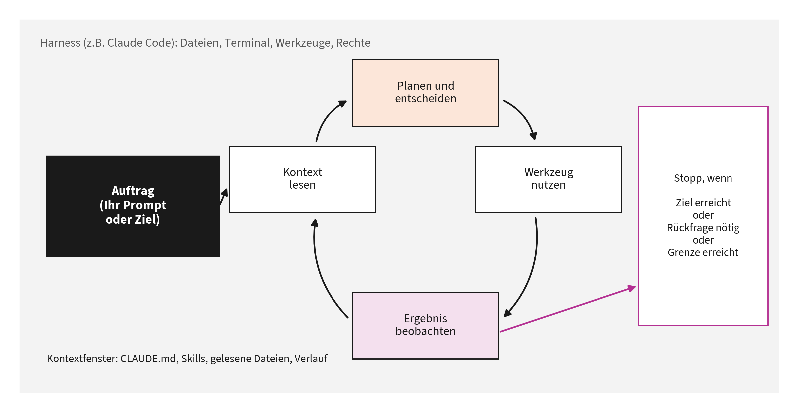
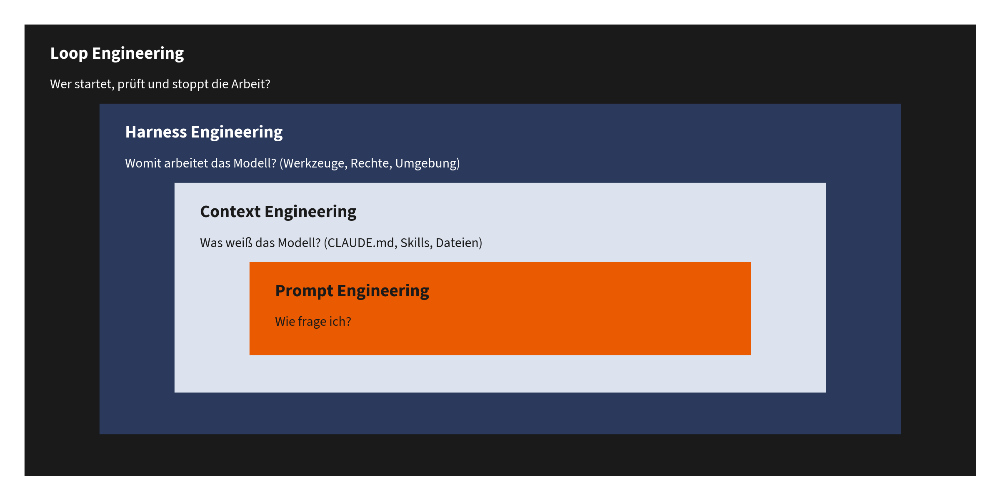
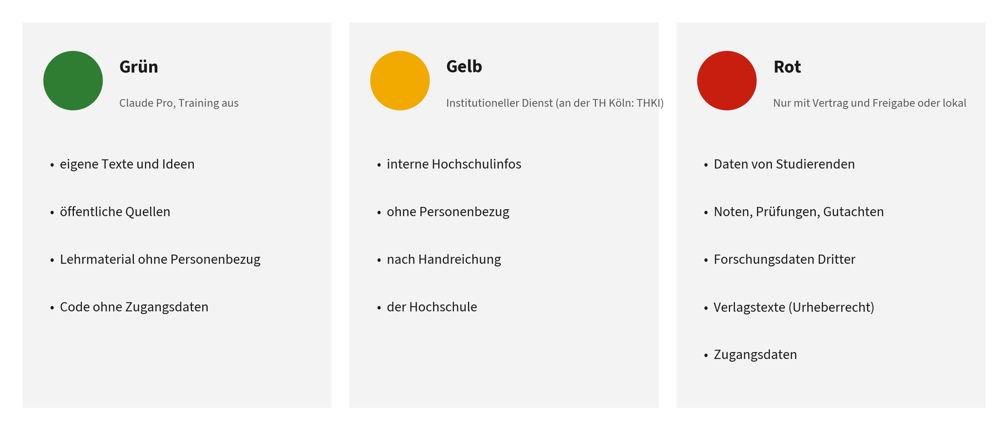

# Kapitel 1: Grundlagen und Datenschutz

Dieses Kapitel gehört zu **Block 1** des Vortrags. Teil A erklärt, wie Sprachmodelle und Agenten arbeiten. Teil B klärt darauf aufbauend, was mit Ihren Daten geschieht und wie Sie Claude hochschultauglich einstellen.

Die Reihenfolge ist Absicht. Die Datenschutz-Ampel in 1.12 verlangt eine Entscheidung darüber, welche Daten ein Werkzeug zu sehen bekommt. Diese Entscheidung lässt sich erst treffen, wenn man weiß, dass ein Agent Dateien auch von sich aus liest: Nicht nur was Sie tippen ist eine Eingabe, sondern auch, was Sie ihn lesen lassen.

**Lernziele:**

- Sie können erklären, was ein Sprachmodell tut, was es von einem Agenten unterscheidet und warum der Kontext über die Qualität entscheidet.
- Sie können Prompt, Kontext, Harness und Loop als aufeinander aufbauende Schichten unterscheiden und am Fehlerbild erkennen, an welcher Schicht Sie ansetzen müssen.
- Sie wissen, was mit Ihren Eingaben in Claude geschieht, haben Ihre Einstellungen bewusst gesetzt und können für jede Aufgabe das datenschutzrechtlich passende Werkzeug wählen.

**Kernaussagen:**

- Chat beantwortet Fragen, ein Agent erledigt Aufgaben. Wie gut er das tut, hängt vor allem vom Kontext ab.
- Claude Pro ist ein Verbraucherdienst: sehr gut für eigene und öffentliche Inhalte, nicht für personenbezogene Daten aus dem Hochschulbetrieb.
- Eingabe ist alles, was das Werkzeug zu sehen bekommt, auch die Datei, die es selbst öffnet.

## Teil A: Wie Sprachmodelle und Agenten arbeiten

### 1.1 Ein Sprachmodell in fünf Sätzen

1.  Ein Sprachmodell zerlegt Text in **Token** (Wortstücke) und sagt Token für Token vorher, was als Nächstes am plausibelsten folgt.
2.  Alles, was das Modell in einer Anfrage „weiß“, steht in seinem **Kontextfenster**: Ihre Anweisung, mitgeschickte Dateien, der bisherige Verlauf und Systemvorgaben.
3.  Das Modell hat **kein Gedächtnis zwischen Sitzungen**, außer man gibt ihm Gedächtnis explizit mit (Memory-Funktionen, Dateien wie `CLAUDE.md`).
4.  Weil es Plausibles erzeugt, kann es **überzeugend falsche** Aussagen machen („Halluzination“). Das ist keine Störung, sondern eine Eigenschaft des Verfahrens [1].
5.  Die Antwortqualität steigt, wenn die Aufgabe klar ist, wenn prüfbare Kriterien genannt werden und wenn relevante Quellen im Kontext stehen.

> **Merksatz:** Ein Sprachmodell ist ein hervorragender Formulierer und Mustererkenner, aber kein Faktenspeicher. Fakten gehören in den Kontext, nicht in die Hoffnung.

### 1.2 Drei Arbeitsweisen in einer App: Chat, Cowork, Code

Die Claude Desktop App hat drei Bereiche [2]:

| Bereich | Wofür | Typische Hochschulaufgabe |
|----|----|----|
| **Chat** | Gespräch, Denken, Formulieren | Gliederung einer Vorlesung entwerfen, Gutachtenstruktur durchdenken |
| **Cowork** | längere Aufgaben über Dateien und Anwendungen hinweg, ohne Programmierung | Unterlagen sichten, Dokumente zusammenführen, Recherche aufbereiten |
| **Code** | Claude Code: arbeitet in einem Projektordner, liest und ändert Dateien, führt Befehle aus | Skripte für Datenanalyse, Webseiten, Automatisierungen, strukturierte Dokumentsammlungen |

Der Code-Tab ist für bezahlte Pläne (Pro, Max, Team, Enterprise) verfügbar und braucht unter Windows beim ersten Start **Git for Windows** [2]. Er ist nicht nur für Programmierer interessant: Jeder Ordner mit Texten, Tabellen oder Notizen kann ein „Projekt“ sein.

### 1.3 Exkurs: Terminal oder App, Tokens, compact oder clear

Claude Code gibt es als Tab „Code“ in der Desktop-App und als Kommandozeilenwerkzeug im Terminal. Die App nutzt denselben Kern wie das Terminal, nur mit grafischer Oberfläche, und beide lesen dieselben Einstellungen, `CLAUDE.md`-Dateien und Skills [2]. Drei Fragen tauchen dazu in jeder Schulung auf.

#### Wann sich das Terminal lohnt

Für die meisten Lehrenden ist die App der richtige Einstieg. Das Terminal lohnt sich in fünf Fällen:

1.  **Automatisieren und Skripten.** `claude -p "Auftrag"` arbeitet ohne Dialog und lässt sich in Skripte, Zeitpläne oder Pipelines wie GitHub Actions einbauen, auf Wunsch mit maschinenlesbarer Ausgabe (`--output-format json`). Die App ist rein interaktiv [2].
2.  **Datenströme.** Ausgaben anderer Programme lassen sich direkt übergeben, etwa `cat protokoll.log | claude -p "Fasse die Fehler zusammen"`.
3.  **Server ohne Oberfläche.** In einer SSH-Sitzung auf einem Institutsserver oder Rechencluster gibt es nur das Terminal; lange Läufe überstehen in `tmux` auch einen Verbindungsabbruch.
4.  **Funktionen, die es nur dort gibt.** Agent Teams (mehrere koordinierte Claude-Instanzen), der Modus `dontAsk` (nur vorab freigegebene Werkzeuge), Befehle mit eigenem Dialog wie `/permissions`, eine eigene Statuszeile mit Kontextanzeige, das Zurückspulen mit `/rewind` sowie der direkte Betrieb über Amazon Bedrock, Google Cloud oder Microsoft Foundry [2], [3].
5.  **Arbeitsgewohnheit.** Wer ohnehin im Terminal oder in VS Code arbeitet, bleibt dort schneller.

Die App lohnt sich für visuelle Diffs mit Zeilenkommentaren, mehrere parallele Sitzungen in einem Fenster (jede mit eigener, isolierter Arbeitskopie), die Vorschau im Browser-Bereich, Dateianhänge wie Bilder und PDFs, Konnektoren und Plugins per Mausklick, Computer Use und geplante Aufgaben über die Oberfläche. Beide lassen sich kombinieren: Mit `/desktop` wandert eine Terminal-Sitzung in die App [2].

#### Mythos: „In der App verbraucht Claude Code mehr Tokens“

Das stimmt so nicht. Modell, Werkzeuge und Abrechnung sind in App und Terminal dieselben, und das Nutzungsbudget des Abos teilen sich alle Claude-Code-Oberflächen [2]. Der Verbrauch hängt davon ab, **was** in einer Sitzung passiert, nicht davon, **wo** sie läuft. Die Dokumentation nennt diese Treiber [2], [4]:

| Treiber | Warum | Gegenmittel |
|----|----|----|
| Lange Sitzungen | Mit jeder Anfrage wird der gesamte bisherige Verlauf erneut verarbeitet (dank Prompt-Caching günstiger, aber nicht umsonst). Auch eine Einzeilenfrage in einer seit Stunden offenen Sitzung zieht Budget für den ganzen Verlauf. | `/clear` zwischen unabhängigen Aufgaben |
| Pausen | Nach einer Pause, die länger dauert als die Lebensdauer des Zwischenspeichers (im Abo eine Stunde), wird der ganze Kontext neu verarbeitet. | vor längeren Pausen eine Übergabe schreiben und danach neu beginnen |
| Modell und Denkaufwand | Opus kostet mehr als Sonnet; Denk-Token werden wie Ausgabe-Token gezählt. | Sonnet als Standard, bei einfachen Aufgaben `/effort` senken |
| Parallelität | Jede Sitzung, jeder Unteragent und jedes Teammitglied hat ein eigenes Kontextfenster. | nur so viele parallele Sitzungen wie nötig |
| Werkzeugausgaben | Lange Logs, Testausgaben und gelesene Dateien füllen den Kontext. In der App kommen bei Web-Projekten die Screenshots der automatischen Prüfung in der Vorschau hinzu. | Unteragenten für ausgabestarke Aufgaben; die automatische Prüfung bei Bedarf abschalten (`"autoVerify": false` in `.claude/launch.json`) |
| Angebundene Werkzeuge | MCP-Server und Konnektoren belegen Kontext, standardmäßig aber nur mit Namen und Kurzbeschreibung, bis ein Werkzeug gebraucht wird. | ungenutzte Server mit `/mcp` abschalten |

**Selbst nachsehen:** In der App zeigt der Nutzungsring neben der Modellauswahl den Kontext- und den Planverbrauch. Im Terminal zeigt `/usage` den Verbrauch mit einer Aufschlüsselung nach Skills, Unteragenten, Plugins und MCP-Servern, und `/context` zeigt, was das Kontextfenster füllt [2], [4].

> **Merksatz:** Nicht die Oberfläche kostet, sondern der Kontext. Wer Sitzungen kurz und fokussiert hält, spart in App und Terminal gleichermaßen.

#### /compact oder /clear?

Das Kontextfenster ist das Arbeitsgedächtnis einer Sitzung (Abschnitt 1.1). Wird es voll, fasst Claude Code den Verlauf automatisch zusammen. Besser ist, selbst zu steuern [4]:

| Situation | Befehl | Warum |
|----|----|----|
| Neue, unabhängige Aufgabe | `/clear`, vorher `/rename`, um die Sitzung später mit `/resume` wiederzufinden | Alter Kontext kostet bei jeder Nachricht und lenkt ab. `/clear` selbst kostet nichts. |
| Gleiche Aufgabe, der Kontext wird voll, der Verlauf ist wichtig | `/compact` mit Fokus, z.B. `/compact Behalte die Entscheidungen zur Gliederung und die offenen Punkte` | Zusammenfassung statt Neustart; der Fokus bestimmt, was erhalten bleibt. |
| Falscher Weg eingeschlagen | Esc, dann im Terminal `/rewind` (oder zweimal Esc); sonst Übergabe schreiben und `/clear` | Falsche Annahmen im Kontext wirken nach, auch wenn man sie korrigiert. |
| Kurze Nebenfrage | in der App Seitenchat (Cmd+; bzw. Strg+; oder `/btw`) | Die Antwort landet nicht im Hauptkontext. |
| Arbeit geht später, morgen oder bei jemand anderem weiter | `/handover`, dann `/clear` | Die Übergabe liegt auf der Platte statt im Verlauf. |
| Viel Ausgabe (Tests, Logs, Dokumentation durchsuchen) | Unteragent beauftragen | Nur die Zusammenfassung kommt in den Hauptkontext zurück. |

Drei Hinweise dazu:

- `/compact` liest den gesamten Verlauf, den es zusammenfasst, und ist damit selbst eine große Anfrage. Wer keinen Zusammenhang braucht, fährt mit `/clear` günstiger [4].
- Zusammenfassungen verlieren Details, vor allem aus dem Anfang einer Sitzung. Die Projekt-`CLAUDE.md` übersteht das Zusammenfassen, weil sie neu geladen wird [5]. Dauerhafte Hinweise für das Zusammenfassen gehören dort in einen Abschnitt `# Compact instructions` [4].
- Im Terminal bietet `/rewind` einen Mittelweg: Es kann Code und Gespräch auf einen früheren Stand zurücksetzen oder den Verlauf ab einem gewählten Punkt zusammenfassen, während die ersten Anweisungen erhalten bleiben. Änderungen durch Terminalbefehle erfasst es nicht; Git ersetzt es nicht [3]. In der App startet eine **neue Sitzung** (Cmd+N bzw. Strg+N) mit leerem Kontext, die alte bleibt in der Seitenleiste erhalten.

#### Der Handover-Skill: /clear ohne Gedächtnisverlust

Die automatische Zusammenfassung ist unsichtbar, nicht prüfbar und bleibt in der Sitzung. Eine **Übergabedatei** ist explizit, lässt sich lesen und korrigieren, kann versioniert werden und funktioniert über Oberflächen (App, Terminal) und Personen hinweg (Kapitel 6). Sie folgt dem Prinzip aus Kapitel 7: Gedächtnis gehört auf die Platte, nicht in den Chatverlauf.

**Ablauf:**

1.  `/handover` eingeben, optional mit Fokus, etwa `/handover Fokus Literaturliste`.
2.  Claude prüft den tatsächlichen Stand (Dateien, Git, Prüfbefehle), schreibt `HANDOVER.md` und zeigt die Datei.
3.  Sie lesen die Übergabe und korrigieren, was nicht stimmt.
4.  `/clear` eingeben, in der App alternativ eine neue Sitzung starten.
5.  Mit dem Startprompt aus der Übergabe weitermachen: `Lies @HANDOVER.md, prüfe kurz den Stand und setze mit Schritt 1 fort.`
6.  Nach Abschluss die Übergabe löschen oder archivieren und dauerhafte Erkenntnisse in die `CLAUDE.md` übernehmen.

**Aufbau der Übergabe:** Ziel, Stand, Entscheidungen mit Begründung, verworfene Wege (damit sie nicht wiederholt werden), nummerierte nächste Schritte, relevante Dateien, Prüfbefehle mit aktuellem Ergebnis, offene Fragen an den Menschen und ein Startprompt. Höchstens 80 Zeilen, geschrieben für eine Leserin ohne Vorwissen.

Der Skill liegt im Handout-Repository unter `.claude/skills/handover/`. Für alle Projekte kopieren Sie den Ordner nach `~/.claude/skills/handover/`.

> **Merksatz:** `/compact` ist Aufräumen im laufenden Gespräch. `/clear` mit Übergabe ist ein sauberer Schichtwechsel.

### 1.4 Vom Chat zum Agenten

Ein **Agent** ist ein Sprachmodell, das in einer Schleife arbeitet: Es liest den Auftrag und den Kontext, entscheidet über den nächsten Schritt, nutzt ein Werkzeug (Datei lesen, Befehl ausführen, Webseite abrufen), beobachtet das Ergebnis und entscheidet erneut. Das wiederholt sich, bis das Ziel erreicht ist, eine Rückfrage nötig wird oder eine Grenze greift.



Die Agenten-Schleife

Die Umgebung, die dem Modell Werkzeuge, Rechte und Grenzen gibt, heißt **Harness** (Geschirr, Gurtzeug). Claude Code ist ein solcher Harness. Das Muster, Denken und Handeln abzuwechseln, geht auf das Forschungsverfahren **ReAct** (Reason + Act) von Yao et al. zurück [6].

Wichtig für das Verständnis: Der Agent „denkt“ nicht dauerhaft nach. Jede Runde ist ein neuer Modellaufruf, der den gesamten bisherigen Kontext mitbekommt. Deshalb wird der Kontext mit der Zeit voll, und deshalb fasst Claude Code lange Sitzungen automatisch zusammen („Compaction“).

### 1.5 Context Engineering: der eigentliche Hebel

Zwei Befunde erklären, warum Kontext wichtiger ist als geschickte Formulierungen:

- **Mehr ist nicht besser.** Liu et al. zeigen in „Lost in the Middle“ [7], dass Sprachmodelle Informationen in der Mitte langer Kontexte schlechter nutzen als am Anfang oder Ende. Ein vollgestopfter Kontext verschlechtert Ergebnisse.
- **Gezielt ist besser.** Werkzeuge wie Claude Code laden deshalb Wissen gestaffelt: Die `CLAUDE.md` wird immer gelesen, Skills nur bei Bedarf, Dateien erst, wenn sie gebraucht werden. Anthropic empfiehlt, `CLAUDE.md`-Dateien knapp zu halten; Dateien mit mehr als etwa 200 Zeilen verbrauchen mehr Kontext und werden weniger zuverlässig befolgt [5].

Daraus ergeben sich drei Regeln, die sich durch alle folgenden Kapitel ziehen:

1.  **Dauerhaftes Wissen in Dateien** (CLAUDE.md, Skills, Dokumentation), nicht in Chatverläufen.
2.  **Nur Relevantes laden**, lieber gezielt nachschlagen lassen als alles vorab mitgeben.
3.  **Prüfbare Kriterien mitgeben**: „Fertig ist es, wenn das Prüfskript ohne Fehler durchläuft“ ist besser als „Mach es gut“.

### 1.6 Workflow oder Agent?

Schluntz und Zhang unterscheiden in „Building Effective Agents“ [8] zwei Bauformen:

- **Workflow:** Der Mensch legt die Schritte fest, das Modell erledigt einzelne Schritte darin. Vorhersagbar, gut prüfbar, günstig.
- **Agent:** Das Modell entscheidet selbst über die Schrittfolge. Flexibel, aber schwerer vorherzusagen und teurer.

Die Empfehlung lautet, mit der einfachsten Lösung zu beginnen und Autonomie nur dort einzusetzen, wo sie echten Mehrwert bringt. Für die Verwaltung (Kapitel 4) sind Workflows mit einem KI-Schritt oft genau richtig; für offene Aufgaben wie „Räume dieses Projekt auf“ ist ein Agent sinnvoll.

### 1.7 Gute Aufträge formulieren

Unabhängig vom Werkzeug helfen fünf Bausteine [9]:

| Baustein | Beispiel |
|----|----|
| Rolle und Ziel | „Du unterstützt die Studiengangskoordination bei der Semesterplanung.“ |
| Kontext | „Die Modulbeschreibungen liegen in `module/`, die Raumliste in `raeume.csv`.“ |
| Aufgabe | „Erstelle einen Stundenplanentwurf für das 3. Semester.“ |
| Kriterien | „Keine Überschneidungen, maximal vier Blöcke pro Tag, Mittagspause 12 bis 13 Uhr.“ |
| Prüfung | „Prüfe am Ende jede Regel und liste Verstöße auf.“ |

> **Praxis:** Bitten Sie Claude bei komplexen Aufgaben zuerst um einen **Plan** und erst nach Ihrer Freigabe um die Umsetzung. In Claude Code gibt es dafür einen eigenen Plan-Modus (Kapitel 2).

### 1.8 Vier Schichten: Prompt, Kontext, Harness, Loop

Die vier Begriffe dieses Teils werden in Fachbeiträgen gern als Moden gegeneinandergestellt: „Prompt Engineering ist tot, jetzt kommt Context Engineering.“ Das ist irreführend. Es sind **Schichten, die aufeinander aufbauen**. Wer eine Schleife baut, formuliert weiterhin Aufträge, und der Kontext muss weiterhin stimmen. Neu ist jeweils nur, was oben dazukommt.



Schichtenmodell vom Prompt zum Loop

| Schicht | Was Sie gestalten | Beispiel aus dem Hochschulalltag |
|----|----|----|
| **Prompt Engineering** | die einzelne Anweisung: Rolle, Aufgabe, Kriterien, Beispiele [9] | „Formuliere aus diesen Stichpunkten eine Absage an eine Bewerbung, sachlich, höchstens 150 Wörter.“ |
| **Context Engineering** | was das Modell beim Arbeiten sieht: Dateien, `CLAUDE.md`, Skills, Verlauf [5], [7] | Die Modulhandbücher liegen im Projektordner, die Hausregeln der Fakultät in der `CLAUDE.md`. |
| **Harness Engineering** | die Umgebung: Werkzeuge, Rechte, Leitplanken, Prüfungen [6] | Claude Code darf im Projektordner lesen und schreiben, aber nichts verschicken; eine Leitplanke sperrt den Ordner mit den Personaldaten. |
| **Loop Engineering** | den Kreislauf: Auslöser, Ziel, Prüfung, Abbruchregel, Gedächtnis [10], [11] | Jede Nacht vergleicht ein Durchlauf die Modulhandbücher mit der Prüfungsordnung und meldet nur die Abweichungen. |

Welche Schicht dran ist, erkennen Sie am Fehlerbild:

| Was schiefgeht | Woran es liegt |
|----|----|
| Das Ergebnis ist sauber gearbeitet, trifft aber nicht das, was Sie wollten. | Prompt: Der Auftrag war mehrdeutig. |
| Das Modell erfindet Details, widerspricht Ihren Regeln oder fragt nach Dingen, die längst festliegen. | Kontext: Es sieht die maßgeblichen Unterlagen nicht. |
| Das Modell will etwas Richtiges tun und kann es nicht, oder es könnte etwas tun, das es nicht dürfte. | Harness: Werkzeuge und Rechte passen nicht. |
| Ein Durchlauf genügt nicht, weil die Aufgabe wiederkehrt oder das Ergebnis nachgebessert werden muss. | Loop: Es fehlt der Regelkreis. |

Die Reihenfolge ist zugleich eine Reihenfolge des Aufwands. Fangen Sie unten an und steigen Sie erst auf, wenn die darunterliegende Schicht ausgereizt ist. Der häufigste Fehler in der Praxis ist der Sprung nach oben: eine Automatisierung zu bauen, solange noch nicht feststeht, woran man ein gutes Ergebnis überhaupt erkennt. Dasselbe Prinzip steht hinter der Empfehlung aus Abschnitt 1.6, mit der einfachsten Bauform zu beginnen [8].

> **Merksatz:** Jede Schicht ist nur so gut wie die darunter. Ein Regelkreis um einen mehrdeutigen Auftrag wiederholt den Fehler nur zuverlässiger.

Die oberen beiden Schichten bekommen eigene Kapitel: Kapitel 2 zeigt den Harness in der Praxis (`CLAUDE.md`, Skills, Leitplanken, MCP), Kapitel 7 das Loop Engineering mit seiner Theorie aus der Regelungstechnik. \## Teil B: Sicher starten

### 1.9 Verbraucherdienst oder Geschäftskundendienst?

Anthropic unterscheidet zwei Welten mit unterschiedlichen Vertragsbedingungen [12], [13]:

|  | Verbraucherprodukte | Geschäftskundenprodukte |
|----|----|----|
| Pläne | Free, Pro, Max | Team, Enterprise, API |
| Bedingungen | Consumer Terms | Commercial Terms |
| Rolle von Anthropic | Verantwortlicher im Sinne der DSGVO | Auftragsverarbeiter für den Kunden |
| Modelltraining | per Schalter wählbar | standardmäßig ausgeschlossen |
| Auftragsverarbeitungsvertrag (AVV) | nicht vorgesehen | Teil der Geschäftsbedingungen |

Für Nutzerinnen und Nutzer im Europäischen Wirtschaftsraum ist bei den Verbraucherprodukten **Anthropic Ireland, Limited** der datenschutzrechtlich Verantwortliche [13]. Daraus folgt eine wichtige Einordnung: Wenn Sie ein privat abgeschlossenes Pro-Konto nutzen, besteht zwischen Ihrer Hochschule und Anthropic **kein Auftragsverarbeitungsvertrag**. Personenbezogene Daten Dritter aus dem Hochschulbetrieb, also etwa von Studierenden, Beschäftigten oder Bewerbenden, gehören deshalb nicht in ein solches Konto.

> **Achtung:** Klären Sie zusätzlich, ob Ihre Hochschule die dienstliche Nutzung eines privat abgeschlossenen Kontos überhaupt erlaubt. Viele KI-Richtlinien regeln genau diesen Punkt.

### 1.10 Die Einstellungen, die Sie jetzt setzen sollten

Die folgenden Schalter finden Sie in den Einstellungen der Claude-App (Web, Desktop, Mobil). Bezeichnungen und Menüpfade ändern sich gelegentlich; in der deutschen Oberfläche sind sie übersetzt.

**So finden Sie die Schalter** (Browser und Desktop-App, Stand September 2026) [14], [15], [16], [17]:

1.  Unten links auf **Ihren Namen** klicken, dann **Einstellungen** wählen.
2.  Bereich **Datenschutz** (englisch: Privacy): Schalter **„Help improve Claude“** (Modelltraining) und **„Location metadata“**.
3.  Bereich **Memory**: Schalter **„Generate memory from chat history“** und **„Search and reference chats“**. In älteren App-Versionen standen beide unter „Capabilities“ bzw. „Fähigkeiten“.
4.  **Neuen Chat** außerhalb eines Projekts öffnen: Das **Geist-Symbol** oben rechts startet einen Incognito-Chat.
5.  Bereich **Konnektoren** (englisch: Connectors): verbundene Dienste prüfen und trennen.
6.  **Mobil:** Name bzw. Menü, dann Einstellungen, dann Datenschutz. „Location metadata“ gilt pro Gerät und muss dort gesondert ausgeschaltet werden.

| Schalter | Empfehlung für die Hochschulnutzung | Begründung |
|----|----|----|
| **Modelltraining** („Help improve Claude“, Datenschutz-Einstellungen) | **aus** | Ist das Training erlaubt, bewahrt Anthropic neue und fortgesetzte Chats bis zu fünf Jahre auf und kann sie für das Training künftiger Modelle nutzen. Ist es aus, gilt eine Aufbewahrung von 30 Tagen. Der Schalter gilt auch für Claude Code [12], [18]. |
| **Memory** („Generate memory from chat history“) und **„Search and reference chats“** | **bewusst entscheiden**; bei gemischter privater und dienstlicher Nutzung eher aus | Beide Funktionen sind standardmäßig eingeschaltet. Claude verknüpft dann Inhalte über Chats hinweg. Das ist bequem, kann aber Themen vermischen [15]. |
| **Location metadata** | **aus**, auf jedem Gerät einzeln | Die Einstellung gilt pro Gerät. Die IP-Adresse nutzt Anthropic unabhängig davon, etwa für Missbrauchsschutz und regionale Funktionen [13]. |
| **Incognito-Chat** (Geist-Symbol oben rechts im neuen Chat) | für sensible Einzelfragen nutzen | Incognito-Chats erscheinen nicht im Verlauf, fließen nicht ins Memory und nicht ins Training, werden aber standardmäßig 30 Tage aufbewahrt. „Nicht im Verlauf“ heißt also nicht „nicht gespeichert“ [16]. |
| **Daumen hoch/runter** unter Antworten | bei sensiblen Chats **nicht** nutzen | Mit einer Bewertung übermitteln Sie das zugehörige Gespräch als Feedback. Feedback wird bis zu fünf Jahre aufbewahrt, vom Nutzerkonto getrennt, und kann für Forschung und Training verwendet werden, auch wenn der Trainingsschalter aus ist [18]. |
| **Chats löschen** | regelmäßig aufräumen | Gelöschte Gespräche werden nicht für künftiges Training verwendet [12]. |
| **Konnektoren und Erweiterungen** (z.B. Google Drive, Mail, Kalender) | nur, was Sie wirklich brauchen | Jeder Konnektor erweitert, was Claude lesen kann, im Zweifel ein ganzes Postfach. Dienstliche Konten nur nach Freigabe verbinden. |

> **Praxis:** Öffnen Sie jetzt die Einstellungen Ihrer Claude-App und gehen Sie die Tabelle von oben nach unten durch. Das dauert fünf Minuten. Die Checkliste zum Abhaken liegt im Repository unter `vorlagen/datenschutz-checkliste.md`.

### 1.11 Claude Code: was zusätzlich zu beachten ist

Claude Code arbeitet auf Ihrem Rechner und schickt Ihre Anweisungen, die gelesenen Dateiinhalte und die Antworten verschlüsselt an die Modellschnittstelle. Drei Punkte sind für die Hochschulnutzung wichtig:

1.  **Kein Incognito-Modus.** Claude Code speichert Sitzungen lokal im Klartext unter `~/.claude/projects/`, standardmäßig 30 Tage. Sitzungen aus Claude Desktop und Cowork sind von dieser Frist ausgenommen und bleiben länger liegen [19]. Auf gemeinsam genutzten Rechnern ist das relevant.
2.  **Feedback-Wege.** Mit `/feedback` (und `/bug`, `/share`) geteilte Transkripte werden fünf Jahre aufbewahrt. Nach einer Sitzungsbewertung fragt Claude Code gelegentlich: „Can Anthropic look at your session transcript?“ Ein „Yes“ lädt Transkript und Quellcode hoch, die bis zu sechs Monate aufbewahrt werden [19]. Antworten Sie hier mit „No“, wenn Sie mit vertraulichem Material arbeiten.
3.  **Telemetrie.** Claude Code sendet Nutzungsmetriken und Fehlerberichte, aber laut Dokumentation keine Prompts oder Dateiinhalte in den Metriken [19]. Alles lässt sich abschalten.

Alle Schalter lassen sich dauerhaft in der Datei `~/.claude/settings.json` setzen. Claude Desktop liest dieselbe Datei wie das Kommandozeilenwerkzeug, die Einstellung wirkt also auch im Code-Tab [2]. Vorlage (im Repository unter `vorlagen/settings-datenschutz.json`):

``` json
{
  "cleanupPeriodDays": 14,
  "env": {
    "DISABLE_TELEMETRY": "1",
    "DISABLE_ERROR_REPORTING": "1",
    "DISABLE_FEEDBACK_COMMAND": "1",
    "CLAUDE_CODE_DISABLE_FEEDBACK_SURVEY": "1"
  }
}
```

`cleanupPeriodDays` verkürzt die lokale Aufbewahrung der Sitzungsprotokolle. Die übrigen Variablen schalten Metriken, Fehlerberichte, den Feedback-Befehl und die Sitzungsumfrage ab. Wer alles Nicht-Notwendige auf einmal abschalten möchte, kann stattdessen `CLAUDE_CODE_DISABLE_NONESSENTIAL_TRAFFIC` setzen [19].

> **Achtung:** Wenn bereits eine `settings.json` existiert, fügen Sie die Einträge ein, statt die Datei zu überschreiben.

### 1.12 Die Datenschutz-Ampel

Die wichtigste Entscheidung treffen Sie nicht in den Einstellungen, sondern vor jeder Eingabe: **Welche Daten sind das, und welches Werkzeug passt dazu?**



Datenschutz-Ampel

- **Grün, Claude Pro mit ausgeschaltetem Training:** eigene Texte und Ideen, öffentliche Quellen, Lehrmaterial ohne Personenbezug, Code ohne Zugangsdaten.
- **Gelb, institutioneller Dienst nach Hochschulrichtlinie**, an der TH Köln **THKI** (auf Basis von KI:connect.nrw): interne Hochschulinformationen ohne Personenbezug. Anfragen werden zentral gebündelt und ohne Ihre campusID-Daten weitergeleitet [20].
- **Rot, nur mit Vertrag und Freigabe oder lokal, im Zweifel gar nicht:** Daten von Studierenden, Beschäftigten und Bewerbenden, Noten und Prüfungsleistungen, Gutachten, Forschungsdaten mit Rechten Dritter oder Ethikauflagen, urheberrechtlich geschützte Fremdinhalte (etwa Verlagstexte), Zugangsdaten.

> **TH Köln:** Die Handreichung für Lehrende zu THKI formuliert als Grundsatz, bei der Verwendung **jeglicher** KI-Systeme auf die Eingabe personenbezogener und urheberrechtsgeschützter Daten zu verzichten [21]. Das gilt also auch für THKI selbst.

#### THKI und KI:connect.nrw: die institutionelle Alternative

Die TH Köln stellt allen Hochschulangehörigen mit **THKI** einen eigenen, kostenlosen Zugang zu aktuellen Sprachmodellen bereit, in zwei Varianten [20], [22]:

- **THKI Chat** unter `https://ki.th-koeln.de`, Anmeldung mit der campusID.
- **THKI API** für den Einsatz über den Chat hinaus, etwa in Automatisierungen wie dem n8n-Workflow aus Kapitel 4.

THKI wird über die landesweite Plattform **KI:connect.nrw** bereitgestellt, die von der RWTH Aachen für die Hochschulen in Nordrhein-Westfalen umgesetzt wird, und von der Campus IT integriert [20], [23]. Die Programmierschnittstelle von KI:connect ist **OpenAI-kompatibel**; API-Schlüssel erzeugen Sie selbst in der Oberfläche, und API-Aufrufe laufen gegen dieselben Kontingente wie der Chat [23]. Welche Modelle freigeschaltet sind, zeigt die Oberfläche. Seit April 2026 stehen über das Landesprojekt „Inferenz NRW“ zusätzlich Open-Weight-Modelle bereit, die auf Servern in NRW laufen [24], [25].

Ansprechstelle für Lehrende ist das Zentrum für Lehrentwicklung (ZLE), erreichbar über `digitalelehre@th-koeln.de`. Handreichungen für Lehrende und Studierende finden Sie auf den Lehrpfaden der TH Köln [22]. Seit dem 1. Juli 2026 bündelt das **KI:Expertisezentrum.nrw** die Landesprojekte KI:edu.nrw, KI:connect.nrw und Open Source-KI.nrw [26]; die TH Köln gehört zu den beteiligten Hochschulen [27].

### 1.13 Rechtsrahmen kompakt

**DSGVO.** Entscheidend sind die Rollenverteilung (Verantwortlicher oder Auftragsverarbeiter, siehe 1.1) und die Zweckbindung. Artikel 22 DSGVO untersagt ausschließlich automatisierte Entscheidungen mit rechtlicher oder ähnlich erheblicher Wirkung [28]. Für die Lehre heißt das: KI darf bei der Bewertung assistieren, **entscheiden muss ein Mensch**.

**EU AI Act, KI-Kompetenz (Art. 4).** Die Pflicht gilt seit dem 2. Februar 2025 [29]. Seit dem 27. Juli 2026 ist sie so gefasst, dass Anbieter und Betreiber Maßnahmen zur Förderung von KI-Kompetenz ergreifen müssen, abgestimmt auf Wissen, Erfahrung und Einsatzkontext; ein bestimmtes individuelles Niveau müssen sie nicht garantieren [30]. Hochschulen, die KI-Systeme einsetzen, sind Betreiber. Fortbildungen wie diese sind eine solche Maßnahme.

**EU AI Act, Hochrisiko-Bereich Bildung (Anhang III).** KI-Systeme, die etwa Lernergebnisse bewerten oder über den Zugang zu Bildung entscheiden sollen, gelten als Hochrisiko-Systeme [29]. Durch den „Digital Omnibus“ (Verordnung (EU) 2026/1744, in Kraft seit 27. Juli 2026) gelten die zugehörigen Pflichten erst ab dem **2. Dezember 2027** [30]. Das ist Aufschub, keine Entwarnung: Wer heute Bewertungsprozesse mit KI plant, sollte sie schon jetzt so gestalten, dass sie später prüfbar sind.

**Urheberrecht und Lizenzen.** Prüfen Sie bei Verlagsinhalten und lizenzierten Datenbanken, ob die Lizenz das Hochladen in KI-Dienste erlaubt; die Handreichung der TH Köln rät grundsätzlich davon ab. Eigene Texte und offen lizenzierte Materialien sind unproblematisch.

**Prüfungsrecht.** Wenn Studierende KI nutzen dürfen, gehört eine klare Regel in die Aufgabenstellung oder Prüfungsordnung, einschließlich einer Kennzeichnungspflicht.

### 1.14 Checkliste

- [ ] Modelltraining ausgeschaltet
- [ ] Memory und Chat-Suche bewusst eingestellt
- [ ] Location metadata auf allen Geräten aus
- [ ] Incognito-Chat für sensible Einzelfragen bekannt
- [ ] Keine Daumen-Bewertungen bei sensiblen Inhalten
- [ ] Nur benötigte Konnektoren verbunden
- [ ] `~/.claude/settings.json` mit Datenschutz-Profil angelegt (wenn Sie Claude Code nutzen)
- [ ] Handreichung für Lehrende zu THKI gelesen, Ansprechstelle (ZLE) bekannt
- [ ] Ampel verinnerlicht: Was ist grün, gelb, rot?

## Quellen

[1] Z. Ji *u. a.*, „Survey of Hallucination in Natural Language Generation“, *ACM Computing Surveys*, Bd. 55, Nr. 12, S. 1-38, 2023, doi: [10.1145/3571730](https://doi.org/10.1145/3571730).

[2] Anthropic, „Desktop application“, Claude Code Docs. Zugegriffen: 11. September 2026. [Online]. Verfügbar unter: <https://code.claude.com/docs/en/desktop>

[3] Anthropic, „Checkpointing“, Claude Code Docs. Zugegriffen: 11. September 2026. [Online]. Verfügbar unter: <https://code.claude.com/docs/en/checkpointing>

[4] Anthropic, „Manage costs effectively“, Claude Code Docs. Zugegriffen: 11. September 2026. [Online]. Verfügbar unter: <https://code.claude.com/docs/en/costs>

[5] Anthropic, „How Claude remembers your project“, Claude Code Docs. Zugegriffen: 11. September 2026. [Online]. Verfügbar unter: <https://code.claude.com/docs/en/memory>

[6] S. Yao *u. a.*, „ReAct: Synergizing Reasoning and Acting in Language Models“, in *International Conference on Learning Representations (ICLR)*, 2023. Verfügbar unter: <https://arxiv.org/abs/2210.03629>

[7] N. F. Liu *u. a.*, „Lost in the Middle: How Language Models Use Long Contexts“, *Transactions of the Association for Computational Linguistics*, Bd. 12, S. 157-173, 2024, doi: [10.1162/tacl_a_00638](https://doi.org/10.1162/tacl_a_00638).

[8] E. Schluntz und B. Zhang, „Building effective agents“, Anthropic Research. Zugegriffen: 11. September 2026. [Online]. Verfügbar unter: <https://www.anthropic.com/research/building-effective-agents>

[9] Anthropic, „Prompt engineering overview“, Claude Docs. Zugegriffen: 11. September 2026. [Online]. Verfügbar unter: <https://docs.claude.com/en/docs/build-with-claude/prompt-engineering/overview>

[10] S. Macedo, „Stop Hand-Holding Your Coding Agent: Engineering the Loops that Replace Step-by-Step Prompting“, 2026, 2607.00038. Verfügbar unter: <https://arxiv.org/abs/2607.00038>

[11] IBM, „What Is Loop Engineering?“, IBM Think. Zugegriffen: 11. September 2026. [Online]. Verfügbar unter: <https://www.ibm.com/think/topics/loop-engineering>

[12] Anthropic, „Updates to Consumer Terms and Privacy Policy“, Anthropic News. Zugegriffen: 11. September 2026. [Online]. Verfügbar unter: <https://www.anthropic.com/news/updates-to-our-consumer-terms>

[13] Anthropic, „Privacy Policy“, Anthropic Legal. Zugegriffen: 11. September 2026. [Online]. Verfügbar unter: <https://www.anthropic.com/legal/privacy>

[14] Anthropic, „How do I change my model improvement privacy settings?“, Anthropic Privacy Center. Zugegriffen: 11. September 2026. [Online]. Verfügbar unter: <https://privacy.anthropic.com/en/articles/12109829-how-do-i-change-my-model-improvement-privacy-settings>

[15] Anthropic, „Use Claude’s chat search and memory to build on previous context“, Claude Help Center. Zugegriffen: 11. September 2026. [Online]. Verfügbar unter: <https://support.claude.com/en/articles/11817273-use-claude-s-chat-search-and-memory-to-build-on-previous-context>

[16] Anthropic, „Use incognito chats“, Claude Help Center. Zugegriffen: 11. September 2026. [Online]. Verfügbar unter: <https://support.claude.com/en/articles/12260368>

[17] Guideflow, „How to manage location metadata settings in Claude.ai“. Zugegriffen: 11. September 2026. [Online]. Verfügbar unter: <https://www.guideflow.com/tutorial/how-to-manage-location-metadata-settings-in-claudeai>

[18] Anthropic, „How long do you store my data?“, Anthropic Privacy Center. Zugegriffen: 11. September 2026. [Online]. Verfügbar unter: <https://privacy.claude.com/en/articles/10023548-how-long-do-you-store-my-data>

[19] Anthropic, „Data usage“, Claude Code Docs. Zugegriffen: 11. September 2026. [Online]. Verfügbar unter: <https://code.claude.com/docs/en/data-usage>

[20] TH Köln, „THKI: KI-Zugang für Hochschulangehörige“, TH Köln. Zugegriffen: 11. September 2026. [Online]. Verfügbar unter: <https://www.th-koeln.de/hochschule/thki_112385.php>

[21] TH Köln, „Handreichung für Lehrende zum Umgang mit THKI Chat“, TH Köln, Version 07, Sep. 2025. Zugegriffen: 11. September 2026. [Online]. Verfügbar unter: <https://lehrpfade.th-koeln.de/thki-chat/>

[22] TH Köln, „THKI Chat“, Lehrpfade der TH Köln. Zugegriffen: 11. September 2026. [Online]. Verfügbar unter: <https://lehrpfade.th-koeln.de/thki-chat/>

[23] RWTH Aachen, IT Center, „KI:connect“, IT Center der RWTH Aachen. Zugegriffen: 11. September 2026. [Online]. Verfügbar unter: <https://www.itc.rwth-aachen.de/cms/it-center/services/kollaboration/~bndnjc/ki-connect/>

[24] TU Dortmund, ITMC, „„Inferenz NRW“ ist gestartet: Souveräne KI-Modelle für die Hochschulen in Nordrhein-Westfalen“. April 2026. Zugegriffen: 11. September 2026. [Online]. Verfügbar unter: <https://itmc.tu-dortmund.de/storages/itmc/Bilder/News/2026/Info-Inferenz-NRW-Start.pdf>

[25] RWTH Aachen, IT Center, „KI:Inferenz.nrw: AI Models for Universities in North Rhine-Westphalia“, IT Center News. Zugegriffen: 11. September 2026. [Online]. Verfügbar unter: <https://www.itc.rwth-aachen.de/go/id/bndmqb?lidx=1>

[26] Ministerium für Kultur und Wissenschaft des Landes Nordrhein-Westfalen, „Nordrhein-westfälische Hochschulen bündeln ihre KI-Kompetenzen im KI:Expertisezentrum.nrw“, Pressemitteilung, Land NRW. Zugegriffen: 11. September 2026. [Online]. Verfügbar unter: <https://www.land.nrw/pressemitteilung/nordrhein-westfaelische-hochschulen-buendeln-ihre-ki-kompetenzen-im>

[27] fernstudi.net, „NRW-Hochschulen bündeln Kräfte: KI:Expertisezentrum.nrw startet mit Beteiligung der FernUni Hagen“. Zugegriffen: 11. September 2026. [Online]. Verfügbar unter: <https://www.fernstudi.net/news/nrw-hochschulen-buendeln-kraefte-ki-expertisezentrum-nrw-startet-mit-beteiligung-der-fernuni-hagen>

[28] *Verordnung (EU) 2016/679 (Datenschutz-Grundverordnung)*, Bd. L 119. 2016, S. 1-88. Verfügbar unter: <https://eur-lex.europa.eu/eli/reg/2016/679/oj>

[29] *Verordnung (EU) 2024/1689 (Verordnung über künstliche Intelligenz)*. 2024. Verfügbar unter: <https://eur-lex.europa.eu/eli/reg/2024/1689/oj>

[30] *Verordnung (EU) 2026/1744 (Digital Omnibus zur KI-Verordnung)*. 2026. Verfügbar unter: <https://eur-lex.europa.eu/eli/reg/2026/1744/oj>
