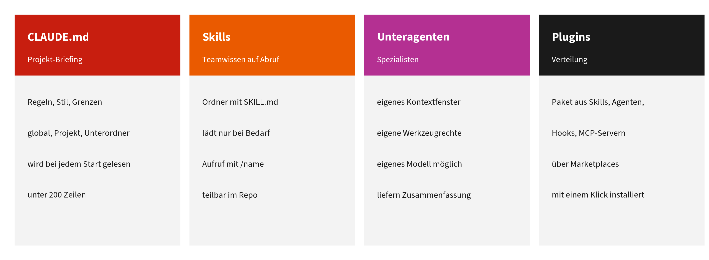

# Kapitel 2: Claude Code und Arbeitsweise

Dieses Kapitel gehört zu **Block 2** des Vortrags. Die zugehörigen Übungen stehen in Kapitel 3.

**Lernziele:**

- Sie können Claude Code starten, ein Repository öffnen und eine erste echte Aufgabe mit Plan-Modus sicher erledigen lassen.
- Sie können Claude Ihr Projekt beibringen: mit einer guten `CLAUDE.md`, mit Skills, Unteragenten und Plugins.
- Sie wissen, wie Claude an weitere Systeme angebunden wird, wie Leitplanken Regeln technisch durchsetzen und welches Modell zu welcher Aufgabe passt.
- Sie können einschätzen, wann eine einzelne Sitzung genügt und wann Unteragenten, parallele Sitzungen oder Schleifen sinnvoll sind.

**Kernaussage:** Kontext, der sich aufbaut, schlägt jeden Einzelprompt. `CLAUDE.md`, Skills, Unteragenten und Plugins machen aus einem Allzweckmodell einen Assistenten, der Ihr Projekt kennt; Leitplanken sorgen dafür, dass Sie ihm mehr Spielraum geben können.



Vier Bausteine: CLAUDE.md, Skills, Unteragenten, Plugins

## 2.1 Was Claude Code ist

Claude Code ist ein **agentisches Werkzeug**: Es arbeitet in einem Projektordner, liest und ändert Dateien, führt Befehle aus und prüft die Ergebnisse. Es folgt der Schleife aus Kapitel 1.4: lesen, planen, handeln, beobachten, bis das Ziel erreicht ist oder eine Rückfrage nötig wird [1], [2]. Claude Code gibt es in mehreren Oberflächen, die denselben Kern teilen [2]:

| Weg | Für wen | Installation |
|----|----|----|
| **Claude Desktop, Tab „Code“** | Einstieg ohne Terminal | App von claude.com/download installieren, anmelden, Tab „Code“ öffnen. Unter Windows zuerst Git for Windows installieren und die App neu starten. |
| **Kommandozeile (CLI)** | Automatisierung, Skripte, volle Kontrolle | siehe unten |
| **IDE-Erweiterungen** | Entwicklerinnen und Entwickler | VS Code, JetBrains |

Voraussetzungen laut Dokumentation (Stand September 2026): macOS 13 oder neuer, Windows 10 (1809) oder neuer, Ubuntu 20.04 oder Debian 10 und neuer, mindestens 4 GB Arbeitsspeicher, Internetverbindung und ein bezahlter Claude-Plan oder ein API-Konto [3].

**Installation der CLI** (der native Installer braucht kein Node.js und aktualisiert sich selbst) [3]:

``` bash
# macOS, Linux, WSL
curl -fsSL https://claude.ai/install.sh | bash

# Windows PowerShell (keine Administratorrechte nötig)
irm https://claude.ai/install.ps1 | iex

# Alternativen
brew install --cask claude-code          # Homebrew (macOS)
winget install Anthropic.ClaudeCode      # WinGet (Windows)
```

Danach im gewünschten Projektordner `claude` eingeben; beim ersten Start meldet sich Claude Code über den Browser an. `claude doctor` prüft Installation und Konfiguration [3]. Unter Windows funktioniert die CLI auch ohne Git for Windows, der Code-Tab in Claude Desktop braucht Git dagegen zwingend [2], [3].

## 2.2 Die erste Aufgabe: ein echter Fehler

### Die Sitzung einrichten

Im Code-Tab legen Sie vor der ersten Nachricht vier Dinge fest: die **Umgebung** (Local, Cloud, SSH oder unter Windows WSL), den **Projektordner**, das **Modell** und den **Berechtigungsmodus** [2].

| Modus | Verhalten | Wann sinnvoll |
|----|----|----|
| **Manual** | fragt vor jeder Dateiänderung und jedem Befehl | Einstieg, sensible Projekte |
| **Accept edits** | Dateiänderungen automatisch, andere Befehle nur nach Rückfrage | wenn Sie den Änderungen vertrauen |
| **Plan** | liest und erkundet, schlägt einen Plan vor, ändert keinen Quelltext | vor größeren oder folgenreichen Änderungen |
| **Auto** | handelt selbstständig, Hintergrundprüfungen achten auf Übereinstimmung mit Ihrem Auftrag | eingespielte Abläufe |
| **Bypass permissions** | keine Rückfragen | nur in abgeschotteten Umgebungen |

Die Modi und ihr Verhalten folgen der Dokumentation [2]. In der CLI wechseln Sie die Modi mit Shift+Tab [4].

### Vom fehlschlagenden Test zum behobenen Fehler

Im Handout-Repository liegt unter `beispiele/literaturliste/` ein kleines Python-Projekt mit zwei absichtlichen Fehlern: Die Sortierung behandelt Umlaute falsch, und Einträge ohne Jahr führen zum Absturz. Vier Tests beschreiben das gewünschte Verhalten; zwei davon schlagen fehl. Das Projekt ist bewusst klein, damit man jede Phase der Agenten-Schleife beobachten kann.

1.  **Lesen.** Öffnen Sie das Handout-Repository im Code-Tab, Modus Manual, und geben Sie ein:

    ```
    In beispiele/literaturliste schlagen Tests fehl. Finde die Ursache.
    Ändere noch nichts.
    ```

    Claude öffnet die Dateien, führt die Tests aus und benennt die Ursachen. Dabei liest es auch die `CLAUDE.md` im Unterordner, sobald es dort arbeitet (siehe 2.4).

2.  **Planen.** Wechseln Sie in den Plan-Modus und bitten Sie um einen Lösungsvorschlag. Prüfen Sie den Plan: Welche Sortierregel wird umgesetzt? Werden die Tests angefasst? (Die `CLAUDE.md` des Unterordners verbietet das.)

3.  **Handeln.** Geben Sie den Plan frei und wechseln Sie zu Manual oder Accept edits. Claude ändert `literaturliste.py`.

4.  **Beobachten.** Claude führt die Tests erneut aus. Erst wenn alle vier bestehen, ist die Aufgabe erledigt.

5.  **Prüfen.** Sehen Sie sich die Änderung im Diff-Bereich an, kommentieren Sie einzelne Zeilen oder lassen Sie mit „Review code“ eine zweite Prüfung laufen [2].

| Phase | Was Claude im Beispiel tut |
|----|----|
| Lesen | Dateien und Unterordner-`CLAUDE.md` öffnen, Tests ausführen, Fehlermeldungen lesen |
| Planen | Ursache benennen, Lösung nach DIN 5007-1 vorschlagen [5], offene Fragen stellen |
| Handeln | nur `literaturliste.py` ändern |
| Beobachten | Tests erneut ausführen, bei Fehlern zurück zu „Planen“ |

**Zuschauen, was Claude tut.** Im Hörsaal oder in der Lehre hilft es, jeden Schritt sichtbar zu machen. Claude Desktop zeigt in der ausführlichen Transkriptansicht jeden Werkzeugaufruf und im Diff-Bereich jede Änderung. Anschaulicher für ein Publikum ist ein **Live-Monitor**, wie er im Vortrag gezeigt wird (ein eigenes Werkzeug des Dozenten, nicht Teil des Handouts): Er nutzt Hooks, die Claude Code bei jedem Schritt aufruft [6], und zeigt die Schritte im Browser nach Lesen, Planen, Handeln und Beobachten geordnet, mit markierten Codeänderungen und Testergebnissen. Eine zweite Ansicht zeigt jede Sitzung als Pixel-Figur in einem Bürogebäude mit einem Stockwerk je Projekt, Unteragenten als eigene Helfer. Tokens kostet das nicht: Hooks laufen außerhalb des Modells, und der Hook des Monitors gibt nichts an Claude zurück.

**Warum der Plan-Modus?** Er trennt Erkunden und Planen vom Ändern. Anthropic empfiehlt diesen Ablauf (erkunden, planen, umsetzen, festschreiben) ausdrücklich, weil ein früh geprüfter Plan teure Umwege vermeidet [4], [7]. Faustregel: Plan-Modus immer dann, wenn eine Änderung mehrere Dateien betrifft, schwer rückgängig zu machen ist oder Sie die Lösung noch nicht selbst vor Augen haben.

> **Merksatz:** Prüfbare Ziele machen den Agenten verlässlich. „Fertig ist es, wenn alle Tests bestehen“ ist ein besserer Auftrag als „Mach es richtig“.

## 2.3 Ein GitHub-Repository laden

- **Ohne Installation:** Auf der GitHub-Seite „Code“ und „Download ZIP“ wählen, entpacken, im Code-Tab als Projektordner auswählen.
- **Mit Git:** `git clone https://github.com/ThorMaker/<repository>.git`, dann den Ordner öffnen. Vorteil: Aktualisierungen mit `git pull`, Änderungen nachvollziehbar.

Claude Desktop legt für Git-Repositorys pro Sitzung automatisch eine isolierte Arbeitskopie an (Git Worktree), sodass sich mehrere Sitzungen am selben Projekt nicht stören [2].

## 2.4 CLAUDE.md: das Projekt-Briefing

Eine `CLAUDE.md` ist eine Markdown-Datei mit dauerhaften Anweisungen, die Claude Code zu Beginn jeder Sitzung liest. Alle gefundenen Dateien werden zusammengeführt, nicht gegeneinander ausgetauscht [8].

| Ebene | Ort | Gilt für |
|----|----|----|
| Organisation | vom Administrator verwaltete Datei | alle Nutzer einer Organisation |
| **Global (persönlich)** | `~/.claude/CLAUDE.md` | alle Ihre Projekte |
| **Projekt** | `./CLAUDE.md` oder `./.claude/CLAUDE.md` | alle, die das Projekt nutzen (per Git geteilt) |
| Projekt, privat | `./CLAUDE.local.md` | nur Sie, nicht im Git |
| **Unterordner** | `unterordner/CLAUDE.md` | wird erst geladen, wenn Claude Dateien in diesem Unterordner liest |

Die letzte Zeile ist für größere Projekte wichtig: Claude liest `CLAUDE.md`-Dateien vom Arbeitsordner aufwärts und entdeckt zusätzlich solche in Unterordnern, lädt diese aber erst bei Bedarf [8]. So bekommt jeder Teil eines Projekts seine eigenen Regeln, ohne den Kontext der anderen Teile zu belasten. Das Beispielprojekt `beispiele/literaturliste/` zeigt genau das. Für feinere Steuerung gibt es **Regeln** in `.claude/rules/`, die über ein Feld `paths` nur für passende Dateien geladen werden [8].

Nützliche Befehle: `/init` erzeugt einen ersten Entwurf aus dem Projektinhalt, `/memory` zeigt und öffnet die geladenen Dateien, `@pfad/zur/datei.md` bindet weitere Dateien ein (die dann ebenfalls beim Start geladen werden). Zusätzlich führt Claude Code ein **automatisches Gedächtnis** pro Projekt, in dem es selbst Notizen zu Ihren Korrekturen ablegt [8].

### Vorher und nachher: eine globale CLAUDE.md

**Vorher** (typische erste Version):

``` markdown
# Meine Regeln
Sei hilfreich und genau. Schreib guten Code. Denk nach bevor du antwortest.
Antworte ausführlich. Halte dich kurz. Benutze Best Practices.
Das Projekt hat die Ordner src, docs, tests und assets.
```

Die Anweisungen sind unprüfbar („sei genau“), widersprüchlich („ausführlich“ und „kurz“), selbstverständlich („Best Practices“) oder aus dem Projekt ableitbar (Ordnerliste). Solche Zeilen kosten Kontext und ändern nichts.

**Nachher** (Auszug, vollständig unter `vorlagen/CLAUDE-global-nachher.md`):

``` markdown
# Über mich
- Prof. Dr. <Name>, Professur für Wirtschaftsinformatik an der TH Köln.

# So arbeite ich
- Sprache: Deutsch. Fazit zuerst, dann Details.
- Vor Änderungen an mehr als zwei Dateien: erst Plan vorlegen, auf Freigabe warten.
- Nach jeder Änderung prüfen und das Ergebnis nennen.

# Niemals
- Personenbezogene Daten Dritter verarbeiten oder in Beispiele übernehmen.
- Zugangsdaten in Dateien schreiben; Platzhalter wie <API_KEY> verwenden.

# Ausgabe
- Mails an die Verwaltung in Sie-Form, kollegial, mit konkreter Bitte und Frist.
```

**Prinzipien einer guten CLAUDE.md:**

1.  **Konkret und prüfbar** statt allgemein.
2.  **Nur, was vom Standard abweicht:** Konventionen, Stolperfallen, Begründungen.
3.  **Kurz:** unter 200 Zeilen; Dateien darüber verbrauchen mehr Kontext und werden weniger zuverlässig befolgt [8]. Spezielles gehört in Skills, die nur bei Bedarf laden [4].
4.  **Grenzen explizit:** Datenschutz, Ordner, Freigaben.
5.  **Kontext, der sich aufbaut:** Jede Korrektur, die Sie zweimal geben mussten, wird eine Zeile in der `CLAUDE.md` oder ein Skill. So wird das Projekt mit jeder Sitzung klüger.

> **Achtung:** Eine CLAUDE.md ist Kontext, keine Sperre [8]. Was unter keinen Umständen passieren darf, sichern Sie mit Berechtigungsregeln oder Hooks ab (Abschnitt 2.9).

## 2.5 Skills: Teamwissen, das Claude einfach weiß

In jedem Institut gibt es Wissen, das nirgends aufgeschrieben ist: wie ein Gremienprotokoll aussehen muss, welche Formulierungen das Prüfungsamt erwartet, wie Übungsaufgaben aufgebaut sind. Ein **Skill** macht aus diesem Erfahrungswissen eine Anleitung, die Claude bei Bedarf selbst hervorholt.

Ein Skill ist ein Ordner mit einer Datei `SKILL.md` und optional weiteren Dateien. Claude liest zunächst nur Name und Beschreibung aller Skills; die eigentliche Anleitung lädt es erst, wenn der Skill zur Aufgabe passt oder Sie ihn aufrufen [9].

``` markdown
---
name: mail-dekanat
description: Formuliert aus Stichpunkten eine sachliche E-Mail an das Dekanat
  im Hochschulstil. Verwenden, wenn der Nutzer eine Mail an Dekanat,
  Prüfungsamt oder Fakultätsverwaltung schreiben möchte.
---

# Mail an das Dekanat
1. Frage nach Anlass, Empfänger und gewünschter Frist, falls sie fehlen.
2. Aufbau: Betreff mit Kernanliegen, Anrede, Anliegen in zwei Sätzen,
   Details als kurze Liste, konkrete Bitte mit Frist, Gruß.
3. Ton: höflich, knapp, ohne Floskeln; keine personenbezogenen Daten Dritter.
```

| Ort | Pfad | Gilt für |
|----|----|----|
| Persönlich | `~/.claude/skills/<name>/SKILL.md` | alle Ihre Projekte |
| Projekt | `.claude/skills/<name>/SKILL.md` | dieses Projekt (per Git teilbar) |
| Plugin | `<plugin>/skills/<name>/SKILL.md` | wo das Plugin aktiv ist |

Orte und Aufrufweise folgen der Dokumentation [9]. Aufgerufen wird ein Skill automatisch, wenn seine Beschreibung zur Aufgabe passt, oder direkt mit `/name`. Die Beschreibung ist deshalb der wichtigste Teil: Sie sagt Claude, **wann** der Skill gebraucht wird. Am einfachsten lassen Sie Claude den Skill schreiben und prüfen ihn vor dem Speichern (Übung in Kapitel 3.3). Skills funktionieren auch im Chat: Nach dem Einschalten der Code-Ausführung laden Sie unter „Customize“ und „Skills“ einen gezippten Skill-Ordner hoch [10].

## 2.6 Unteragenten und eigene Agenten

Ein **Unteragent** (Subagent) ist ein spezialisierter Assistent mit eigenem Kontextfenster, eigener Systemanweisung, eigenen Werkzeugrechten und eigenen Berechtigungen. Passt eine Aufgabe zu seiner Beschreibung, delegiert Claude sie an ihn; der Unteragent arbeitet eigenständig und liefert nur das Ergebnis zurück [11].

**Wofür:**

- **Kontext schützen:** Tests laufen lassen, Dokumentation durchsuchen oder Logdateien auswerten erzeugt viel Ausgabe. Im Unteragenten bleibt sie in dessen Kontext, zurück kommt nur eine Zusammenfassung [4].
- **Spezialisieren:** ein Prüfer, der nur lesen darf; ein Rechercheur, der nur Quellen sammelt.
- **Kosten senken:** Einfache Unteragenten-Aufgaben können mit dem schnellen, günstigen Haiku-Modell laufen [4].

**So entsteht ein eigener Agent:** als Markdown-Datei mit Kopfbereich in `.claude/agents/` (Projekt) oder `~/.claude/agents/` (persönlich). Am einfachsten bitten Sie Claude, die Datei zu schreiben; der frühere Assistent hinter `/agents` wurde mit Version 2.1.198 entfernt [11]. Beispiel aus dem Handout-Repository:

``` markdown
---
name: quellen-pruefer
description: Prüft Texte auf Tatsachenbehauptungen ohne Quellenangabe, auf
  Webquellen ohne Abrufdatum und auf uneinheitliche Zitierweise.
tools: Read, Grep, Glob
model: haiku
---
Du prüfst Texte im Hochschulkontext auf ihre Belege. Du änderst keine Dateien.
...
```

Der Agent darf nur lesen (`Read, Grep, Glob`) und läuft mit Haiku. Aufruf zum Beispiel: „Prüfe Kapitel 1 mit dem quellen-pruefer.“

| Baustein | Was er ist | Kontext | Typischer Einsatz |
|----|----|----|----|
| Skill | Anleitung, die Claude selbst befolgt | teilt den Kontext der Sitzung | wiederkehrender Ablauf |
| Unteragent | eigener Assistent innerhalb der Sitzung | eigenes Kontextfenster, liefert Zusammenfassung | ausgabestarke oder spezialisierte Teilaufgaben |
| Agent Team | mehrere Claude-Instanzen, die sich abstimmen | je Instanz eigenes Fenster, über Sitzungen hinweg | große, parallelisierbare Vorhaben (Abschnitt 2.11) |

Die Abgrenzung von Unteragenten und Agent Teams folgt der Dokumentation: Unteragenten arbeiten innerhalb einer Sitzung, Agent Teams koordinieren sich über getrennte Sitzungen [11].

## 2.7 Plugins und Marketplaces

Ein **Plugin** bündelt Skills, Befehle, Unteragenten, Hooks und MCP-Server zu einem installierbaren Paket; ein **Marketplace** ist ein Katalog solcher Plugins, technisch ein Git-Repository mit einer Datei `.claude-plugin/marketplace.json` [12].

```
hochschul-toolkit/
├── .claude-plugin/
│   └── plugin.json          Name, Version, Beschreibung
├── skills/
│   ├── gremien-protokoll/SKILL.md
│   └── lv-feedback-auswerten/SKILL.md
└── commands/
    └── kurzfassung.md
```

**Installieren im Code-Tab:** „+“ neben dem Eingabefeld, dann „Plugins“ und „Add plugin“. Der Plugin-Browser zeigt die Plugins aller eingerichteten Marketplaces, darunter den offiziellen Marketplace von Anthropic, der beim ersten interaktiven Start automatisch hinzugefügt wird [2], [12].

**Installieren in der CLI:**

``` bash
/plugin                                       # Plugin-Verwaltung öffnen
/plugin install <name>@claude-plugins-official
/plugin marketplace add ThorMaker/<repository>  # weiteren Marketplace hinzufügen
```

**Was sich am ersten Tag lohnt:** die Integration für den eigenen Code-Hoster (etwa die GitHub-Integration aus dem offiziellen Marketplace) sowie für getypte Programmiersprachen ein Code-Intelligenz-Plugin, das präzise Symbolnavigation ermöglicht und unnötiges Lesen von Dateien vermeidet [4], [12]. Das Handout-Repository ist selbst ein Marketplace mit dem Beispiel-Plugin `hochschul-toolkit`.

> **Achtung:** Plugins können Befehle ausführen und externe Dienste anbinden. Installieren Sie nur Plugins aus Quellen, denen Sie vertrauen, und lesen Sie vorher, was sie tun.

## 2.8 Claude an Ihre Welt anbinden: MCP und GitHub

Vieles, was Claude für eine Aufgabe braucht, liegt nicht im Dateisystem: Tickets, Issues, Wiki-Seiten, Datenbanken, Literaturverwaltung, Workflows. Das **Model Context Protocol (MCP)** ist ein offener Standard, den Anthropic im November 2024 vorgestellt hat, um KI-Assistenten mit solchen Werkzeugen und Datenquellen zu verbinden [13].

**Anbinden in der CLI** [14]:

``` bash
# entfernter Server über HTTP
claude mcp add --transport http <name> <url>

# für das ganze Team: Konfiguration in .mcp.json im Projekt
claude mcp add --transport http --scope project <name> <url>
```

Ohne weitere Angabe gilt ein Server nur lokal für Sie im aktuellen Projekt; `--scope user` macht ihn in allen Projekten verfügbar, `--scope project` schreibt ihn in eine `.mcp.json`, die per Git geteilt wird. Server aus einer `.mcp.json` muss jede Person vor der ersten Nutzung ausdrücklich freigeben. Mit `/mcp` sehen Sie den Status und melden sich bei Diensten mit Browser-Anmeldung an [14]. In Claude Desktop heißen solche Anbindungen **Konnektoren**; Sie verwalten sie unter Einstellungen und „Konnektoren“ oder über das „+“-Menü [2].

**Beispiele für die Hochschule:** das GitLab oder GitHub des Instituts, ein Ticket- oder Projektsystem (etwa Jira und Confluence), eine Datenbank mit einem ausschließlich lesenden Zugang, eigene n8n-Workflows als Werkzeuge (Kapitel 4).

**Kontext und Kosten:** Werkzeugdefinitionen von MCP-Servern werden standardmäßig erst geladen, wenn Claude ein Werkzeug tatsächlich nutzt. Wo es ein Kommandozeilenwerkzeug gibt (etwa `gh` für GitHub), ist dieses noch sparsamer; ungenutzte Server schalten Sie mit `/mcp` ab [4].

**Sicherheit und Datenschutz:**

- Jeder MCP-Server ist ein Zugang zu einem System. Nur vertrauenswürdige Server, nur die nötigen Rechte, bei Datenbanken nur lesend.
- Inhalte aus externen Quellen können versteckte Anweisungen enthalten. Berechtigungsregeln und Sandbox sind deshalb als zusätzliche Schutzschicht gedacht, die auch dann greift, wenn eine solche Anweisung Claudes Entscheidungen beeinflusst [15].
- Die Datenschutz-Ampel aus Kapitel 1.12 gilt für jede angebundene Quelle. Zugangsdaten gehören nie in eine geteilte `.mcp.json`.

**GitHub-App: Claude im Team-Workflow.** Mit `/install-github-app` richten Sie im Terminal die Claude-GitHub-App und die zugehörigen GitHub Actions ein. Danach reagiert Claude auf `@claude` in Issues und Pull Requests: Es analysiert Code, erstellt Pull Requests, setzt Änderungen um und beachtet dabei die `CLAUDE.md` des Repositorys; die Arbeit läuft auf den Runnern von GitHub [16]. Für Lehrprojekte mit studentischen Teams ist das eine elegante Brücke zu Kapitel 6.

## 2.9 Leitplanken: Berechtigungen, Regeln und Hooks

Wer Claude mehr Spielraum geben will, braucht Grenzen, die nicht vom Wohlverhalten des Modells abhängen. Claude Code bietet dafür vier Schichten, die sich ergänzen:

| Schicht | Was sie tut | Wie verlässlich |
|----|----|----|
| **Berechtigungsmodus** | legt fest, wie viel Claude ohne Rückfrage tun darf (2.2) | wirkt auf die ganze Sitzung |
| **Berechtigungsregeln** | `allow`, `ask` und `deny` für einzelne Werkzeuge, Befehle und Pfade | Deny-Regeln greifen zuerst und gelten auch im Modus Bypass |
| **Hooks** | eigene Skripte, die an festen Punkten laufen, etwa vor jedem Werkzeugaufruf | deterministisch: gleiche Eingabe, gleiches Ergebnis |
| **Sandbox** | Betriebssystemschutz für Terminalbefehle (Dateisystem, Netzwerk) | greift unabhängig von Claudes Entscheidungen |

Die Einordnung folgt der Dokumentation: Berechtigungen gelten für alle Werkzeuge, die Sandbox für Terminalbefehle; beide zusammen bilden eine gestaffelte Verteidigung [15]. Deny-Regeln blockieren ein Werkzeug selbst im Modus Bypass [15].

**Hooks** sind Skripte, die Claude Code an festen Punkten im Ablauf aufruft. Ein Hook vom Typ `PreToolUse` sieht die geplante Aktion, bevor sie ausgeführt wird. Endet er mit **Exit-Code 2**, wird die Aktion blockiert, und seine Meldung geht an Claude zurück. **Achtung:** Exit-Code 1 blockiert nicht, er gilt als nicht blockierender Fehler [6].

**Beispiel: Datenschutz technisch durchsetzen** (Vorlage unter `vorlagen/settings-leitplanken.json` und `vorlagen/hooks/`):

``` json
{
  "permissions": {
    "deny": ["Read(./personendaten/**)", "Edit(./personendaten/**)"],
    "ask": ["Bash(git push *)"]
  },
  "hooks": {
    "PreToolUse": [
      { "matcher": "Edit|Write",
        "hooks": [{ "type": "command",
          "command": "python3 \"$CLAUDE_PROJECT_DIR/.claude/hooks/schuetze_ordner.py\"" }] }
    ]
  }
}
```

Die Regeln sperren Lesen und Bearbeiten des Ordners `personendaten/`; Pushes nach GitHub fragen immer nach. Der Hook blockiert zusätzlich jede Dateiänderung in `pruefungen/`. Hooks in der Projektdatei `.claude/settings.json` werden mit dem Repository geteilt und gelten damit für das ganze Team [6]. Die genaue Regelsyntax prüfen Sie am besten mit `/permissions` und `/hooks` im Terminal gegen die aktuelle Dokumentation.

> **Merksatz:** Die CLAUDE.md bittet, Hooks und Regeln erzwingen. Was nie passieren darf, gehört nicht nur in eine Anweisung, sondern in eine Leitplanke.

## 2.10 Das richtige Modell für die Aufgabe

| Modell | Stärke | Typischer Einsatz |
|----|----|----|
| **Opus** | tiefes Schlussfolgern, Architekturentscheidungen | Planung, schwierige Analysen, Fehlersuche über viele Dateien |
| **Sonnet** | gutes Verhältnis von Leistung und Kosten | die tägliche Umsetzung |
| **Haiku** | schnell und günstig | einfache Teilaufgaben, Unteragenten |

Die Dokumentation empfiehlt Sonnet für die meisten Aufgaben und Opus für komplexe Architekturentscheidungen oder mehrstufiges Schlussfolgern; für einfache Unteragenten genügt Haiku [4]. Das Modell wechseln Sie mit `/model` in der Sitzung, beim Start mit `claude --model <alias>` oder dauerhaft in den Einstellungen. Der Alias `opusplan` verbindet beides: Opus im Plan-Modus, danach automatisch Sonnet für die Umsetzung [17]. Zusätzlich lässt sich der Denkaufwand mit `/effort` einstellen; Denk-Token werden wie Ausgabe-Token abgerechnet [4].

## 2.11 Vom Einzelagenten zur Flotte: wann was?

| Stufe | Wann sinnvoll | Worauf achten | Mehr dazu |
|----|----|----|----|
| **Eine Sitzung** | fast immer der Anfang | Kontext pflegen (1.9) | Kapitel 1 und 2 |
| **Unteragenten** | ausgabestarke oder spezialisierte Teilaufgaben | nur die Zusammenfassung kommt zurück | 2.6 |
| **Parallele Sitzungen mit Git-Worktrees** | unabhängige Aufgaben gleichzeitig | jede Sitzung hat eigenen Kontext und eigene Kosten; in Claude Desktop automatisch, in der CLI mit `--worktree` [2] | Kapitel 6 |
| **Agent Teams** | große Vorhaben mit abgestimmten Teilaufgaben | nur in der CLI, experimentell; laut Dokumentation rund siebenfacher Tokenverbrauch, wenn Teammitglieder im Plan-Modus arbeiten [4] | Kapitel 6 |
| **Schleifen für lange Arbeit** | Aufgaben mit prüfbarem Endzustand oder festen Intervallen | die Prüfung ist das Herzstück | Kapitel 7 |

**Urteilsregeln:**

1.  **Einfach anfangen.** Mehr Autonomie und mehr Agenten nur dort, wo sie nachweislich Nutzen bringen [18].
2.  **Nur Unabhängiges parallelisieren.** Aufgaben, die dieselben Dateien berühren, gehören nacheinander.
3.  **Jeder Agent kostet Kontext und Budget.** Parallelität vervielfacht den Verbrauch.
4.  **Der Engpass ist die Prüfung.** Mehr Agenten erzeugen mehr Ergebnisse, die jemand verstehen und abnehmen muss.

## 2.12 Bewährte Arbeitsweise

1.  **Erkunden, planen, umsetzen, festschreiben.** Erst verstehen lassen, dann Plan im Plan-Modus, dann umsetzen, dann prüfen und in Git festschreiben [7].
2.  **Kleine Schritte.** Eine Aufgabe pro Sitzung; lieber zwei klare Aufträge als einen verschachtelten.
3.  **Prüfkriterien mitgeben.** „Fertig, wenn …“ am Ende jedes Auftrags; Tests, erwartete Ausgaben oder Screenshots als Ziel [4].
4.  **Git als Sicherheitsnetz.** Jede Änderung ist nachvollziehbar und umkehrbar.
5.  **Kontext pflegen.** Zwischen unabhängigen Aufgaben `/clear`, bei langen Aufgaben `/compact` mit Fokus, vor Pausen und Übergaben `/handover` (Kapitel 1.3).
6.  **Wiederholung erkennen.** Was Sie dreimal ähnlich beauftragen, wird ein Skill. Was Sie im Kollegium teilen wollen, wird ein Plugin. Was nie passieren darf, wird eine Leitplanke.

## 2.13 Übung

Die Übungen zu diesem Kapitel stehen in **Kapitel 3 „Selbst ausprobiert“**: das Handout-Repository erkunden, einen eigenen Skill anlegen, eine globale `CLAUDE.md` einrichten, ein Plugin installieren, eine Übergabe schreiben und den Fehler im Beispielprojekt mit dem Plan-Modus beheben.

## Quellen

[1] S. Yao *u. a.*, „ReAct: Synergizing Reasoning and Acting in Language Models“, in *International Conference on Learning Representations (ICLR)*, 2023. Verfügbar unter: <https://arxiv.org/abs/2210.03629>

[2] Anthropic, „Desktop application“, Claude Code Docs. Zugegriffen: 11. September 2026. [Online]. Verfügbar unter: <https://code.claude.com/docs/en/desktop>

[3] Anthropic, „Set up Claude Code“, Claude Code Docs. Zugegriffen: 11. September 2026. [Online]. Verfügbar unter: <https://code.claude.com/docs/en/setup>

[4] Anthropic, „Manage costs effectively“, Claude Code Docs. Zugegriffen: 11. September 2026. [Online]. Verfügbar unter: <https://code.claude.com/docs/en/costs>

[5] DIN, *DIN 5007-1:2005-08: Ordnen von Schriftzeichenfolgen (ABC-Regeln), Teil 1: Allgemeine Regeln für die Aufbereitung (ABC-Regeln)*, August 2005.

[6] Anthropic, „Hooks reference“, Claude Code Docs. Zugegriffen: 11. September 2026. [Online]. Verfügbar unter: <https://code.claude.com/docs/en/hooks>

[7] Anthropic, „Claude Code: Best practices for agentic coding“, Anthropic Engineering. Zugegriffen: 11. September 2026. [Online]. Verfügbar unter: <https://www.anthropic.com/engineering/claude-code-best-practices>

[8] Anthropic, „How Claude remembers your project“, Claude Code Docs. Zugegriffen: 11. September 2026. [Online]. Verfügbar unter: <https://code.claude.com/docs/en/memory>

[9] Anthropic, „Extend Claude with skills“, Claude Code Docs. Zugegriffen: 11. September 2026. [Online]. Verfügbar unter: <https://code.claude.com/docs/en/skills>

[10] Anthropic, „Use skills in Claude“, Claude Help Center. Zugegriffen: 11. September 2026. [Online]. Verfügbar unter: <https://support.claude.com/en/articles/12512180>

[11] Anthropic, „Create custom subagents“, Claude Code Docs. Zugegriffen: 11. September 2026. [Online]. Verfügbar unter: <https://code.claude.com/docs/en/sub-agents>

[12] Anthropic, „Discover and install prebuilt plugins through marketplaces“, Claude Code Docs. Zugegriffen: 11. September 2026. [Online]. Verfügbar unter: <https://code.claude.com/docs/en/discover-plugins>

[13] Anthropic, „Introducing the Model Context Protocol“, Anthropic News. Zugegriffen: 11. September 2026. [Online]. Verfügbar unter: <https://www.anthropic.com/news/model-context-protocol>

[14] Anthropic, „Connect Claude Code to tools via MCP“, Claude Code Docs. Zugegriffen: 11. September 2026. [Online]. Verfügbar unter: <https://code.claude.com/docs/en/mcp>

[15] Anthropic, „Configure permissions“, Claude Code Docs. Zugegriffen: 11. September 2026. [Online]. Verfügbar unter: <https://code.claude.com/docs/en/permissions>

[16] Anthropic, „Claude Code GitHub Actions“, Claude Code Docs. Zugegriffen: 11. September 2026. [Online]. Verfügbar unter: <https://code.claude.com/docs/en/github-actions>

[17] Anthropic, „Model configuration“, Claude Code Docs. Zugegriffen: 11. September 2026. [Online]. Verfügbar unter: <https://code.claude.com/docs/en/model-config>

[18] E. Schluntz und B. Zhang, „Building effective agents“, Anthropic Research. Zugegriffen: 11. September 2026. [Online]. Verfügbar unter: <https://www.anthropic.com/research/building-effective-agents>
