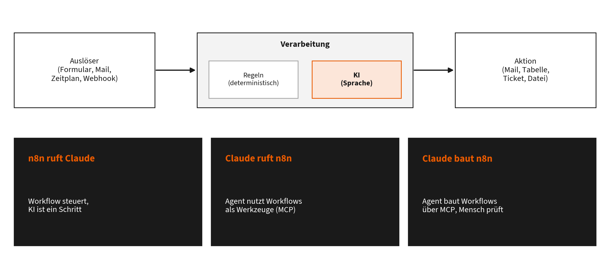
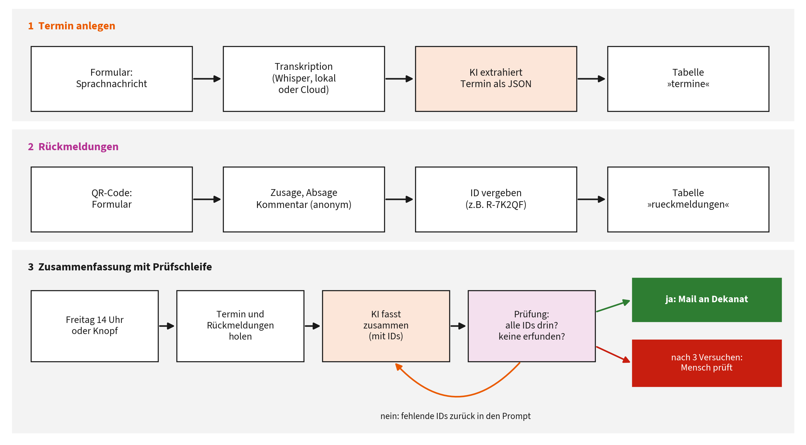

# Kapitel 4: Abläufe, die ohne Sie weiterlaufen

Dieses Kapitel gehört zu **Block 4** des Vortrags (Arts: Gestaltung von Abläufen). Es erklärt den durchgehenden Fall, den Sie seit Beginn des Vortrags mitgestalten.

**Lernziele:**

- Sie erkennen, welche Teile eines Ablaufs sich automatisieren lassen und wo KI hineingehört.
- Sie kennen drei Muster, Claude und n8n zu kombinieren, und ihre Stärken.
- Sie können den Dekanats-Workflow nachvollziehen, einrichten und anpassen, auch mit THKI statt Claude.

**Kernaussage:** Automatisierung besteht aus Auslöser, Verarbeitung und Aktion. KI übernimmt nur den Teil, der Sprache verstehen muss; alles andere bleibt deterministisch und damit prüfbar.

## 4.1 Das Grundmuster



Grundmuster der Automatisierung und drei Kombinationsmuster

Jeder automatisierte Ablauf hat drei Teile:

- **Auslöser:** Ein Formular wird abgeschickt, eine Mail kommt an, es ist Freitag 14 Uhr, ein anderes System meldet sich per Webhook.
- **Verarbeitung:** Daten werden geprüft, umgeformt, ergänzt. Hier liegen **Regeln** (deterministisch: gleiche Eingabe, gleiches Ergebnis) und gegebenenfalls ein **KI-Schritt** (probabilistisch: versteht Sprache, fasst zusammen, klassifiziert).
- **Aktion:** Eine Mail geht raus, eine Tabelle wird aktualisiert, ein Ticket entsteht.

Diese Aufteilung entspricht der Unterscheidung von Workflows und Agenten aus Kapitel 1.6: Bei einem Workflow legt der Mensch die Schritte fest, das Modell erledigt einzelne Schritte darin; für die meisten Verwaltungsaufgaben ist das die robustere Bauform [1].

> **Merksatz:** So viel wie möglich deterministisch, so wenig wie nötig KI. Die KI bekommt eine klar umrissene Teilaufgabe mit prüfbarem Ergebnis.

**Gute Kandidaten** kommen häufig vor, folgen einem erkennbaren Muster, haben klare Eingaben und ein prüfbares Ergebnis, und ein Fehler wird vor seiner Wirkung von einem Menschen gesehen. Kapitel 8 zeigt, wie Sie Kandidaten systematisch bewerten.

## 4.2 n8n in fünf Minuten

n8n ist eine Plattform für Workflow-Automatisierung mit grafischer Oberfläche, die sich selbst betreiben oder als Cloud-Dienst nutzen lässt [2]. Man verbindet **Knoten** (Nodes) zu einem Ablauf:

- **Trigger-Knoten** starten einen Workflow (Formular, Webhook, Zeitplan, Mail-Eingang).
- **Aktions-Knoten** sprechen Dienste an (HTTP-Anfrage, Mail, Datenbank, Tabellen, KI-Modelle).
- **Logik-Knoten** verzweigen und prüfen (If, Switch, Code).
- **Credentials** speichern Zugangsdaten getrennt vom Workflow; ein exportierter Workflow enthält keine Schlüssel.
- **Executions** protokollieren jeden Lauf mit Ein- und Ausgaben jedes Knotens; das ist die wichtigste Fehlersuche.
- **Data Tables** sind einfache Tabellen direkt in n8n. Der Knoten „Data Table“ kann Zeilen einfügen, lesen, ändern und löschen; eine Abfrage ohne Treffer liefert keine Ausgabe, was man beim Bauen berücksichtigen muss [3].

Für datenschutzsensible Abläufe ist der Eigenbetrieb, etwa per Docker auf einem Hochschulserver, die naheliegende Wahl.

## 4.3 Drei Muster, Claude und n8n zu kombinieren

| Muster | Wer steuert? | Beispiel | Stärke |
|----|----|----|----|
| **1. n8n ruft Claude** | der Workflow | Formular kommt an, das Modell extrahiert strukturierte Daten, n8n speichert und verschickt | vorhersagbar, prüfbar, günstig |
| **2. Claude ruft n8n** | der Agent | Claude Code nutzt einen Workflow als Werkzeug, etwa „Raum buchen“ oder „Termin eintragen“ | der Agent erhält freigegebene Aktionen statt freier Systemzugriffe |
| **3. Claude baut n8n** | der Mensch mit Claude als Werkzeugbauer | Claude Code erzeugt oder ändert Workflows, Sie prüfen und veröffentlichen | schneller Aufbau, Dokumentation inklusive |

**Muster 2 technisch:** Ein Workflow mit dem Knoten **MCP Server Trigger** stellt einen MCP-Server bereit; angehängte Workflow-Werkzeuge werden für den Client sichtbar. Der Knoten spricht Streamable HTTP und Server-Sent Events (kein stdio), hat eine Test- und eine Produktions-URL und lässt sich mit einer Authentifizierung absichern [4]. Alternativ bietet n8n einen **MCP-Zugang für die ganze Instanz**: eine Verbindung pro Instanz mit zentraler Anmeldung, bei der jeder Workflow einzeln freigegeben werden muss [5]. In Claude Code binden Sie den Server wie jeden entfernten MCP-Server an (Kapitel 2.8):

``` bash
claude mcp add --transport http n8n <server-url> --header "Authorization: Bearer <token>"
```

Muster 2 ist besonders elegant: Der Agent bekommt nicht Zugriff auf das Buchungssystem, sondern nur auf einen geprüften Workflow, der genau eine Sache kann. Das begrenzt Risiken und ist eine gute Brücke zu Kapitel 7.

**Muster 3 technisch:** Über den instanzweiten MCP-Zugang können Clients ab n8n 2.13 Workflows nicht nur ausführen, sondern auch bauen und bearbeiten. n8n empfiehlt dafür ausdrücklich Coding-Agenten wie Claude Code und stellt eigene Skills bereit, die dem Agenten die Konventionen von n8n beibringen [5], [6]. Eine verbreitete Community-Alternative ist der MCP-Server `n8n-mcp`, der die Dokumentation aller Knoten bereitstellt [7].

> **Achtung:** Alle verbundenen Clients sehen alle für MCP freigegebenen Workflows; die Freigabe lässt sich nicht pro Client einschränken [6]. Geben Sie nur frei, was ein Agent wirklich auslösen darf.

## 4.4 Fallstudie: Termine im Auftrag des Dekanats

**Ausgangslage:** Das Dekanat plant regelmäßig Termine. Einladungen entstehen per Mail, Rückmeldungen kommen verstreut zurück, und am Ende der Woche fasst jemand von Hand zusammen, wer zugesagt hat und welche Anmerkungen es gibt.

**Ziel:** Termin per Sprachnachricht anlegen, Rückmeldungen strukturiert sammeln, freitags automatisch eine geprüfte Zusammenfassung per Mail verschicken. Im Vortrag ist genau das der durchgehende Fall: Der Termin wurde zu Beginn eingesprochen, Ihre Rückmeldungen per QR-Code sind die Daten.



Der Dekanats-Workflow

### Die drei Teilabläufe

**Teil 1, Termin anlegen:** Formular mit Datei-Upload für eine Sprachnachricht (oder Texteingabe als Ausweichweg); Transkription über eine Whisper-Schnittstelle im OpenAI-Format, wahlweise in der Cloud oder auf einem eigenen Server; ein KI-Schritt extrahiert Titel, Datum, Uhrzeit, Ort, Teilnehmerkreis und Rückmeldefrist als JSON; ein Code-Knoten prüft das JSON und vergibt eine Termin-ID; Speichern in der Data Table `termine`.

**Teil 2, Rückmeldungen sammeln:** Formular per QR-Code mit Zusage, Absage, Vielleicht oder Feedback, einem Kommentarfeld und optionalem Namen; ein Code-Knoten ordnet die Rückmeldung dem aktuellen Termin zu und vergibt eine kurze ID wie `R-7K2QF`; Speichern in der Data Table `rueckmeldungen`.

**Teil 3, Wochenzusammenfassung mit Prüfschleife:** Auslöser ist ein Zeitplan (Freitag 14 Uhr) oder ein Formular „Jetzt zusammenfassen“. Der Workflow lädt Termin und Rückmeldungen, das Modell schreibt die Zusammenfassung und belegt **jede Rückmeldung mit ihrer ID**. Ein Code-Knoten prüft deterministisch: Fehlt eine ID oder taucht eine erfundene auf, geht der Workflow mit dem Hinweis auf die fehlenden IDs zurück zum KI-Schritt. Nach höchstens drei Versuchen geht entweder die Mail an das Dekanat oder eine Person bekommt die Bitte um Prüfung.

Dieser letzte Teil ist ein kleiner **Regelkreis**: Das Ergebnis wird gegen ein objektives Kriterium geprüft, die Abweichung steuert den nächsten Durchlauf. Anthropic beschreibt dieses Bauprinzip als Muster „Evaluator-Optimizer“ [1]; Kapitel 7 erklärt die Theorie dahinter.

### Datenmodell

| Tabelle `termine` | Tabelle `rueckmeldungen` |
|----|----|
| `termin_id`, `titel`, `datum` (JJJJ-MM-TT), `uhrzeit`, `ort` | `rueckmeldung_id`, `termin_id` |
| `teilnehmerkreis`, `rueckmeldung_bis`, `hinweise` | `antwort` (Zusage, Absage, Vielleicht, Feedback) |
| `transkript`, `erstellt_am` | `kommentar`, `name` (optional), `eingang` |

Alle Spalten sind vom Typ Text. Die vollständige Einrichtung beschreibt `n8n/README.md` im Handout-Repository.

### Die Prompts

**Termin extrahieren** (Systemanweisung):

```
Du extrahierst Termindaten aus einer gesprochenen Nachricht eines Dekanats.
Antworte ausschließlich mit einem JSON-Objekt ohne weiteren Text:
{"titel": "", "datum": "JJJJ-MM-TT", "uhrzeit": "HH:MM", "ort": "",
 "teilnehmerkreis": "", "rueckmeldung_bis": "JJJJ-MM-TT", "hinweise": ""}
Regeln:
- Relative Angaben ("nächsten Donnerstag") rechnest du vom heutigen Datum aus um.
- Unbekannte Felder bleiben leere Zeichenketten. Erfinde nichts.
- Keine Namen von Einzelpersonen in "teilnehmerkreis", nur Gruppen.
```

**Zusammenfassen** (Systemanweisung):

```
Du fasst Rückmeldungen zu einem Termin für das Dekanat zusammen.
Pflicht: Jede Rückmeldung wird mindestens einmal mit ihrer ID in eckigen
Klammern belegt, z.B. [R-7K2QF]. Erfinde keine IDs.
Aufbau als HTML: <h3>Überblick</h3> mit Zahlen zu Zusagen, Absagen,
Vielleicht und Feedback; <h3>Anmerkungen</h3> thematisch gruppiert;
<h3>Offene Punkte</h3> mit Handlungsbedarf.
Sachlich, höchstens 250 Wörter, keine Wertungen über Personen, keine Namen.
```

### Warum die IDs so wichtig sind

Ohne IDs könnte nur ein Mensch oder ein zweites Modell beurteilen, ob die Zusammenfassung vollständig ist. Mit IDs wird Vollständigkeit **maschinell prüfbar**: Die Prüfung ist ein paar Zeilen Code, kostet nichts und irrt nicht. Ein weiches Qualitätskriterium in ein hartes, prüfbares zu übersetzen, ist der wichtigste Trick beim Einsatz von KI in Abläufen.

### Datenschutz im Beispiel

- Rückmeldungen im Vortrag sind anonym; das Namensfeld ist optional und geht nicht an das Modell, nur Antwort und Kommentar.
- Die Transkription kann lokal laufen (Whisper auf eigener Hardware); dann verlassen Sprachaufnahmen den eigenen Rechner nicht.
- Für den Echtbetrieb mit Namen gilt die Ampel aus Kapitel 1.12: Verarbeitung nur mit vertraglicher Grundlage oder auf freigegebenen Systemen wie THKI, und nach der Handreichung der TH Köln ohne personenbezogene Daten [8].

### Kosten

Eine Zusammenfassung von 30 Rückmeldungen umfasst grob einige tausend Token Eingabe und wenige hundert Token Ausgabe; über die API sind das in der Regel Bruchteile eines Euros pro Lauf. Der eigentliche Aufwand liegt im Aufbau und in der Pflege, nicht im Betrieb.

## 4.5 Modellwechsel: Claude oder THKI

Der Workflow spricht die KI über das verbreitete **OpenAI-kompatible Chat-Completions-Format** an. Damit genügen drei Angaben für einen Anbieterwechsel:

| Einstellung | Claude | THKI bzw. KI:connect.nrw |
|----|----|----|
| Basis-URL | in der Zugangsdatei des KI-Knotens | laut THKI-Oberfläche; bei KI:connect `https://chat.kiconnect.nrw/api/v1` |
| Modell | im Knoten `Konfiguration`, Feld `llm_model` | laut Modellliste, z.B. `inferenz-mistral-small-4-119b` |
| Schlüssel | Anthropic-API-Schlüssel | in der Oberfläche selbst erzeugt |

Der Workflow nutzt den KI-Knoten von n8n statt eines selbst gebauten HTTP-Aufrufs. Das hat zwei Vorteile: Der Schlüssel liegt als richtige Zugangsdatei in n8n und nicht im Ablauf, und die Basis-Adresse steht ebenfalls dort. Ein Anbieterwechsel ist damit eine Einstellung, kein Umbau. KI:connect bietet eine OpenAI-kompatible Schnittstelle, deren Schlüssel man selbst in der Oberfläche erzeugt [9]; die Modellnamen des Landesprojekts Inferenz NRW lauten etwa `inferenz-gpt-oss-120b` und `inferenz-mistral-small-4-119b` (Stand 30. Juni 2026, am Beispiel der FernUniversität) [10], [11]. Welche Modelle an der TH Köln freigeschaltet sind, zeigt THKI selbst.

Für die Lehre ist der einheitliche Weg didaktisch wertvoll: Er zeigt, dass der Ablauf wichtiger ist als das einzelne Modell, und er erlaubt, denselben Workflow datenschutzfreundlich auf NRW-Infrastruktur zu betreiben.

## 4.6 Eine Sandbox für Experimente

Wer Claude Code über MCP Workflows bauen und ausführen lässt (Muster 3), sollte das zuerst in einer **Sandbox** tun: einer eigenen, abgeschotteten n8n-Instanz, in der alles erlaubt ist, weil nichts Echtes passieren kann. Die Sicherheit kommt dann aus der Umgebung, nicht aus dem Vertrauen in das Modell (vgl. Kapitel 2.9).

| Schicht | Umsetzung |
|----|----|
| Eigene Instanz | eigener Container, eigene Datenbank, eigener Verschlüsselungsschlüssel, getrennt von der Produktivinstanz |
| Keine echten Zugangsdaten | Testschlüssel mit Ausgabenlimit; Mails gehen an einen Test-Mailserver wie Mailpit |
| Kein Zugriff aufs eigene Netz | SSRF-Schutz sperrt private Adressen, localhost und Cloud-Metadaten; dazu ein getrenntes Netz |
| Riskante Knoten gesperrt | Befehle ausführen, Dateizugriff, SSH |
| Wegwerfbar | Instanz samt Daten löschen und neu starten |
| Getrennte Rechte in Claude Code | Sandbox-MCP ohne Rückfrage, Produktiv-MCP nur mit Rückfrage |

n8n liefert dafür die Bausteine: Seit Version 2.0 sind die Knoten zum Ausführen von Befehlen und zum Überwachen lokaler Dateien standardmäßig gesperrt, Code-Knoten laufen in isolierten Task-Runnern und dürfen keine Umgebungsvariablen lesen [12]. Weitere Knoten sperrt die Variable `NODES_EXCLUDE` [13]; ein eigener Wert ersetzt allerdings die Standardliste, die gesperrten Standardknoten müssen also wieder mit hinein [14]. Der SSRF-Schutz (ab Version 2.12, `N8N_SSRF_PROTECTION_ENABLED=true`) verhindert, dass Workflows interne Adressen erreichen; n8n versteht ihn ausdrücklich als zusätzliche Schicht zu Firewall und Netztrennung [15]. Warum das wichtig ist, zeigt eine Analyse von Compass Security: Wer Workflows bauen darf, kann über Knoten wie SSH oder Datenbanken Netzsegmentierung umgehen, nicht durch eine Lücke, sondern bestimmungsgemäß [14].

Eine fertige Vorlage mit Docker Compose, Test-Mailserver und Berechtigungsdatei für Claude Code liegt unter `n8n/sandbox/`. In Claude Code lassen sich Sandbox und Produktivinstanz als zwei getrennte MCP-Server anbinden; die Berechtigungsregeln erlauben den einen ohne Rückfrage und verlangen beim anderen eine Freigabe (Kapitel 2.9).

**Zwei Dienste als Beispiel.** Die Sandbox bringt neben n8n und dem Mailfänger zwei kleine Dienste mit: Gotenberg macht aus HTML oder Office-Dateien PDFs, ein eigener QR-Dienst liefert QR-Codes als Bild. Der Workflow `n8n/dekanat-serienbrief.json` zeigt damit Muster 1 in Reinform: n8n holt je Empfänger einen QR-Code, baut den Brief als HTML, lässt Gotenberg das PDF rendern und verschickt es mit Anhang. Alles bleibt im Netz der Sandbox. Dasselbe Muster trägt Bescheide, Einladungen und Berichte; für Excel-Listen genügt der Knoten *Extract from File* statt der Beispieldaten.

## 4.7 Übung

1.  Importieren Sie `n8n/dekanat-live-klammer.json` in eine eigene n8n-Instanz und folgen Sie `n8n/README.md`.
2.  Legen Sie per Texteingabe einen Termin an, geben Sie drei Rückmeldungen ab, lösen Sie die Zusammenfassung aus.
3.  Ändern Sie den Zusammenfassungs-Prompt absichtlich so, dass die IDs fehlen, und beobachten Sie in den Executions, wie die Prüfschleife reagiert.
4.  Für Fortgeschrittene: Stellen Sie einen einfachen Workflow über den MCP Server Trigger bereit und rufen Sie ihn aus Claude Code auf (Muster 2).

## Quellen

[1] E. Schluntz und B. Zhang, „Building effective agents“, Anthropic Research. Zugegriffen: 11. September 2026. [Online]. Verfügbar unter: <https://www.anthropic.com/research/building-effective-agents>

[2] n8n, „n8n Documentation“, n8n Docs. Zugegriffen: 11. September 2026. [Online]. Verfügbar unter: <https://docs.n8n.io>

[3] n8n, „Data Table node: Row operations“, n8n Docs. Zugegriffen: 11. September 2026. [Online]. Verfügbar unter: <https://docs.n8n.io/integrations/builtin/core-nodes/n8n-nodes-base.datatable/rows>

[4] n8n, „MCP Server Trigger“, n8n Docs. Zugegriffen: 11. September 2026. [Online]. Verfügbar unter: <https://docs.n8n.io/integrations/builtin/core-nodes/n8n-nodes-langchain.mcptrigger>

[5] n8n, „Set up and use n8n MCP server“, n8n Docs. Zugegriffen: 11. September 2026. [Online]. Verfügbar unter: <https://docs.n8n.io/advanced-ai/mcp/accessing-n8n-mcp-server/>

[6] n8n, „Connect to n8n MCP server“, n8n Docs. Zugegriffen: 11. September 2026. [Online]. Verfügbar unter: <https://docs.n8n.io/connect/connect-to-n8n-mcp-server>

[7] R. Czlonkowski, „n8n-mcp: MCP server for building n8n workflows“, GitHub. Zugegriffen: 11. September 2026. [Online]. Verfügbar unter: <https://github.com/czlonkowski/n8n-mcp>

[8] TH Köln, „Handreichung für Lehrende zum Umgang mit THKI Chat“, TH Köln, Version 07, Sep. 2025. Zugegriffen: 11. September 2026. [Online]. Verfügbar unter: <https://lehrpfade.th-koeln.de/thki-chat/>

[9] RWTH Aachen, IT Center, „KI:connect“, IT Center der RWTH Aachen. Zugegriffen: 11. September 2026. [Online]. Verfügbar unter: <https://www.itc.rwth-aachen.de/cms/it-center/services/kollaboration/~bndnjc/ki-connect/>

[10] FernUniversität in Hagen, ZLI, „KI:connect.nrw“, FernUniversität in Hagen. Zugegriffen: 11. September 2026. [Online]. Verfügbar unter: <https://www.fernuni-hagen.de/zli/produkte/weitere-tools/ki-connect-nrw.shtml>

[11] TU Dortmund, ITMC, „„Inferenz NRW“ ist gestartet: Souveräne KI-Modelle für die Hochschulen in Nordrhein-Westfalen“. April 2026. Zugegriffen: 11. September 2026. [Online]. Verfügbar unter: <https://itmc.tu-dortmund.de/storages/itmc/Bilder/News/2026/Info-Inferenz-NRW-Start.pdf>

[12] n8n, „v2.0 Breaking changes“, n8n Docs. Zugegriffen: 11. September 2026. [Online]. Verfügbar unter: <https://docs.n8n.io/2-0-breaking-changes/>

[13] n8n, „Block specific nodes“, n8n Docs. Zugegriffen: 11. September 2026. [Online]. Verfügbar unter: <https://docs.n8n.io/deploy/host-n8n/configure-n8n/security/block-specific-nodes>

[14] Compass Security, „The Hidden Privilege of Automation Platforms“, Compass Security Blog. Zugegriffen: 11. September 2026. [Online]. Verfügbar unter: <https://blog.compass-security.com/2026/07/the-hidden-privilege-of-automation-platforms/>

[15] n8n, „Enable SSRF protection“, n8n Docs. Zugegriffen: 11. September 2026. [Online]. Verfügbar unter: <https://docs.n8n.io/deploy/host-n8n/configure-n8n/security/enable-ssrf-protection>
