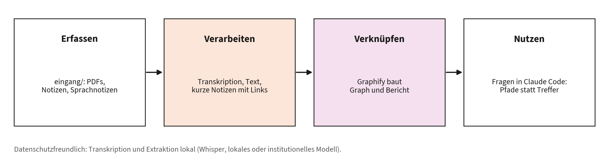
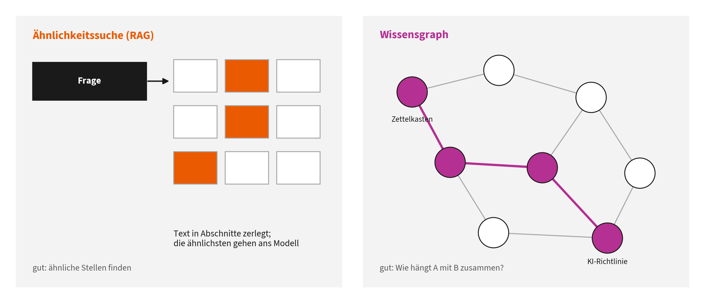

# Kapitel 5: Wie Ihr Wissen zur KI kommt

Dieses Kapitel gehört zu **Block 5** des Vortrags (Sciences: Wissen und Theorie).

**Lernziele:**

- Sie verstehen die Idee eines „Second Brain“ und ihre Wurzeln.
- Sie kennen den Unterschied zwischen Ähnlichkeitssuche und Wissensgraph.
- Sie können einschätzen, wann Graphify und wann Graft das passende Werkzeug ist, und beide an einem Demo-Korpus ausprobieren.

**Kernaussage:** Wissen wird erst nutzbar, wenn es verknüpft ist. Graphify baut eine Wissenslandkarte zum Anschauen und Teilen, Graft ein Navigationssystem, das im Hintergrund mitläuft.

## 5.1 Die Idee: vom Zettelkasten zum Second Brain

Die Idee ist älter als jede Software. Der Bielefelder Soziologe **Niklas Luhmann** führte über Jahrzehnte einen Zettelkasten mit rund 90.000 Notizen [1]. Sein Prinzip: kurze Notizen mit je einem Gedanken, eine feste Adresse für jede Notiz und vor allem **Verweise zwischen den Notizen**. Luhmann beschrieb den Kasten als Kommunikationspartner, weil die Verweise Zusammenhänge sichtbar machten, die er beim Schreiben einzelner Notizen nicht geplant hatte [2].

**Tiago Forte** hat das Prinzip als „Building a Second Brain“ für die digitale Wissensarbeit popularisiert: Informationen **erfassen** (Capture), **ordnen** (Organize), **verdichten** (Distill) und **nutzen** (Express), kurz CODE [3].

Sprachmodelle verändern diese Praxis in zwei Richtungen: Sie nehmen die mühsame Arbeit des Verdichtens und Verknüpfens ab, und sie können ein verknüpftes Wissensnetz selbst befragen. Genau hier setzen Werkzeuge wie Graphify an.



Eine persönliche Wissenspipeline

## 5.2 Ähnlichkeitssuche oder Wissensgraph?



Ähnlichkeitssuche und Wissensgraph im Vergleich

|  | Ähnlichkeitssuche (klassisches RAG) | Wissensgraph |
|----|----|----|
| Prinzip | Texte in Abschnitte teilen, als Vektoren speichern, die ähnlichsten Abschnitte zur Frage heraussuchen | Begriffe als Knoten, Beziehungen als Kanten; das Modell folgt Verbindungen |
| Stärke | findet inhaltlich ähnliche Stellen, auch bei anderer Wortwahl | beantwortet „Wie hängt A mit B zusammen?“, zeigt Struktur und Themengruppen |
| Schwäche | Zusammenhänge über viele Dokumente gehen verloren | Aufbau aufwendiger; die Qualität hängt an der Extraktion |
| Nachvollziehbarkeit | „diese fünf Abschnitte waren ähnlich“ | „dieser Pfad verbindet die Begriffe“ |

Retrieval-Augmented Generation (RAG) wurde von Lewis et al. eingeführt: Ein Modell bekommt zur Frage passende Textstellen aus einer Wissensbasis und stützt seine Antwort darauf [4]. Microsoft Research hat mit **GraphRAG** gezeigt, dass Wissensgraphen mit zusammengefassten Themengruppen („Communities“) Fragen über ganze Dokumentsammlungen besser beantworten als reine Ähnlichkeitssuche [5]. Hinzu kommt ein praktischer Befund aus Kapitel 1.5: Mehr Text im Kontext ist nicht automatisch besser [6]. Ein Graph hilft, gezielt das Relevante zu laden.

## 5.3 Graphify

**Was es ist:** ein quelloffenes Werkzeug, das als Skill in Claude Code und weiteren KI-Assistenten läuft. Mit `/graphify` verwandelt es einen Ordner mit Code, Dokumenten, PDFs, Bildern oder Medien in einen abfragbaren Wissensgraphen [7].

**Wie es funktioniert** [7]:

1.  **Code** wird lokal mit tree-sitter analysiert: deterministisch, ohne KI, nichts verlässt den Rechner.
2.  **Dokumente, PDFs und Bilder** liest in einem semantischen Durchgang das Modell Ihrer Claude-Code-Sitzung; Begriffe und Beziehungen werden extrahiert. Markdown-Links und `[[Wikilinks]]` werden zu Verweiskanten.
3.  **Clustering:** Der Graph wird in Themengruppen zerlegt.
4.  **Kennzeichnung:** Jede Kante trägt eine Herkunft, etwa `EXTRACTED` (steht explizit in der Quelle) oder `INFERRED` (erschlossen). So sehen Sie, was gelesen und was vermutet wurde.

**Installation und Nutzung** (Python 3.10 oder neuer) [7]:

``` bash
uv tool install graphifyy     # Paketname mit doppeltem y; Alternative: pipx install graphifyy
graphify install              # registriert den Skill in Claude Code
```

Danach in Claude Code:

```
/graphify ./unterlagen                 Graph für einen Ordner bauen
/graphify ./unterlagen --update        nur geänderte Dateien neu einlesen
/graphify query "Welche Unterlagen betreffen die KI-Richtlinie?"
/graphify path "Zettelkasten" "KI-Richtlinie"
/graphify explain "Wissensgraph"
```

**Ergebnis** im Ordner `graphify-out/`: `graph.html` (interaktive Darstellung im Browser), `GRAPH_REPORT.md` (zentrale Begriffe, überraschende Verbindungen, vorgeschlagene Fragen) und `graph.json` (der vollständige Graph, abfragbar ohne erneutes Lesen der Rohdateien) [7].

**Für Teams** ist `graphify-out/` zum Einchecken ins Git gedacht; mit `graphify hook install` wird der Graph bei Commits aktualisiert, und über einen MCP-Server kann ein ganzes Team denselben Graphen abfragen (Kapitel 6) [7].

**Datenschutz:** Code bleibt lokal. Dokumente und Bilder gehen an das Modell Ihrer Sitzung. Wer das vermeiden muss, kann die Extraktion mit einem lokalen Modell oder einem OpenAI-kompatiblen Anbieter wie KI:connect ausführen [7], [8].

## 5.4 Graft

**Was es ist:** ein quelloffenes Werkzeug, das eine **Kontextschicht für große Codebasen** baut und sich tief in Claude Code einklinkt [9].

**Wie es funktioniert** [9]:

1.  Graft analysiert den Code strukturell mit tree-sitter und legt optional mit einem Modell Ihrer Wahl Zusammenfassungen je Teilsystem an.
2.  Das Ergebnis ist ein Ordner `graft/` mit **verlinkten Markdown-Dateien**, ein Knoten je System, Schnittstelle oder Konzept.
3.  Über Hooks zieht Graft zu **jedem Prompt automatisch die passenden Knoten** in den Kontext, zeigt beim Bearbeiten, was von einer Datei abhängt, und aktualisiert den Graphen im Hintergrund.
4.  Der Graph ist ein lokaler Zwischenspeicher, der nicht eingecheckt wird; geteilt wird nur die Verdrahtung in `.claude/`.

**Installation und Nutzung** (Node.js) [9]:

``` bash
npm install -g @nanonets/graft   # einmalig
graft init                       # Graph bauen und in Claude Code verdrahten
graft viz                        # interaktive Ansicht im Browser
graft ask "Wo werden Namen anonymisiert?"
graft build --deep               # zusätzlich KI-Zusammenfassungen (eigener API-Schlüssel)
```

Graft sendet anonyme Nutzungsstatistiken, die sich abschalten lassen (`graft telemetry disable` oder `DO_NOT_TRACK=1`). Die vom Projekt berichteten Einsparungen bei Token und Laufzeit sind Herstellerangaben; für eine wissenschaftliche Bewertung fehlt eine unabhängige Replikation [9].

## 5.5 Vergleich und Entscheidungshilfe

| Kriterium | Graphify | Graft |
|----|----|----|
| Bild | Landkarte, die man aufschlägt und teilt | Navi, das im Hintergrund mitläuft |
| Material | Code, Texte, PDFs, Bilder, Medien | nur Code |
| Nutzung | auf Anfrage (`/graphify`, `query`, `path`, `explain`) | automatisch bei jedem Prompt |
| Teilen im Team | Graph wird eingecheckt | Graph bleibt lokal, Verdrahtung wird eingecheckt |
| Installation | Python | Node.js |
| Stärkster Einsatz | Second Brain, Literatur, Lehrmaterial | Arbeit an großen Software-Projekten |

Die Gegenüberstellung stützt sich auf die Dokumentation beider Projekte [7], [9]. **Faustregel:** Wer mit Papern, Unterlagen und Notizen arbeitet, beginnt mit Graphify. Wer an größerer Forschungssoftware entwickelt, profitiert zusätzlich von Graft.

## 5.6 Beispiel: eine persönliche Wissenspipeline

1.  **Erfassen:** Ein Ordner `eingang/` sammelt Rohmaterial: PDFs, Mitschriften, Sprachnotizen, Links.
2.  **Verarbeiten:** Ein Workflow (n8n oder ein Claude-Code-Skill) transkribiert Audio, extrahiert Text und legt pro Quelle eine kurze Notiz mit Kernaussagen und Verweisen an.
3.  **Verknüpfen:** Graphify baut aus dem Notizordner Graph und Bericht.
4.  **Nutzen:** Sie fragen in Claude Code: „Was habe ich zu Prüfungsformaten mit KI gesammelt, und wo widersprechen sich Quellen?“

Datenschutzfreundlich wird die Pipeline, wenn Transkription und Extraktion lokal laufen, etwa mit Whisper auf dem eigenen Rechner und einem lokalen oder institutionellen Modell.

## 5.7 Übung

Im Handout-Repository liegt unter `second-brain-demo/unterlagen/` ein kleiner, fiktiver Korpus aus Vorlesungsnotizen, Paper-Exzerpten, einem Gremienprotokoll und einem Richtlinienentwurf, verknüpft mit Wikilinks. `second-brain-demo/README.md` führt durch Graphify; unter `second-brain-demo/code-beispiel/` liegt ein kleines Python-Projekt zum Ausprobieren von Graft.

## Quellen

[1] Niklas Luhmann-Archiv, „Zettelkasten“, Universität Bielefeld. Zugegriffen: 11. September 2026. [Online]. Verfügbar unter: <https://niklas-luhmann-archiv.de/nachlass/zettelkasten>

[2] N. Luhmann, „Kommunikation mit Zettelkästen. Ein Erfahrungsbericht“, in *Öffentliche Meinung und sozialer Wandel*, H. Baier, H. M. Kepplinger, und K. Reumann, Hrsg., Opladen: Westdeutscher Verlag, 1981, S. 222-228.

[3] T. Forte, *Building a Second Brain*. New York: Atria Books, 2022.

[4] P. Lewis *u. a.*, „Retrieval-Augmented Generation for Knowledge-Intensive NLP Tasks“, in *Advances in Neural Information Processing Systems 33 (NeurIPS 2020)*, 2020, S. 9459-9474. Verfügbar unter: <https://arxiv.org/abs/2005.11401>

[5] D. Edge *u. a.*, „From Local to Global: A Graph RAG Approach to Query-Focused Summarization“, 2024, 2404.16130. Verfügbar unter: <https://arxiv.org/abs/2404.16130>

[6] N. F. Liu *u. a.*, „Lost in the Middle: How Language Models Use Long Contexts“, *Transactions of the Association for Computational Linguistics*, Bd. 12, S. 157-173, 2024, doi: [10.1162/tacl_a_00638](https://doi.org/10.1162/tacl_a_00638).

[7] Graphify Labs, *graphify: Turn any folder into a queryable knowledge graph*. Zugegriffen: 11. September 2026. [Online]. Verfügbar unter: <https://github.com/Graphify-Labs/graphify>

[8] RWTH Aachen, IT Center, „KI:connect“, IT Center der RWTH Aachen. Zugegriffen: 11. September 2026. [Online]. Verfügbar unter: <https://www.itc.rwth-aachen.de/cms/it-center/services/kollaboration/~bndnjc/ki-connect/>

[9] trailhq, *Graft: Context layer for large codebases*. Zugegriffen: 11. September 2026. [Online]. Verfügbar unter: <https://github.com/trailhq/Graft>
