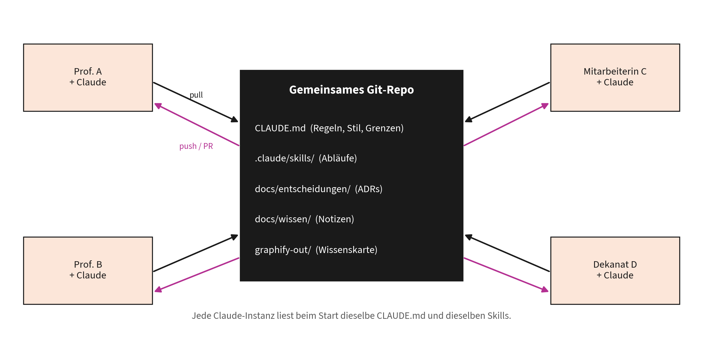
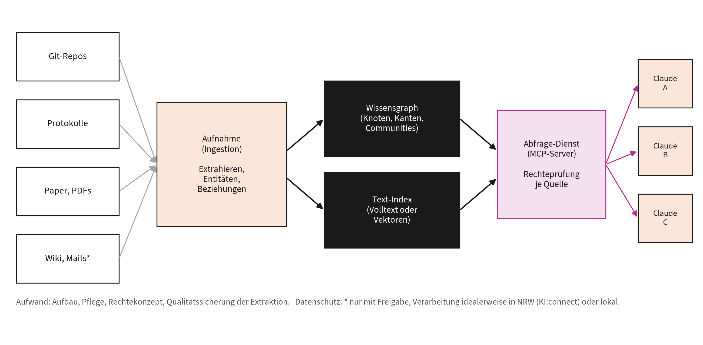

# Kapitel 6: Zusammenarbeit über mehrere Claude-Instanzen

Dieses Kapitel gehört zu **Block 6** des Vortrags (Sciences: Wissen und Theorie).

**Lernziele:**

- Sie können ein gemeinsames Repository so aufsetzen, dass mehrere Personen mit ihren Claude-Instanzen konsistent zusammenarbeiten.
- Sie kennen die Stufen parallelen Arbeitens (Unteragenten, parallele Sitzungen, Agent Teams, GitHub-App) und wann sie sich lohnen.
- Sie können Aufwand, Grenzen und Datenschutz eines gemeinsamen Wissensgraphen (GraphRAG) realistisch einschätzen.

**Kernaussage:** Mehrere Claudes arbeiten gut zusammen, wenn sie denselben Kontext teilen: heute über ein Git-Repository, künftig über einen gemeinsamen Wissensgraphen.

## 6.1 Das Problem: Jede Instanz startet bei null

Wenn fünf Kolleginnen und Kollegen mit fünf Claude-Instanzen am selben Forschungsprojekt arbeiten, weiß keine Instanz, was die anderen gelernt, entschieden oder verworfen haben. Jede Sitzung beginnt mit leerem Kontextfenster (Kapitel 1.1). Ohne gemeinsamen Kontext entstehen widersprüchliche Texte, doppelte Arbeit und wiederholte Diskussionen. Die Lösung ist nicht, die Instanzen miteinander reden zu lassen, sondern ihnen **dieselbe Wissensbasis** zu geben.

## 6.2 Weg 1: Das gemeinsame Repository als Gedächtnis



Zusammenarbeit über ein gemeinsames Git-Repository

Ein Git-Repository ist für Claude Code das natürliche gemeinsame Gedächtnis: Jede Instanz liest beim Start die Projekt-`CLAUDE.md`, kennt die Projekt-Skills und Unteragenten, und Hooks in der Projektdatei `.claude/settings.json` gelten für alle, die das Repository nutzen [1], [2], [3], [4].

**Empfohlene Struktur** (Vorlage unter `zusammenarbeit/team-repo-vorlage/`):

```
projekt/
├── CLAUDE.md                     gemeinsame Regeln, Stil, Grenzen
├── CONTRIBUTING.md               wie Menschen und Claudes hier arbeiten
├── .claude/skills/               gemeinsame Abläufe, z.B. "entscheidung-dokumentieren"
├── .claude/settings.json         gemeinsame Leitplanken
├── docs/
│   ├── entscheidungen/           Architecture Decision Records (ADRs)
│   ├── wissen/                   Notizen, Glossar, Quellen
│   └── status.md                 aktueller Stand, offene Fragen
└── graphify-out/                 Wissenslandkarte (optional, siehe 6.5)
```

**Was in die gemeinsame CLAUDE.md gehört:** Ziel des Projekts in zwei Sätzen, Begriffsdefinitionen, Stil- und Zitierregeln, Datenschutzgrenzen, wo Entscheidungen dokumentiert werden und welche Befehle Ergebnisse prüfen.

**Entscheidungen festhalten:** Ein Architecture Decision Record ist eine kurze Datei pro Entscheidung mit Kontext, Entscheidung und Konsequenzen [5]. ADRs verhindern, dass eine Claude-Instanz eine längst getroffene Entscheidung erneut infrage stellt; ein Projekt-Skill standardisiert das Anlegen.

**Arbeitsablauf:**

1.  Vor der Arbeit `git pull`, damit Ihre Instanz den aktuellen Stand kennt.
2.  Arbeit auf einem eigenen Zweig; Claude Desktop legt ohnehin pro Sitzung eine isolierte Arbeitskopie an [6].
3.  Ergebnisse als Pull Request einreichen; eine zweite Person oder eine zweite Claude-Instanz prüft.
4.  Neue Erkenntnisse gehören in `docs/`, neue Regeln in die `CLAUDE.md`, wiederkehrende Abläufe in einen Skill, harte Grenzen in eine Leitplanke (Kapitel 2.9).

> **Achtung:** Keine Zugangsdaten, keine personenbezogenen Daten und keine vertraulichen Forschungsdaten ins Repository. Für ein öffentliches Repository gilt das doppelt.

## 6.3 Parallel arbeiten: Unteragenten, Worktrees, Agent Teams

| Stufe | Was passiert | Wann sinnvoll | Worauf achten |
|----|----|----|----|
| **Unteragenten** | Claude delegiert Teilaufgaben innerhalb einer Sitzung an Spezialisten mit eigenem Kontext | viel Ausgabe oder spezielle Rollen, etwa Quellenprüfung | nur die Zusammenfassung kommt zurück |
| **Parallele Sitzungen** | mehrere Sitzungen am selben Repository, jede in eigener Arbeitskopie (Git Worktree) | unabhängige Aufgaben gleichzeitig | eigene Kosten je Sitzung; Ergebnisse zusammenführen |
| **Agent Teams** | mehrere Claude-Instanzen koordinieren sich über getrennte Sitzungen | große, gut zerlegbare Vorhaben | nur CLI, experimentell, deutlich höherer Tokenverbrauch |

Unteragenten arbeiten innerhalb einer Sitzung, Agent Teams über getrennte Sitzungen hinweg [3], [7]. Parallele Sitzungen isoliert Claude Desktop automatisch in eigenen Worktrees, die CLI mit der Option `--worktree` [6]. Für Agent Teams nennt die Dokumentation einen rund siebenfachen Tokenverbrauch, wenn Teammitglieder im Plan-Modus arbeiten [8].

**Urteilsregel:** Parallelisieren Sie nur, was unabhängig ist, und nur so weit, wie Sie die Ergebnisse noch prüfen können. Der Engpass ist fast immer die Prüfung, nicht die Rechenleistung.

## 6.4 Claude im Team-Workflow: die GitHub-App

Mit `/install-github-app` wird die Claude-GitHub-App eingerichtet. Danach reagiert Claude auf `@claude` in Issues und Pull Requests, analysiert Code, erstellt Pull Requests und beachtet dabei die `CLAUDE.md` des Repositorys; die Arbeit läuft über GitHub Actions auf den Runnern von GitHub [9]. Für Lehrprojekte mit studentischen Teams ist das eine elegante Form der Zusammenarbeit: Studierende öffnen Issues, Claude schlägt Umsetzungen vor, Menschen prüfen und entscheiden im Pull Request.

## 6.5 Zwischenstufe: die Wissenslandkarte im Repository

Graphify (Kapitel 5) ist die pragmatische Brücke zu einem gemeinsamen Graphen [10]:

- `graphify-out/` wird mit eingecheckt; wer das Repository klont, hat sofort die Landkarte.
- `graphify hook install` aktualisiert den Graphen bei Commits automatisch.
- `graphify claude install` weist Claude Code an, vor dem Durchsuchen von Dateien zuerst den Graphen zu befragen.
- Für Teams lässt sich der Graph als MCP-Server über HTTP bereitstellen; alle Claude-Instanzen fragen dann denselben Dienst ab.

Das deckt einen großen Teil der GraphRAG-Idee ab, mit wenig Aufwand und ohne neue Infrastruktur.

## 6.6 Weg 2: GraphRAG als gemeinsame Wissensbasis

Die weitergehende Idee: **alle relevanten Quellen** eines Instituts oder Projekts (Repositorys, Protokolle, Paper, Wiki-Seiten, freigegebene Mails) fließen in einen gemeinsamen Wissensgraphen, den alle Claude-Instanzen über eine definierte Schnittstelle befragen. Grundlage ist das GraphRAG-Verfahren, das Wissensgraphen mit zusammengefassten Themengruppen für Fragen über ganze Sammlungen nutzt [11].



Gemeinsamer Wissensgraph (GraphRAG)

**Bausteine:** Aufnahme (Quellen einlesen, Begriffe und Beziehungen extrahieren), Speicher (Graph und Textindex), Abfrage-Dienst als MCP-Server mit **Rechteprüfung** je Quelle (Kapitel 2.8) und Pflege (Aktualisierung, Qualitätskontrolle, Löschkonzept) [11], [12].

| Stufe | Aufwand | Ergebnis |
|----|----|----|
| Graphify im Repository | Stunden | gemeinsame Landkarte für ein Projekt |
| Graphify als Team-MCP-Server | ein bis zwei Tage | gemeinsamer Abfragedienst für ein Projekt |
| GraphRAG über mehrere Quellen | Wochen bis Monate, plus laufende Pflege | institutsweite Wissensbasis mit Rechtekonzept |

Die Aufwandsangaben sind Erfahrungswerte aus Automatisierungsprojekten, keine Messwerte.

**Grenzen:**

- **Extraktionsqualität:** Ein Modell kann Beziehungen falsch erschließen; ohne Kennzeichnung wie `EXTRACTED` oder `INFERRED` sind solche Fehler schwer zu erkennen [10].
- **Aktualität:** Ohne automatische Aktualisierung beantwortet ein Graph Fragen zum Stand von gestern.
- **Rechte:** Ein gemeinsamer Graph kann Wissen aus Quellen verknüpfen, die nicht jede Person sehen darf. Rechte müssen pro Quelle und Abfrage geprüft werden.
- **Kosten:** Extraktion und Aktualisierung großer Textmengen kosten Rechenzeit oder API-Guthaben.

**Datenschutz:** Die Ampel aus Kapitel 1.12 gilt pro Quelle; Protokolle und Mails enthalten fast immer personenbezogene Daten. Nach der Handreichung der TH Köln gehören solche Daten in kein KI-System [13]. Eine Hochschullösung braucht deshalb institutionelle Infrastruktur (etwa KI:connect oder lokal betriebene Modelle), einen dokumentierten Zweck, ein Rechte- und ein Löschkonzept. Ohne diese Grundlagen ist ein institutsweiter Graph kein Technik-, sondern ein Governance-Projekt.

## 6.7 Entscheidungsmatrix

| Frage | Weg 1: Repository | Zwischenstufe: Graph im Repository | Weg 2: GraphRAG |
|----|----|----|----|
| Quellen | ein Projekt | ein Projekt | viele Quellen |
| Aufwand | gering | gering | hoch |
| Infrastruktur | Git | Git, Python | Server, Datenbank, Rechte |
| Datenschutz | einfach | einfach | anspruchsvoll |
| Empfehlung | sofort starten | wenn das Repository wächst | als Pilot mit klarer Frage |

> **Merksatz:** Beginnen Sie mit Weg 1, ergänzen Sie die Landkarte, und bauen Sie GraphRAG erst, wenn Sie eine konkrete Frage haben, die nur viele Quellen gemeinsam beantworten können.

## 6.8 Übung

Kopieren Sie `zusammenarbeit/team-repo-vorlage/` in ein neues Repository, passen Sie die `CLAUDE.md` an ein eigenes Projekt an und lassen Sie Claude mit dem Skill `entscheidung-dokumentieren` einen ersten ADR anlegen (Aufgabenkarte `diy/09_team-repo.md`).

## Quellen

[1] Anthropic, „How Claude remembers your project“, Claude Code Docs. Zugegriffen: 11. September 2026. [Online]. Verfügbar unter: <https://code.claude.com/docs/en/memory>

[2] Anthropic, „Extend Claude with skills“, Claude Code Docs. Zugegriffen: 11. September 2026. [Online]. Verfügbar unter: <https://code.claude.com/docs/en/skills>

[3] Anthropic, „Create custom subagents“, Claude Code Docs. Zugegriffen: 11. September 2026. [Online]. Verfügbar unter: <https://code.claude.com/docs/en/sub-agents>

[4] Anthropic, „Hooks reference“, Claude Code Docs. Zugegriffen: 11. September 2026. [Online]. Verfügbar unter: <https://code.claude.com/docs/en/hooks>

[5] M. Nygard, „Documenting Architecture Decisions“, Cognitect Blog. Zugegriffen: 11. September 2026. [Online]. Verfügbar unter: <https://cognitect.com/blog/2011/11/15/documenting-architecture-decisions>

[6] Anthropic, „Desktop application“, Claude Code Docs. Zugegriffen: 11. September 2026. [Online]. Verfügbar unter: <https://code.claude.com/docs/en/desktop>

[7] Anthropic, „Agent teams“, Claude Code Docs. Zugegriffen: 11. September 2026. [Online]. Verfügbar unter: <https://code.claude.com/docs/en/agent-teams>

[8] Anthropic, „Manage costs effectively“, Claude Code Docs. Zugegriffen: 11. September 2026. [Online]. Verfügbar unter: <https://code.claude.com/docs/en/costs>

[9] Anthropic, „Claude Code GitHub Actions“, Claude Code Docs. Zugegriffen: 11. September 2026. [Online]. Verfügbar unter: <https://code.claude.com/docs/en/github-actions>

[10] Graphify Labs, *graphify: Turn any folder into a queryable knowledge graph*. Zugegriffen: 11. September 2026. [Online]. Verfügbar unter: <https://github.com/Graphify-Labs/graphify>

[11] D. Edge *u. a.*, „From Local to Global: A Graph RAG Approach to Query-Focused Summarization“, 2024, 2404.16130. Verfügbar unter: <https://arxiv.org/abs/2404.16130>

[12] Anthropic, „Connect Claude Code to tools via MCP“, Claude Code Docs. Zugegriffen: 11. September 2026. [Online]. Verfügbar unter: <https://code.claude.com/docs/en/mcp>

[13] TH Köln, „Handreichung für Lehrende zum Umgang mit THKI Chat“, TH Köln, Version 07, Sep. 2025. Zugegriffen: 11. September 2026. [Online]. Verfügbar unter: <https://lehrpfade.th-koeln.de/thki-chat/>
