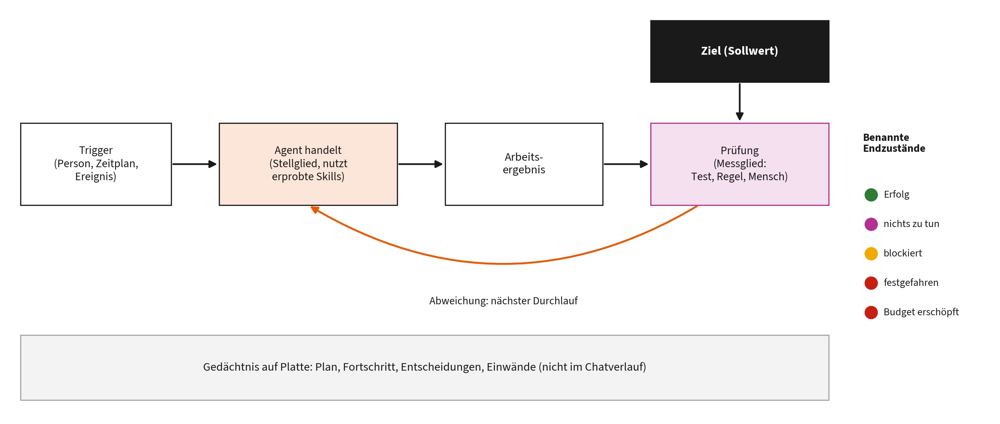
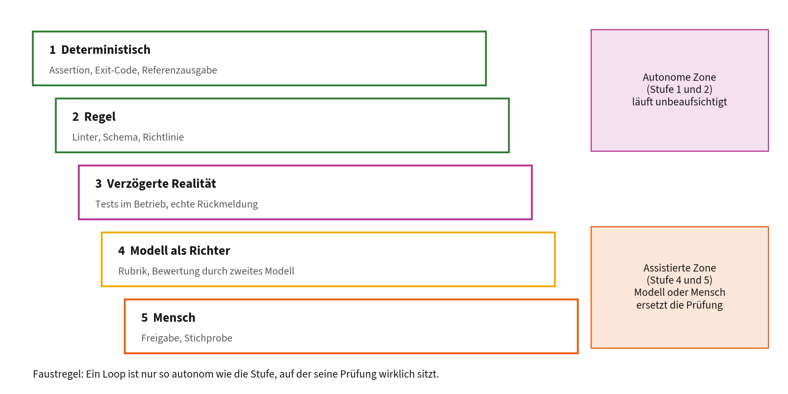

# Kapitel 7: Wenn die KI sich selbst korrigiert

Dieses Kapitel gehört zu **Block 7** des Vortrags (Sciences: Wissen und Theorie).

**Lernziele:**

- Sie können Loop Engineering definieren und in die Tradition der Regelungstechnik einordnen.
- Sie können eine Loop-Spezifikation mit Trigger, Ziel, Ausführung, Prüfung, Abbruchregel und Gedächtnis entwerfen.
- Sie erkennen typische Fehlerbilder wie Selbstbestätigung und Specification Gaming und wissen, welches Werkzeug in Claude Code zu welcher Schleife passt.

**Kernaussage:** Die nächste Stufe ist nicht der bessere Prompt, sondern der gut gebaute Regelkreis. Sein Herzstück ist eine ehrliche Prüfung.

## 7.1 Begriff und Einordnung

**Loop Engineering** bezeichnet das Entwerfen von Schleifen, die einen KI-Agenten iterativ und mit wenig menschlichem Eingreifen zu einem vorgegebenen Ziel führen; die Rolle des Menschen verschiebt sich vom Formulieren einzelner Anweisungen zum Bauen von Systemen, die den Agenten anleiten, prüfen und lenken [1]. Der Begriff hat sich 2026 in der Praxis verbreitet [1], [2]. Eine der ersten wissenschaftlichen Aufarbeitungen ist ein Positionspapier mit Korpusanalyse, kein kontrolliertes Experiment [3]. Das Feld ist jung; viele Behauptungen sind noch nicht empirisch geprüft.

Damit ist Loop Engineering die oberste der vier Schichten aus Kapitel 1.8. Die Leitfrage der Schichten lautet der Reihe nach: Wie frage ich? Was weiß das Modell? Womit arbeitet es, mit welchen Rechten? Und hier nun: Wer startet, prüft und stoppt die Arbeit?

Wichtig ist die Abgrenzung von drei Bedeutungen des Wortes „Schleife“: die gewöhnliche Programmierschleife, die **innere** Schleife jedes Agenten (lesen, planen, handeln, beobachten; Kapitel 1.4) und die **äußere** Schleife, die ein Mensch als wiederverwendbare Spezifikation entwirft. Loop Engineering meint die dritte [3].

## 7.2 Die Theorie dahinter: Regelkreise

**Kybernetik.** Norbert Wiener beschrieb Rückkopplung als Grundprinzip der Steuerung in Maschinen und Lebewesen [4]. Die Regelungstechnik formalisiert das im **Regelkreis**: Ein Messglied erfasst den Istwert, der Regler vergleicht ihn mit dem Sollwert und steuert über ein Stellglied, bis die Abweichung verschwindet.

**Autonomic Computing.** Kephart und Chess übertrugen das Prinzip auf selbstverwaltende IT-Systeme mit dem Zyklus aus Überwachen, Analysieren, Planen und Ausführen über einer gemeinsamen Wissensbasis (MAPE-K) [5].

**Sprachmodelle.** ReAct verschränkt Denken und Handeln [6]; Self-Refine und Reflexion lassen Modelle eigene Ergebnisse überarbeiten [7], [8]; Anthropic beschreibt das Muster „Evaluator-Optimizer“, bei dem ein Modell erzeugt und ein anderes bewertet [9].

| Regelkreis | Loop Engineering | Beispiel Dekanat (Kapitel 4) |
|----|----|----|
| Sollwert | Ziel | Zusammenfassung enthält alle Rückmeldungen, erfindet keine |
| Messglied | Prüfung | Code-Knoten vergleicht IDs |
| Regler | Entscheidungslogik | Vollständig? Noch Versuche übrig? |
| Stellglied | Agent bzw. Modell | Claude schreibt die Zusammenfassung |
| Störgröße | Unsicherheit des Modells | vergessene oder erfundene Einträge |
| Rückführung | Hinweis an den nächsten Durchlauf | „Diese IDs fehlen: …“ |

> **Merksatz:** Loop Engineering ist Regelungstechnik mit einem probabilistischen Stellglied. Ein Regelkreis ist nur so gut wie sein Messglied.

## 7.3 Anatomie einer Loop-Spezifikation

Anatomie eines Loops als Regelkreis

Macedo beschreibt die Loop-Spezifikation als begrenztes, wiederverwendbares Artefakt, das ein Mensch einem Harness wie Claude Code übergibt [3]:

1.  **Trigger:** Wer oder was startet den Durchlauf? Eine Person, ein Zeitplan oder ein Ereignis.
2.  **Ziel:** möglichst **prüfbar**: „Das Prüfskript endet mit Exit-Code 0“ statt „Die Zusammenfassung ist gut“.
3.  **Ausführung:** Der Agent arbeitet, idealerweise mit erprobten Skills statt mit freien Anweisungen.
4.  **Prüfung:** eine echte Prüfung des Ergebnisses (7.4).
5.  **Abbruchregel mit benannten Endzuständen:** Erfolg, nichts zu tun, blockiert, festgefahren, Budget erschöpft. Ein erschöpftes Budget zählt nie als Erfolg.
6.  **Gedächtnis:** Plan, Fortschritt und Entscheidungen liegen **auf der Platte**, nicht im Chatverlauf. Genau das leistet auch die Übergabedatei aus Kapitel 1.3.

Eine Vorlage zum Ausfüllen liegt im Handout-Repository unter `vorlagen/loop-spezifikation.md`.

**Die goldene Regel:** Eine Schleife lohnt sich nur, wenn das Ergebnis eines Durchlaufs die nächste Aktion verändert. Eine feste Aufgabe zu einer festen Zeit, bei der nichts aus dem letzten Lauf in den nächsten einfließt, ist ein geplanter Einzelprompt, kein Loop [3].

## 7.4 Die Prüfung ist das Herzstück

Verifikationsleiter

| Stufe | Art der Prüfung | Beispiel |
|----|----|----|
| 1 | deterministisch | Assertion, Exit-Code, Vergleich mit Referenzausgabe |
| 2 | Regel | Linter, Schema, Richtlinie |
| 3 | verzögerte Realität | Tests im Betrieb, echte Rückmeldung |
| 4 | Modell als Richter | Bewertung nach Rubrik durch ein zweites Modell |
| 5 | Mensch | Freigabe, Stichprobe |

Stufen 1 und 2 bilden die **autonome Zone**: Diese Prüfungen laufen sofort und ohne Aufsicht. In der Korpusanalyse von Macedo prüfen 70 Prozent der 50 untersuchten Loops in dieser Zone [3].

> **Merksatz:** Ein Loop ist nur so autonom wie die Stufe, auf der seine Prüfung wirklich sitzt.

**Fehlerbilder:**

- **Selbstbestätigung (Reward Hacking):** Bewertet dasselbe Modell seine eigene Arbeit, steigt die Bewertung, während die tatsächliche Qualität stagniert [10]. Gegenmittel: Macher und Prüfer trennen, am besten mit einer deterministischen Prüfung.
- **Specification Gaming:** Das System erfüllt den Buchstaben der Prüfung und verfehlt ihren Sinn, etwa indem es den Test ändert statt den Fehler zu beheben [11]. Gegenmittel: Prüfskript und Testdaten für den Agenten tabu. Die `CLAUDE.md` im Beispielprojekt `literaturliste` tut genau das (Kapitel 2.2).
- **Goodharts Gesetz:** Wenn eine Kennzahl zum Ziel wird, hört sie auf, eine gute Kennzahl zu sein, so die bekannte Formulierung von Strathern nach Goodhart [12], [13]. Jede Prüfung ist eine Kennzahl, auf die der Loop optimiert.
- **Selbstkorrektur ohne Rückmeldung:** Sprachmodelle verbessern ihr Schlussfolgern ohne äußere Rückmeldung nicht zuverlässig [14]. Die Rückmeldung muss von außen kommen.

## 7.5 Werkzeuge in Claude Code

| Werkzeug | Nächster Durchlauf, wenn | Stoppt, wenn | Einsatz |
|----|----|----|----|
| `/goal <Bedingung>` | der vorige Durchlauf endet | ein kleines Prüfmodell die Bedingung als erfüllt oder unmöglich bewertet, oder bei `/goal clear` | Aufgaben mit prüfbarem Endzustand |
| `/loop` | ein Intervall abgelaufen ist | Sie stoppen oder die Sitzung endet | kurze Kontrollen während der Arbeit |
| Stop-Hook | der vorige Durchlauf endet | Ihr Skript entscheidet | dauerhafte, deterministische Prüfungen |
| geplante Aufgabe in Desktop | ein Zeitplan greift, Rechner an | die Aufgabe fertig ist | wiederkehrende Arbeit mit lokalen Dateien |
| Routine in der Cloud | ein Zeitplan greift, Rechner aus | die Aufgabe fertig ist | wiederkehrende Arbeit ohne lokale Dateien |

**`/goal`** hält eine Sitzung Durchlauf für Durchlauf in Gang, bis eine Bedingung erfüllt ist [15], [16]. Nach jedem Durchlauf beurteilt ein kleines, schnelles Modell, ob die Bedingung erfüllt ist; es führt selbst keine Befehle aus, sondern urteilt über das, was im Verlauf sichtbar ist. Formulieren Sie die Bedingung deshalb so, dass Claudes eigene Ausgabe sie belegen kann, etwa „`python3 pruefe.py` endet mit Exit-Code 0“, und begrenzen Sie die Laufzeit mit einem Zusatz wie „oder stoppe nach 8 Durchläufen“ [15]. Damit entscheidet ein **anderes** Modell als das arbeitende über „fertig“, und mit einem Prüfskript in der Bedingung sitzt die eigentliche Prüfung auf Stufe 1.

**Zeitgesteuert** gibt es drei Wege: `/loop` innerhalb einer offenen Sitzung (ab einer Minute Abstand), geplante Aufgaben in Claude Desktop auf dem eigenen Rechner (ebenfalls ab einer Minute) und Routinen in der Cloud, die ohne eingeschalteten Rechner laufen, aber nur mindestens stündlich und mit einer frischen Kopie des Repositorys [16]. **Stop-Hooks** laufen am Ende jedes Durchlaufs und können das Beenden verhindern [17]. Der **Ralph-Loop** startet denselben Auftrag immer wieder mit frischem Kontext, während der gesamte Zustand in Dateien liegt [18], [19].

## 7.6 Beispiel zum Nachmachen

Im Handout-Repository liegt unter `loop-demo/` ein vollständiges Beispiel:

- `loop-demo/daten/rueckmeldungen.json`: 14 fiktive Rückmeldungen mit IDs,
- `loop-demo/pruefe_zusammenfassung.py`: das Messglied auf Stufe 1; es prüft Pflichtabschnitte, die Zahlen im Überblick, alle IDs, keine erfundenen IDs und die Länge,
- `loop-demo/ziel.md`: die fertige `/goal`-Bedingung, einschließlich des Verbots, Daten oder Prüfskript zu verändern.

Öffnen Sie das Repository in Claude Code, führen Sie zuerst das Prüfskript aus (es scheitert), geben Sie dann die Bedingung aus `ziel.md` ein und beobachten Sie, wie Claude schreibt, prüft, nachbessert und stoppt. Danach zeigt `git diff`, dass nur `zusammenfassung.md` verändert wurde.

## 7.7 Wann welche Stufe?

| Situation | Passende Stufe |
|----|----|
| einmalige Aufgabe, Ergebnis sofort prüfbar | einzelner Auftrag, gegebenenfalls Plan-Modus |
| wiederkehrender Ablauf gleicher Art | Skill |
| viel Ausgabe oder Spezialrolle | Unteragent |
| mehrere unabhängige Aufgaben | parallele Sitzungen mit Worktrees |
| prüfbarer Endzustand, mehrere Anläufe nötig | Loop mit `/goal` und Prüfskript |
| regelmäßig wiederkehrende Arbeit | geplante Aufgabe oder Routine, mit Prüfung und Benachrichtigung |
| fester Geschäftsprozess mit Formularen und Mail | Workflow in n8n mit Prüfschleife (Kapitel 4) |

Der Grundsatz dahinter bleibt derselbe wie in Kapitel 1.6: mit der einfachsten Lösung beginnen und Autonomie nur dort erhöhen, wo sie nachweislich Nutzen bringt [9].

## 7.8 Grenzen und offene Fragen

- **Die Prüflast bleibt beim Menschen.** Ein schneller Loop automatisiert das Tippen, nicht das Urteilen [2].
- **Verständnisschuld:** Je schneller ein Loop Ergebnisse liefert, die man nicht selbst erarbeitet hat, desto größer die Lücke zwischen dem, was existiert, und dem, was man versteht [2], [3].
- **Kosten:** Die sinnvolle Kennzahl sind die Kosten pro akzeptiertem Ergebnis, also Ausgaben geteilt durch die Zahl der Ergebnisse, die die Prüfung bestanden haben.
- **Sicherheit:** Unbeaufsichtigt arbeiten heißt auch unbeaufsichtigt irren. Isolierte Umgebungen, eng begrenzte Rechte (Kapitel 2.9), Budgetgrenzen und menschliche Freigaben für alles Unumkehrbare sind Pflicht.

**Offene Forschungsfragen**, auch als Anregung für Lehre und Abschlussarbeiten: Wie verhalten sich Kosten pro akzeptiertem Ergebnis über Aufgabentypen? Wie gut sind Modelle als Richter im Vergleich zu deterministischen Prüfungen in einer Fachdomäne? Wie verändern Loops die Kompetenzentwicklung von Studierenden?

## Quellen

[1] IBM, „What Is Loop Engineering?“, IBM Think. Zugegriffen: 11. September 2026. [Online]. Verfügbar unter: <https://www.ibm.com/think/topics/loop-engineering>

[2] A. Osmani, „Loop Engineering“, addyosmani.com. Zugegriffen: 11. September 2026. [Online]. Verfügbar unter: <https://addyosmani.com/blog/loop-engineering/>

[3] S. Macedo, „Stop Hand-Holding Your Coding Agent: Engineering the Loops that Replace Step-by-Step Prompting“, 2026, 2607.00038. Verfügbar unter: <https://arxiv.org/abs/2607.00038>

[4] N. Wiener, *Cybernetics: Or Control and Communication in the Animal and the Machine*. Cambridge, MA: MIT Press, 1948.

[5] J. O. Kephart und D. M. Chess, „The Vision of Autonomic Computing“, *Computer*, Bd. 36, Nr. 1, S. 41-50, 2003, doi: [10.1109/MC.2003.1160055](https://doi.org/10.1109/MC.2003.1160055).

[6] S. Yao *u. a.*, „ReAct: Synergizing Reasoning and Acting in Language Models“, in *International Conference on Learning Representations (ICLR)*, 2023. Verfügbar unter: <https://arxiv.org/abs/2210.03629>

[7] A. Madaan *u. a.*, „Self-Refine: Iterative Refinement with Self-Feedback“, in *Advances in Neural Information Processing Systems 36 (NeurIPS 2023)*, 2023. Verfügbar unter: <https://arxiv.org/abs/2303.17651>

[8] N. Shinn, F. Cassano, A. Gopinath, K. Narasimhan, und S. Yao, „Reflexion: Language Agents with Verbal Reinforcement Learning“, in *Advances in Neural Information Processing Systems 36 (NeurIPS 2023)*, 2023. Verfügbar unter: <https://arxiv.org/abs/2303.11366>

[9] E. Schluntz und B. Zhang, „Building effective agents“, Anthropic Research. Zugegriffen: 11. September 2026. [Online]. Verfügbar unter: <https://www.anthropic.com/research/building-effective-agents>

[10] J. Pan, H. He, S. R. Bowman, und S. Feng, „Spontaneous Reward Hacking in Iterative Self-Refinement“, 2024, 2407.04549. Verfügbar unter: <https://arxiv.org/abs/2407.04549>

[11] A. Bondarenko, D. Volk, D. Volkov, und J. Ladish, „Demonstrating Specification Gaming in Reasoning Models“, 2025, 2502.13295. Verfügbar unter: <https://arxiv.org/abs/2502.13295>

[12] M. Strathern, „Improving ratings: audit in the British University system“, *European Review*, Bd. 5, Nr. 3, S. 305-321, 1997.

[13] C. A. E. Goodhart, „Problems of Monetary Management: The U.K. Experience“, in *Papers in Monetary Economics, Vol. I*, Sydney: Reserve Bank of Australia, 1975.

[14] J. Huang *u. a.*, „Large Language Models Cannot Self-Correct Reasoning Yet“, in *International Conference on Learning Representations (ICLR)*, 2024. Verfügbar unter: <https://arxiv.org/abs/2310.01798>

[15] Anthropic, „Keep Claude working toward a goal“, Claude Code Docs. Zugegriffen: 11. September 2026. [Online]. Verfügbar unter: <https://code.claude.com/docs/en/goal>

[16] Anthropic, „Run prompts on a schedule“, Claude Code Docs. Zugegriffen: 11. September 2026. [Online]. Verfügbar unter: <https://code.claude.com/docs/en/scheduled-tasks>

[17] Anthropic, „Hooks reference“, Claude Code Docs. Zugegriffen: 11. September 2026. [Online]. Verfügbar unter: <https://code.claude.com/docs/en/hooks>

[18] G. Huntley, „Ralph Wiggum as a software engineer“, ghuntley.com. Zugegriffen: 11. September 2026. [Online]. Verfügbar unter: <https://ghuntley.com/ralph/>

[19] S. Willison, „Designing agentic loops“, simonwillison.net. Zugegriffen: 11. September 2026. [Online]. Verfügbar unter: <https://simonwillison.net/2025/Sep/30/designing-agentic-loops/>
