# 41 Konzepte der KI-Technik, kurz erklärt

Anhang zum Vortrag „Claude Code, Automatisierung, Wissen“ (TH Köln, 18.09.2026). Je Konzept ein Bild, die Kurzfassung in drei Punkten und dann der Hintergrund: woher das Verfahren kommt, wie es arbeitet, wie gut es belegt ist und womit es oft verwechselt wird. Die Quellen stehen am Ende jedes Eintrags und vollständig im Verzeichnis.

Die vier Gruppen folgen dem Weg einer Anfrage: Das Modell rechnet, es sucht das Richtige, es wird angebunden, und der Betrieb muss halten. Sie können jeden Eintrag einzeln lesen.

## Überblick

**Teil A, Wie man damit arbeitet:** 1. Prompt Engineering, 2. Context Engineering, 3. Harness Engineering, 4. Loop Engineering, 5. Workflow oder Agent

**Teil B, Wie ein Modell rechnet:** 6. Tokenisierung, 7. Kontextfenster und Compaction, 8. Temperatur und Sampling, 9. Halluzination, 10. Reasoning und Test-Time-Compute, 11. Mixture of Experts, 12. KV Cache, 13. Spekulatives Dekodieren, 14. Continuous Batching, 15. Destillation und Quantisierung, 16. Warum es so viele Modelle gibt

**Teil C, Wie es das Richtige findet:** 17. RAG, 18. Embedding und Vektorsuche, 19. Semantisches Chunking, 20. BM25, 21. Hybride Suche, 22. Anfrage umschreiben, 23. Reranking, 24. Recall@k, 25. Wissensgraph und GraphRAG

**Teil D, Wie man es anbindet:** 26. Werkzeugnutzung, 27. Strukturierte Ausgabe, 28. Model Context Protocol, 29. ReAct, 30. Unteragenten und Orchestrierung, 31. Model Routing, 32. Lesen auslagern

**Teil E, Wie man es betreibt und prüft:** 33. Leitplanken und Rechte, 34. Mensch in der Schleife, 35. Checkpointing, 36. Circuit Breaker, 37. Distributed Tracing, 38. Prompt Injection, 39. Benchmarks und ihre Grenzen, 40. Specification Gaming, 41. LLM-as-a-Judge

## Teil A: Wie man damit arbeitet

### 1. Prompt Engineering

**Die einzelne Anweisung so bauen, dass die Antwort verlässlich passt.**

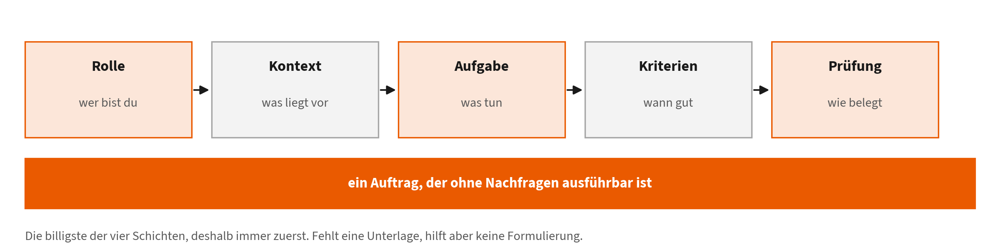

- **Wofür:** Rolle, Kontext, Aufgabe, Kriterien und Prüfung in einen Auftrag bringen, statt darauf zu hoffen, dass das Modell errät, was gemeint war.
- **Wann sinnvoll:** Bei jeder Einzelaufgabe, und immer zuerst: Es ist die billigste der vier Schichten (Kapitel 1.7 und 1.8).
- **Grenze:** Ein guter Auftrag ersetzt keine fehlenden Unterlagen. Sieht das Modell die Prüfungsordnung nicht, hilft keine Formulierung.

**Woher es kommt.** Entstand ab 2020 als Praxis, nachdem Brown et al. zeigten, dass große Modelle neue Aufgaben allein aus Beispielen im Prompt lösen, ohne Nachtraining. Damit wurde die Eingabe selbst zum Gestaltungsgegenstand. Der Begriff wurde später oft für tot erklärt, zu Unrecht: Er ist nur nicht mehr die einzige Schicht.

**Wie es funktioniert.** Fünf Bausteine tragen fast alles: Rolle und Ziel, Kontext, Aufgabe, prüfbare Kriterien, geforderte Prüfung. Beispiele im Prompt wirken wie eine Kurzanleitung, ohne dass sich am Modell etwas ändert. Wo Zwischenschritte nötig sind, hilft die Aufforderung, sie auszuformulieren.

**Wie gut belegt.** Das Grundphänomen ist gut belegt: Brown et al. für das Lernen aus Beispielen, Wei et al. für den Gewinn durch ausformulierte Zwischenschritte bei großen Modellen. Für einzelne Formulierungstricks gilt das nicht; vieles davon ist Erfahrungswissen und altert mit jeder Modellgeneration.

**Nicht verwechseln mit.** Nicht mit Context Engineering verwechseln: Hier geht es um die Formulierung des Auftrags, dort um die Auswahl dessen, was das Modell überhaupt sieht. Und nicht mit Fine-Tuning, bei dem sich die Gewichte ändern.

Quellen: [1], [2], [3]

### 2. Context Engineering

**Gestalten, was das Modell beim Arbeiten überhaupt sieht.**

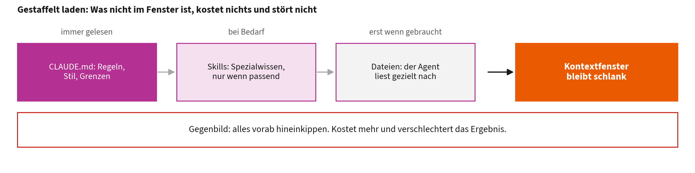

- **Wofür:** Dauerhaftes Wissen in Dateien legen, Relevantes gezielt nachladen, alles andere weglassen. In Claude Code: `CLAUDE.md`, Skills, Unteragenten, Plugins.
- **Wann sinnvoll:** Sobald dieselben Regeln oder Unterlagen in mehreren Sitzungen gebraucht werden (Kapitel 1.5).
- **Grenze:** Mehr Kontext ist nicht besser. Wer alles mitgibt, verschlechtert das Ergebnis und bezahlt es zusätzlich.

**Woher es kommt.** Der Begriff setzte sich 2024 und 2025 durch, als klar wurde, dass bei Agenten die Auswahl der Information mehr entscheidet als die Formulierung. Ausgelöst hat das unter anderem der Befund von Liu et al., dass ein längerer Kontext nicht automatisch ein besserer ist.

**Wie es funktioniert.** Wissen wird gestaffelt geladen statt vorab hineingekippt: Dauerhafte Regeln stehen in einer Datei, die immer gelesen wird; Spezialwissen liegt in Skills, die nur bei Bedarf geladen werden; Dateien liest der Agent erst, wenn er sie braucht. Was nicht im Fenster ist, kostet nichts und stört nicht.

**Wie gut belegt.** Liu et al. zeigen experimentell, dass Modelle Information am Anfang und Ende des Kontexts besser nutzen als in der Mitte, ein Befund über mehrere Modelle hinweg. Die konkreten Empfehlungen der Werkzeughersteller, etwa Dateien unter 200 Zeilen zu halten, sind dagegen Erfahrungswerte.

**Nicht verwechseln mit.** Nicht mit RAG gleichsetzen. RAG ist ein Verfahren, um Kontext zu beschaffen; Context Engineering ist die Entscheidung darüber, was davon tatsächlich mitgegeben wird und was nicht.

Quellen: [4], [5], [6]

### 3. Harness Engineering

**Die Umgebung bauen: Werkzeuge, Rechte, Leitplanken, Prüfungen.**

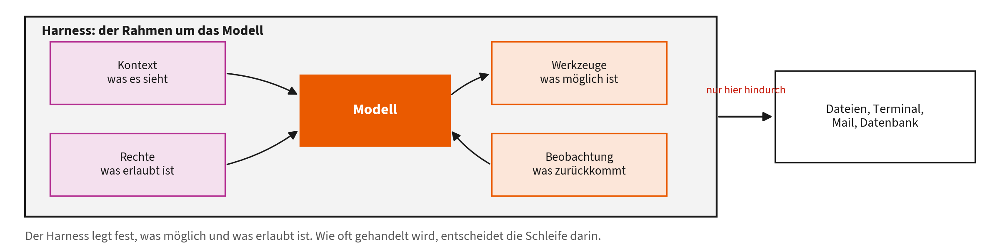

- **Wofür:** Festlegen, was der Agent tun kann und darf, und woran er merkt, dass etwas schiefgegangen ist. Claude Code ist ein solcher Harness.
- **Wann sinnvoll:** Sobald ein Modell nicht nur antwortet, sondern handelt: Dateien ändert, Mails verschickt, Datensätze schreibt (Kapitel 1.4 und 2).
- **Grenze:** Ein guter Harness macht eine schlechte Aufgabe nicht gut. Und je mehr Rechte er vergibt, desto größer der Schaden bei Prompt Injection.

**Woher es kommt.** Das Wort Harness (Geschirr) bezeichnet die Umgebung um das Modell herum. Es wurde nötig, als Modelle anfingen zu handeln statt nur zu antworten. Das Muster dahinter ist ReAct von Yao et al. 2023; Claude Code, n8n-Knoten und Agentenrahmen sind Umsetzungen davon.

**Wie es funktioniert.** Der Harness stellt vier Dinge bereit: Werkzeuge (was ist möglich), Rechte (was ist erlaubt), Kontext (was wird gesehen) und Beobachtung (was kommt zurück). Er führt die Schleife aus, hält Zustand fest und bricht ab. Das Modell entscheidet innerhalb dieses Rahmens, nicht über ihn.

**Wie gut belegt.** Als Begriff jung und wenig systematisch untersucht. Gut belegt sind die Bausteine einzeln: ReAct als Muster, Werkzeugnutzung, Prüfschleifen. Dass ein enger Harness Schäden begrenzt, ist derzeit eher gut begründete Praxis als gemessenes Ergebnis.

**Nicht verwechseln mit.** Nicht mit dem Modell verwechseln. Dasselbe Modell verhält sich in zwei Harnessen deutlich verschieden, weil Werkzeuge, Rechte und Rückmeldungen andere sind. Wer Modelle vergleicht, vergleicht fast immer Harness plus Modell.

Quellen: [7], [8], [9], [10]

### 4. Loop Engineering

**Den Kreislauf entwerfen: Auslöser, Ziel, Prüfung, Abbruch, Gedächtnis.**

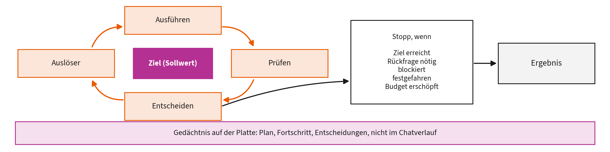

- **Wofür:** Aufgaben, die in einem Durchlauf nicht fertig werden, laufen ohne ständiges Nachfassen zu Ende. Der Mensch baut den Rahmen statt jeden Schritt.
- **Wann sinnvoll:** Bei wiederkehrenden Aufgaben mit einem prüfbaren Ziel. Kapitel 7 führt das mit Vorlage aus.
- **Grenze:** Ein Regelkreis ist nur so gut wie sein Messglied. Ohne ehrliche Prüfung wiederholt er den Fehler nur zuverlässiger.

**Woher es kommt.** Der Begriff verbreitete sich 2026 in der Praxis. Die Sache ist viel älter: Wiener beschrieb 1948 Rückkopplung als Grundprinzip der Steuerung, die Regelungstechnik formalisierte den Regelkreis, und Kephart und Chess übertrugen ihn 2003 auf selbstverwaltende IT-Systeme.

**Wie es funktioniert.** Sechs Teile: Auslöser, prüfbares Ziel, Ausführung, Prüfung, Abbruchregel mit benannten Endzuständen, Gedächtnis auf der Platte. Der Mensch entwirft diese Spezifikation einmal; der Agent durchläuft sie beliebig oft. Entscheidend ist, dass die Prüfung nicht vom Ausführenden stammt.

**Wie gut belegt.** Das Feld ist jung. Eine der ersten wissenschaftlichen Aufarbeitungen ist ein Positionspapier mit Korpusanalyse, kein kontrolliertes Experiment. Solide belegt ist nur der Unterbau: Regelungstechnik, MAPE-K, und die Erkenntnis, dass Modelle sich ohne äußeres Signal schlecht selbst korrigieren.

**Nicht verwechseln mit.** Nicht die innere Schleife des Agenten (ReAct) und nicht die gewöhnliche Programmschleife. Gemeint ist die äußere, vom Menschen entworfene und wiederverwendbare Schleife um einen ganzen Arbeitsgang (Kapitel 7.1).

Quellen: [9], [11], [12], [13], [14]

### 5. Workflow oder Agent

**Wer legt die Schrittfolge fest, Sie oder das Modell?**

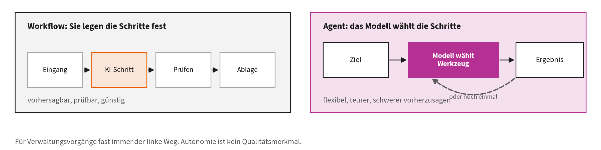

- **Wofür:** Die Grundentscheidung vor jeder Automatisierung. Im Workflow stehen die Schritte fest und das Modell erledigt einzelne davon; ein Agent wählt die Schritte selbst.
- **Wann sinnvoll:** Workflow bei bekanntem Ablauf, Agent bei offenen Aufgaben. Für Verwaltungsvorgänge fast immer ein Workflow mit einem KI-Schritt (Kapitel 1.6 und 4).
- **Grenze:** Autonomie ist kein Qualitätsmerkmal. Sie kostet mehr, ist schwerer vorherzusagen und ist seltener nötig, als es wirkt.

**Woher es kommt.** Schluntz und Zhang haben die Unterscheidung 2024 für Anthropic auf den Punkt gebracht, nachdem viele Projekte Agenten gebaut hatten, wo ein fester Ablauf genügt hätte. Die Empfehlung lautet seither: mit der einfachsten Bauform beginnen.

**Wie es funktioniert.** Im Workflow steht der Ablaufplan im System; das Modell füllt einzelne Schritte aus, etwa Einordnen oder Formulieren. Beim Agenten steht nur das Ziel fest; das Modell wählt Werkzeuge und Reihenfolge selbst und entscheidet, wann es fertig ist.

**Wie gut belegt.** Kein gemessener Befund, sondern eine Entwurfsempfehlung aus Projekterfahrung, die sich breit durchgesetzt hat. Was sich messen lässt, ist die Folge: Feste Abläufe sind reproduzierbar prüfbar, agentische nicht, weil dieselbe Eingabe zu anderen Schritten führen kann.

**Nicht verwechseln mit.** Keine Entweder-oder-Frage für ein ganzes Haus, sondern je Vorgang. Und nicht mit Autonomiegraden verwechseln: Auch ein Agent kann eng eingehegt sein, auch ein Workflow kann gefährliche Schritte enthalten.

Quellen: [15]

## Teil B: Wie ein Modell rechnet

### 6. Tokenisierung

**Aus Text werden Zahlen, und zwar in Stücken.**

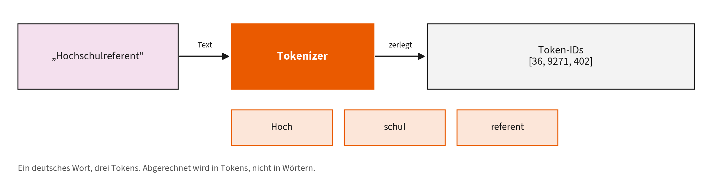

- **Wofür:** Modelle rechnen nicht mit Wörtern, sondern mit Tokens, meist Wortteilen. Jede Abrechnung und jede Kontextgrenze zählt Tokens.
- **Wann wichtig:** Immer, wenn Sie Kosten oder Kontextgrenzen abschätzen wollen. Eine DIN-A4-Seite sind grob 600 bis 800 Tokens.
- **Grenze:** Deutsche Komposita, Eigennamen, Tabellen und Code brauchen mehr Tokens als englischer Fließtext.

**Woher es kommt.** Byte-Pair-Encoding stammt von Philip Gage, 1994, und war ein Verfahren zur Dateikomprimierung. Sennrich, Haddow und Birch übertrugen es 2016 auf maschinelle Übersetzung, um seltene Wörter zu behandeln. Seitdem tokenisieren praktisch alle großen Sprachmodelle so.

**Wie es funktioniert.** Der Tokenizer beginnt bei einzelnen Zeichen und verschmilzt wiederholt das häufigste Zeichenpaar zu einer neuen Einheit, bis das Vokabular voll ist, typisch 50.000 bis 200.000 Einträge. Häufige Wörter werden ein Token, seltene zerfallen in Teile. Die Zerlegung ist rein statistisch, nicht sprachwissenschaftlich: Sie folgt der Häufigkeit im Trainingstext, nicht der Morphologie.

**Wie gut belegt.** Sennrich et al. belegen bessere Übersetzung seltener Wörter. Das Verfahren ist seit zehn Jahren Standard und gut untersucht, hier gibt es nichts Strittiges. Offen ist eher, wie stark die Zerlegung Sprachen benachteiligt, die im Trainingstext selten vorkamen.

**Nicht verwechseln mit.** Nicht mit Embedding verwechseln. Die Tokenisierung zerlegt Text und vergibt Nummern; das Embedding ordnet diesen Nummern erst Bedeutungsvektoren zu. Und nicht mit Silbentrennung: „Hochschulreferent“ zerfällt nicht nach Sprachregeln, sondern nach Häufigkeit.

Quellen: [16], [17], [18]

### 7. Kontextfenster und Compaction

**Der Arbeitsspeicher einer Sitzung, und was passiert, wenn er voll ist.**

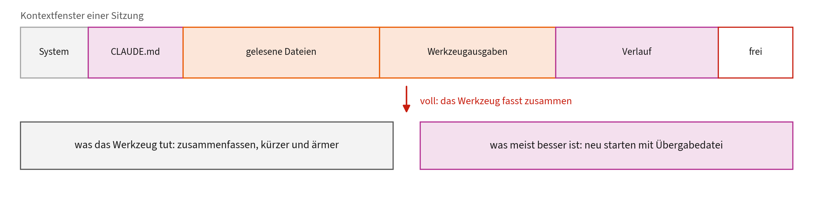

- **Wofür:** Alles, was das Modell in einer Anfrage gleichzeitig sieht: Anweisung, Dateien, Gesprächsverlauf, Werkzeugausgaben.
- **Wann wichtig:** In langen Sitzungen. Läuft das Fenster voll, fasst Claude Code den Verlauf automatisch zusammen, und dabei geht Genauigkeit verloren.
- **Grenze:** Größer ist nicht besser. In der Mitte langer Kontexte nutzen Modelle Information schlechter; ein frischer Start mit Übergabedatei schlägt oft die Zusammenfassung.

**Woher es kommt.** Die Grenze ergibt sich aus der Architektur: Der Aufwand der Aufmerksamkeit wächst mit der Länge, und der Zwischenspeicher belegt Grafikspeicher. Die Fenster wuchsen von wenigen tausend auf Hunderttausende Tokens, und mit ihnen die Frage, ob das überhaupt hilft.

**Wie es funktioniert.** Alles zählt hinein: System-Prompt, `CLAUDE.md`, gelesene Dateien, Werkzeugausgaben, der ganze bisherige Verlauf. Wird es eng, fasst das Werkzeug ältere Teile zusammen und ersetzt sie. Die Zusammenfassung ist kürzer und ärmer; Details, die später gebraucht werden, sind dann weg.

**Wie gut belegt.** Liu et al. belegen, dass mehr Kontext die Qualität sogar senken kann, weil die Mitte schlechter genutzt wird. Dass ein Neustart mit einer selbst geschriebenen Übergabe der automatischen Zusammenfassung überlegen ist, ist dagegen Erfahrungswissen, kein Messergebnis.

**Nicht verwechseln mit.** Nicht das Gedächtnis über Sitzungen hinweg. Das Fenster ist flüchtig; dauerhaftes Wissen gehört in Dateien im Projekt (Kapitel 1.3 und 1.5).

Quellen: [4], [5], [19]

### 8. Temperatur und Sampling

**Warum dieselbe Frage zweimal verschieden beantwortet wird.**

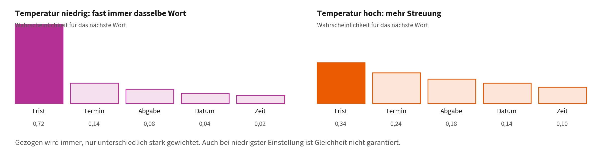

- **Wofür:** Das Modell zieht das nächste Token aus einer Wahrscheinlichkeitsverteilung. Temperatur und verwandte Regler steuern, wie stark es dabei würfelt.
- **Wann wichtig:** Wenn Sie Wiederholbarkeit brauchen, etwa bei Prüfungen oder Protokollen, niedrig einstellen. Beim Sammeln von Ideen darf es höher sein.
- **Grenze:** Auch bei niedrigster Einstellung ist Gleichheit nicht garantiert. Verlassen Sie sich nie darauf, dass zweimal dasselbe herauskommt.

**Woher es kommt.** Sprachmodelle liefern für jedes nächste Token eine Wahrscheinlichkeitsverteilung. Wie man daraus zieht, ist eine eigene Frage. Holtzman et al. zeigten 2020, dass das naheliegende Verfahren, immer das wahrscheinlichste Token zu nehmen, zu auffällig eintönigem und sich wiederholendem Text führt.

**Wie es funktioniert.** Die Temperatur spreizt oder staucht die Verteilung vor dem Ziehen: niedrig bedeutet, dass die wahrscheinlichsten Tokens noch dominanter werden, hoch macht seltene Tokens wahrscheinlicher. Verwandte Regler begrenzen zusätzlich die Auswahl, etwa auf die wahrscheinlichsten Tokens bis zu einer Summe.

**Wie gut belegt.** Holtzman et al. belegen die Entartung bei gieriger Auswahl und begründen die heute üblichen Verfahren. Welcher Wert für Ihre Aufgabe richtig ist, ist nicht allgemein beantwortbar und gehört ausprobiert.

**Nicht verwechseln mit.** Temperatur null heißt nicht deterministisch. Parallele Berechnung auf Grafikkarten, Stapelbildung und Modellwechsel beim Anbieter können das Ergebnis trotzdem verändern. Wer Reproduzierbarkeit braucht, protokolliert die Ausgabe, statt sich auf Wiederholbarkeit zu verlassen.

Quellen: [20]

### 9. Halluzination

**Plausibel formuliert und trotzdem falsch.**

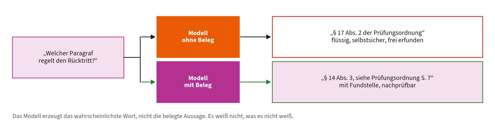

- **Was passiert:** Das Modell erzeugt das wahrscheinlichste nächste Wort, nicht die belegte Aussage. Fehlt Wissen, entsteht trotzdem ein flüssiger, selbstsicherer Satz.
- **Wann gefährlich:** Bei Zahlen, Zitaten, Paragrafen und Namen, und überall dort, wo die Antwort stimmen muss und niemand nachprüft.
- **Gegenmittel:** Belege mitliefern lassen, auf prüfbare Kriterien bestehen, stichprobenartig gegenlesen. Selbstkorrektur ohne äußeres Signal genügt nicht.

**Woher es kommt.** Der Begriff stammt aus der Forschung zur Textgenerierung, lange vor ChatGPT; Ji et al. geben 2023 einen Überblick über Ursachen, Arten und Messverfahren. Der Name ist umstritten, weil er dem Modell eine Wahrnehmung unterstellt, die es nicht hat.

**Wie es funktioniert.** Das Modell ist darauf trainiert, plausiblen Text zu erzeugen, nicht wahren. Es hat keine Repräsentation davon, was es nicht weiß. Fehlt Wissen, füllt es die Lücke mit dem, was in solchen Sätzen üblicherweise steht: ein erfundenes Aktenzeichen sieht aus wie ein echtes.

**Wie gut belegt.** Gut untersuchtes Feld mit einer eigenen Übersichtsarbeit. Wichtig für die Praxis: Huang et al. zeigen, dass Modelle ihre Fehler ohne äußeres Signal kaum zuverlässig selbst finden. Die Aufforderung „prüfe deine Antwort“ ist deshalb keine Absicherung.

**Nicht verwechseln mit.** Nicht dasselbe wie ein veralteter Wissensstand und nicht dasselbe wie eine falsch verstandene Frage. Und keine Lüge: Es fehlt die Absicht, das Modell unterscheidet nicht zwischen wissen und erzeugen.

Quellen: [14], [21]

### 10. Reasoning und Test-Time-Compute

**Mehr Rechenzeit beim Antworten statt mehr Training.**

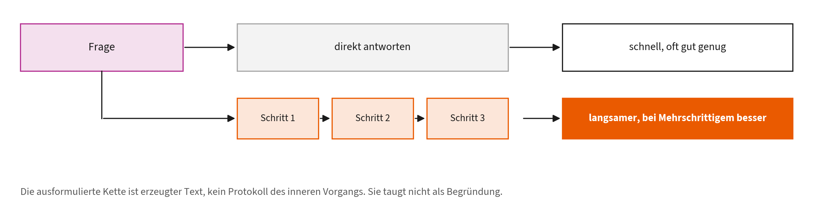

- **Wofür:** Das Modell arbeitet vor der Antwort Zwischenschritte aus. Bei mehrstufigen Aufgaben steigt dadurch die Trefferquote deutlich.
- **Wann sinnvoll:** Bei Analyse, Planung, Rechnen und Regelabgleich. Beim reinen Umformulieren verschenkt es Zeit und Geld.
- **Grenze:** Die ausformulierte Gedankenkette ist eine Ausgabe, kein Protokoll des inneren Vorgangs. Sie taugt nicht als Begründung gegenüber Dritten.

**Woher es kommt.** Wei et al. zeigten 2022, dass die Aufforderung, Schritt für Schritt zu denken, bei großen Modellen die Leistung in mehrstufigen Aufgaben hebt. Daraus wurde eine eigene Modellklasse, die diese Zwischenschritte selbst erzeugt, und die Frage, ob Rechenzeit beim Antworten besser investiert ist als im Training.

**Wie es funktioniert.** Das Modell erzeugt vor der eigentlichen Antwort eine Kette von Zwischenschritten, teils sichtbar, teils verborgen. Mehr Zeit kann auch heißen: mehrere Lösungswege erzeugen und den häufigsten nehmen, oder eine Lösung prüfen und überarbeiten.

**Wie gut belegt.** Der Gewinn bei mehrstufigen Aufgaben ist gut belegt (Wei et al.). Snell et al. zeigen, dass zusätzliche Rechenzeit beim Antworten unter bestimmten Bedingungen wirksamer ist als ein größeres Modell. Nicht belegt ist, dass die ausformulierte Kette dem tatsächlichen inneren Vorgang entspricht.

**Nicht verwechseln mit.** Nicht mit Nachdenken im menschlichen Sinn verwechseln und nicht mit einer Begründung. Die Kette ist erzeugter Text und kann eine falsche Antwort überzeugend stützen.

Quellen: [3], [22]

### 11. Mixture of Experts

**Ein großes Modell, von dem je Token nur ein Teil arbeitet.**

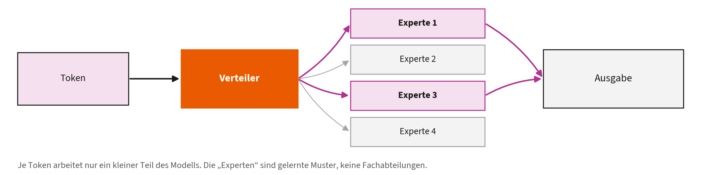

- **Wofür:** Kapazität wächst, ohne dass jede Anfrage das ganze Modell bezahlt. Ein Verteiler schickt jedes Token an wenige Teilnetze.
- **Wann wichtig:** Erklärt, warum heutige Modelle riesig und trotzdem bezahlbar sind. Sie stellen daran nichts ein.
- **Grenze:** Die „Experten“ sind gelernte Muster, keine Fachabteilungen. Im Modell sitzt kein Jurist.

**Woher es kommt.** Die Idee ist von 1991, von Jacobs, Jordan, Nowlan und Hinton: mehrere kleine Netze, ein Verteiler wählt aus. Shazeer et al. machten daraus 2017 die dünnbesetzte Variante, mit der sich sehr große Netze bauen lassen, ohne dass jede Eingabe alles durchlaufen muss.

**Wie es funktioniert.** Eine Schicht enthält viele parallele Teilnetze. Ein kleines Verteilernetz bewertet je Token, welche zwei oder vier davon rechnen sollen; nur deren Ergebnisse werden gewichtet addiert. Die Zahl der Parameter steigt stark, der Rechenaufwand je Token bleibt fast gleich.

**Wie gut belegt.** Shazeer et al. zeigen über tausendfach mehr Parameter bei vergleichbarer Rechenzeit. Das Prinzip ist etabliert. Welche heutigen Modelle es in welcher Form nutzen, geben die Anbieter meist nicht bekannt, das ist also Branchenwissen, kein überprüfbarer Befund.

**Nicht verwechseln mit.** Nicht mit Model Routing verwechseln. Dort wird je Anfrage zwischen eigenständigen Modellen gewählt, hier je Token innerhalb eines Modells. Und die Teilnetze sind keine Fachgebiete: Was ein „Experte“ gelernt hat, lässt sich meist nicht benennen.

Quellen: [23], [24]

### 12. KV Cache

**Das Modell merkt sich Zwischenergebnisse, statt neu zu rechnen.**

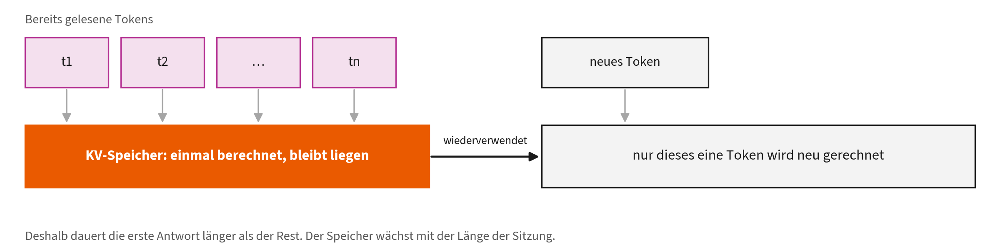

- **Wofür:** Jedes neue Token nutzt die Rechenarbeit der vorherigen weiter, statt die ganze Vorgeschichte erneut zu verarbeiten.
- **Wann wichtig:** Erklärt, warum die erste Antwort lange dauert und der Rest schnell nachkommt.
- **Grenze:** Der Zwischenspeicher wächst mit der Länge. Lange Sitzungen sind deshalb langsamer und teurer, ein Grund für `/clear`.

**Woher es kommt.** Kein eigenes Verfahren, sondern eine Folge der Transformer-Architektur von Vaswani et al. 2017. Zum eigenen Thema wurde der Speicher erst im Produktivbetrieb: Pope et al. beschreiben 2023 die Grenzen, PagedAttention verwaltet ihn im selben Jahr wie ein Betriebssystem.

**Wie es funktioniert.** Beim Erzeugen schaut das Modell für jedes neue Token auf alle vorherigen. Schlüssel und Werte der Aufmerksamkeit für die bereits gelesene Vorgeschichte ändern sich nicht mehr, also werden sie einmal berechnet und liegen gelassen. Neu gerechnet wird nur das jeweils letzte Token.

**Wie gut belegt.** Technisch unstrittig und in jeder Implementierung vorhanden. Messbar ist der Speicherbedarf: Er wächst linear mit Kontextlänge und Zahl gleichzeitiger Anfragen und begrenzt unmittelbar, wie viele Nutzende eine Grafikkarte bedienen kann (Kwon et al.).

**Nicht verwechseln mit.** Nicht das Gedächtnis des Modells. Der Cache lebt innerhalb einer Anfrage und ist danach weg. Auch nicht das Prompt-Caching der Anbieter, das gleiche Textanfänge über mehrere Anfragen hinweg wiederverwendet und deshalb abgerechnet wird.

Quellen: [25], [26], [27]

### 13. Spekulatives Dekodieren

**Ein kleines Modell rät voraus, das große prüft im Block.**

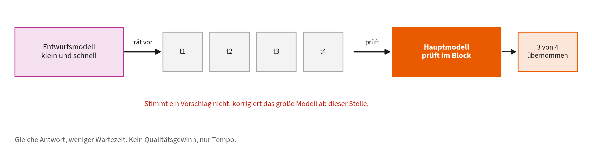

- **Wofür:** Mehrere Tokens auf einmal prüfen statt eines nach dem anderen. Das Ergebnis ist nachweislich dasselbe.
- **Wann wichtig:** Reine Betreibersache. Für Sie sichtbar nur als Tempo.
- **Grenze:** Ein Tempotrick, kein Qualitätsgewinn. Bei ungewöhnlichen Texten rät das kleine Modell oft falsch, dann bleibt es langsam.

**Woher es kommt.** 2023 unabhängig von zwei Gruppen veröffentlicht, Leviathan et al. bei Google und Chen et al. bei DeepMind. Beide lösten dasselbe Problem: Ein großes Modell erzeugt Tokens streng nacheinander, und die Hardware ist dabei schlecht ausgelastet.

**Wie es funktioniert.** Ein kleines Entwurfsmodell erzeugt mehrere Tokens auf Verdacht. Das große Modell bewertet alle auf einmal, denn Prüfen lässt sich parallel rechnen, Erzeugen nicht. Ein Annahmeverfahren entscheidet, wie viele Vorschläge übernommen werden, und stellt sicher, dass am Ende genau die Verteilung des großen Modells herauskommt.

**Wie gut belegt.** Beide Arbeiten messen zwei- bis dreifache Beschleunigung. Wichtiger als die Zahl ist: Die Gleichheit der Ausgabeverteilung ist bewiesen, nicht nur beobachtet. Sie tauschen hier also keine Qualität gegen Tempo.

**Nicht verwechseln mit.** Keine Modellverkleinerung wie Destillation oder Quantisierung, bei denen sich das Ergebnis ändern darf. Und kein Zwischenspeicher: Es wird nichts wiederverwendet, sondern vorausgeraten.

Quellen: [28], [29]

### 14. Continuous Batching

**Wartende Anfragen rücken nach, sobald ein Platz frei wird.**

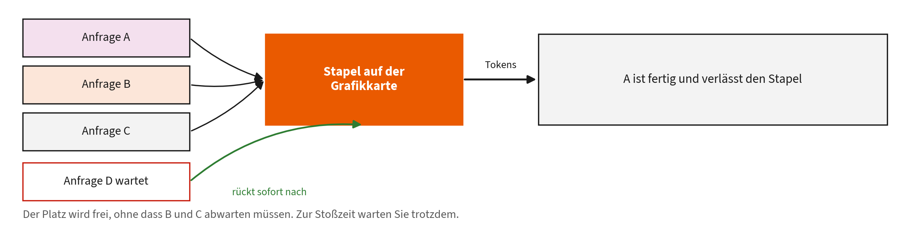

- **Wofür:** Teure Grafikkarten bleiben ausgelastet, auch wenn Anfragen unterschiedlich lang sind.
- **Wann wichtig:** Erklärt, warum dieselbe Frage mal in zwei und mal in zwanzig Sekunden beantwortet wird.
- **Grenze:** Die Technik verteilt Last, sie schafft keine neue. Zur Stoßzeit warten Sie trotzdem.

**Woher es kommt.** Yu et al. 2022 mit dem System Orca, dort „iteration-level scheduling“ genannt. Breit verfügbar wurde das Verfahren 2023 mit vLLM, das zusätzlich den Zwischenspeicher seitenweise verwaltet und damit den Verschnitt fast auf null bringt.

**Wie es funktioniert.** Klassisch wartet ein Stapel, bis alle Anfragen darin fertig sind, dauert also so lange wie die längste. Hier wird nach jedem einzelnen erzeugten Token neu entschieden: Fertige Anfragen verlassen den Stapel sofort, wartende rücken in denselben Durchlauf nach.

**Wie gut belegt.** Orca misst deutlich höheren Durchsatz gegenüber statischem Batching, vLLM berichtet das Zwei- bis Vierfache gegenüber Orca und FasterTransformer. Gemessen wurde Durchsatz und Wartezeit, nicht Antwortqualität; die bleibt unberührt.

**Nicht verwechseln mit.** Keine Beschleunigung Ihrer einzelnen Anfrage. Der Durchsatz des Systems steigt, Ihre eigene Antwort kann sogar etwas später kommen, weil sie sich die Karte mit mehr anderen teilt.

Quellen: [27], [30]

### 15. Destillation und Quantisierung

**Große Modelle kleiner machen, damit sie im eigenen Haus laufen.**

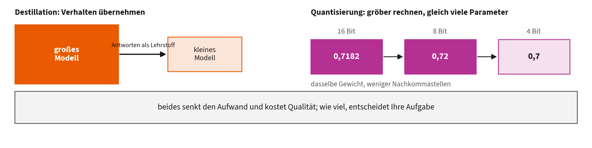

- **Wofür:** Destillation trainiert ein kleines Modell auf den Ausgaben eines großen. Quantisierung rechnet mit gröberen Zahlen und spart Speicher.
- **Wann sinnvoll:** Wenn Daten das Haus nicht verlassen dürfen oder ein eigener Server rechnen soll, Stichwort souveräne Modelle für Hochschulen.
- **Grenze:** Beides kostet Qualität, wie viel, hängt von der Aufgabe ab. Mit eigenen Beispielen messen, nicht mit fremden Bestenlisten.

**Woher es kommt.** Zwei getrennte Linien. Hinton et al. beschrieben 2015 die Destillation, bei der ein kleines Modell von den Ausgaben eines großen lernt. Die Quantisierung kommt aus der Signalverarbeitung; Dettmers et al. zeigten 2022, dass sich sehr große Modelle mit 8 Bit rechnen lassen, ohne dass die Qualität einbricht.

**Wie es funktioniert.** Destillation: Das große Modell erzeugt Antworten samt Wahrscheinlichkeiten, das kleine lernt darauf; es übernimmt Verhalten statt Rohdaten. Quantisierung: Gewichte werden statt mit 16 Bit mit 8 oder 4 Bit dargestellt. Das Modell wird kleiner und schneller, die Rechnung ungenauer.

**Wie gut belegt.** Beide Verfahren sind gut untersucht und breit im Einsatz; Dettmers et al. belegen 8 Bit ohne nennenswerten Qualitätsverlust. Wie stark eine bestimmte Kombination Ihre Aufgabe trifft, lässt sich nur mit eigenen Beispielen feststellen, Bestenlisten helfen dabei wenig.

**Nicht verwechseln mit.** Nicht mit Fine-Tuning verwechseln, das dem Modell neue Inhalte oder einen neuen Stil beibringt. Destillation und Quantisierung wollen das Verhalten möglichst erhalten und nur den Aufwand senken.

Quellen: [31], [32]

### 16. Warum es so viele Modelle gibt

**Größe, Genauigkeit und Fähigkeiten sind drei Achsen, keine Leiter.**

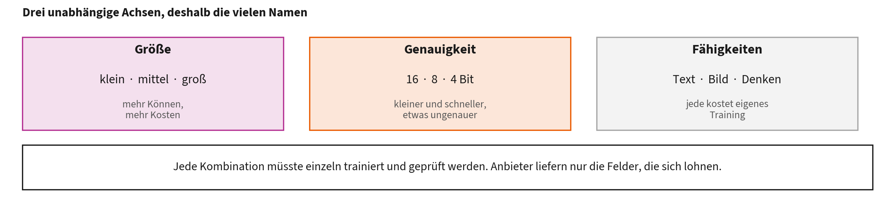

- **Wofür:** Die Namen im Angebot sind Punkte in einem Raster: Größe (klein bis groß), Zahlengenauigkeit (16, 8 oder 4 Bit, siehe Destillation und Quantisierung (Karte 15)) und Fähigkeiten (Text, Bild, ausformuliertes Denken).
- **Warum nicht alles alles kann:** Jede Fähigkeit kostet eigenes Training mit eigenen Daten. Bildverständnis braucht Bild-Text-Paare, ausformuliertes Denken braucht eine eigene Nachschulung. Ein kleines Modell mit beidem wäre nicht mehr klein.
- **Was Sie davon haben:** Sie müssen nicht das größte Modell nehmen. Wählen Sie die Achse, die Ihre Aufgabe wirklich braucht, und sparen Sie auf den anderen.

**Woher es kommt.** Aus der Ökonomie des Trainings. Kaplan et al. zeigten 2020, dass Leistung mit Rechenaufwand, Datenmenge und Parameterzahl in berechenbaren Verhältnissen wächst; Hoffmann et al. korrigierten 2022, dass die meisten Modelle zu groß für ihre Datenmenge trainiert waren. Seitdem plant man Modelle als Punkte in einem Kosten-Nutzen-Raum statt als „immer größer“.

**Wie es funktioniert.** Drei Achsen, die unabhängig voneinander sind. Die Größe legt fest, wie viel das Modell überhaupt gelernt haben kann. Die Zahlengenauigkeit legt fest, wie viel Speicher es im Betrieb braucht, ohne dass sich das Gelernte ändert. Die Fähigkeiten hängen daran, worauf trainiert wurde: Bildverständnis entsteht aus Bild-Text-Paaren, ausformuliertes Denken aus einer eigenen Nachschulung. Jede Kombination müsste getrennt trainiert, geprüft und gepflegt werden, deshalb liefern Anbieter nur einen Teil des Rasters.

**Wie gut belegt.** Die Skalierungsgesetze sind gut belegt und mehrfach nachgerechnet; Hoffmann et al. haben die Faustregeln dabei deutlich verschoben, was zeigt, dass auch solche Gesetze revidiert werden. Für die Fähigkeiten gilt: Dass Bildverständnis aus gekoppelten Bild-Text-Daten entsteht, ist seit CLIP belegt. Welche Kombination ein Anbieter anbietet, ist dagegen eine Geschäftsentscheidung und kein Naturgesetz.

**Nicht verwechseln mit.** Nicht als Rangliste lesen. Ein 4-Bit-Modell ist kein schlechteres Modell, sondern dasselbe Modell mit gröber gespeicherten Zahlen. Und ein Modell ohne Bildverständnis ist nicht veraltet, es wurde nur nicht darauf trainiert. Wer „neuer gleich besser“ annimmt, zahlt für Fähigkeiten, die er nicht braucht.

Quellen: [22], [32], [33], [34], [35]

## Teil C: Wie es das Richtige findet

### 17. RAG

**Erst passende Stellen suchen, dann mit ihnen antworten.**

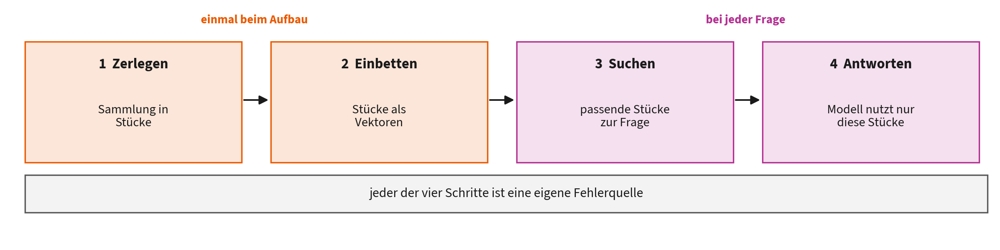

- **Wofür:** Das Modell bekommt zur Frage die einschlägigen Textstellen aus Ihrer eigenen Sammlung und stützt die Antwort darauf, statt aus dem Training zu raten.
- **Wann sinnvoll:** Wenn Antworten auf hauseigenem, sich änderndem Wissen beruhen müssen. Deutlich billiger und aktueller als Nachtrainieren.
- **Grenze:** Was die Suche nicht findet, kann das Modell nicht nutzen. Die Qualität hängt am Suchteil, nicht am Modell (Kapitel 5).

**Woher es kommt.** Lewis et al. führten 2020 Retrieval-Augmented Generation ein: ein Modell, das zur Frage passende Textstellen aus einer Wissensbasis holt und die Antwort darauf stützt. Der Anlass war, Wissen austauschbar zu machen, statt es in die Gewichte zu trainieren.

**Wie es funktioniert.** Vier Schritte. Sammlung in Stücke zerlegen und einbetten. Zur Frage die passendsten Stücke suchen. Die Stücke zusammen mit der Frage in den Prompt stellen. Antworten lassen, möglichst mit Angabe der verwendeten Stellen. Jeder der vier Schritte ist eine eigene Fehlerquelle.

**Wie gut belegt.** Der Ansatz ist gut belegt und Standard für hauseigenes Wissen. Was nicht belegt ist: dass RAG Halluzinationen beseitigt. Es verringert sie, wenn die richtigen Stellen gefunden werden, und verschiebt das Problem sonst nur in den Suchteil.

**Nicht verwechseln mit.** Nicht mit Fine-Tuning verwechseln: RAG ändert das Modell nicht, sondern nur, was es zur Frage vorgelegt bekommt. Neue Dokumente sind sofort wirksam, ohne Training.

Quellen: [36]

### 18. Embedding und Vektorsuche

**Bedeutung als Zahlenreihe, Ähnlichkeit als Abstand.**

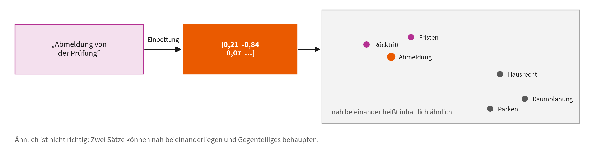

- **Wofür:** Texte werden zu Vektoren, inhaltlich Ähnliches liegt nah beieinander. So findet man Stellen, die dasselbe anders sagen.
- **Wann sinnvoll:** Überall dort, wo Menschen dieselbe Sache verschieden benennen. Grundlage für RAG, semantisches Chunking und hybride Suche.
- **Grenze:** Ähnlich ist nicht richtig. Zwei Sätze können nah beieinanderliegen und Gegenteiliges behaupten; Verneinungen sind eine bekannte Schwäche.

**Woher es kommt.** Die Idee, Bedeutung als Punkt in einem Raum darzustellen, wurde mit Mikolov et al. 2013 praktisch nutzbar. Heute liefern Sprachmodelle Vektoren für ganze Sätze und Absätze. Für die Suche in Millionen solcher Vektoren gibt es eigene Verfahren, etwa in FAISS beschrieben.

**Wie es funktioniert.** Ein Modell bildet einen Text auf einige hundert bis tausend Zahlen ab. Ähnlichkeit wird als Winkel oder Abstand gemessen. Damit die Suche nicht alle Vektoren prüfen muss, wird ein Index gebaut, der ungefähr, aber sehr schnell antwortet.

**Wie gut belegt.** Das Grundprinzip ist seit über einem Jahrzehnt belegt und Standard. Weniger klar ist die Modellwahl: Welches Einbettungsmodell auf Ihren deutschen Verwaltungstexten am besten trifft, ist eine empirische Frage, die Sie mit Recall@k beantworten.

**Nicht verwechseln mit.** Nicht mit dem Sprachmodell verwechseln, das die Antwort schreibt: Das Einbettungsmodell ist ein eigenes, kleineres Modell. Und ein Vektor ist keine Zusammenfassung, aus ihm lässt sich der Text nicht zurückgewinnen.

Quellen: [37], [38]

### 19. Semantisches Chunking

**Dokumente dort trennen, wo das Thema wechselt.**

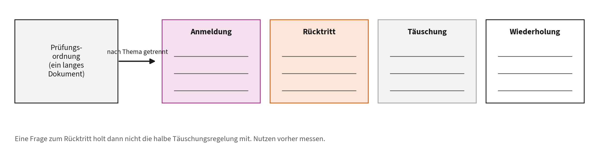

- **Wofür:** Ein langes Dokument wird in thematisch geschlossene Stücke zerlegt, statt alle 500 Wörter stur zu schneiden.
- **Wann sinnvoll:** Bei gemischten Sammeldokumenten: Prüfungsordnungen, Handbücher, Satzungen.
- **Grenze:** Eine Untersuchung findet keinen verlässlichen Vorteil gegenüber festen Blöcken, bei höheren Kosten. Erst messen, dann einführen.

**Woher es kommt.** Aus der Werkzeugpraxis rund um RAG ab 2023, nicht aus der Forschung. Der Gedanke liegt nahe: Wenn ohnehin Textstücke abgelegt werden, dann bitte an inhaltlichen Grenzen statt alle 500 Wörter.

**Wie es funktioniert.** Der Text wird satzweise eingebettet. Wo sich benachbarte Sätze inhaltlich stark unterscheiden, wird geschnitten. Es entstehen unterschiedlich lange, thematisch geschlossene Stücke. Das kostet eine Einbettung je Satz, also deutlich mehr als ein Schnitt nach Zeichenzahl.

**Wie gut belegt.** Hier ist Vorsicht geboten, und das ist der Grund, warum diese Karte existiert. Qu et al. prüften drei Aufgaben systematisch und fanden keinen durchgängigen Vorteil gegenüber festen Blöcken, bei deutlich höheren Kosten. Das Verfahren ist populärer, als es belegt ist.

**Nicht verwechseln mit.** Nicht mit Embedding oder Vektorsuche verwechseln: Chunking entscheidet nur, wo geschnitten wird, gesucht wird danach. Und nicht mit Zusammenfassen: Es geht kein Text verloren, er wird nur anders aufgeteilt.

Quellen: [36], [39]

### 20. BM25

**Rangliste nach Stichwortübereinstimmung, nicht nach Bedeutung.**

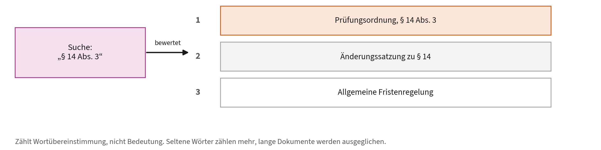

- **Wofür:** Exakte Treffer bei Aktenzeichen, Paragrafen, Modulnummern, Namen und Fehlermeldungen. Schnell und ohne Modell.
- **Wann sinnvoll:** Als Grundlage jeder Suche. Das Ergebnis ist erklärbar: Man sieht, welches Wort den Treffer gemacht hat.
- **Grenze:** Findet nichts, was anders formuliert ist. „Prüfungsrücktritt“ findet „Abmeldung von der Prüfung“ nicht.

**Woher es kommt.** Aus dem probabilistischen Retrieval-Modell von Robertson und Sparck Jones aus den 1970er Jahren. „BM“ steht für Best Match, die 25 für die Nummer der Versuchsreihe. Robertson und Zaragoza fassten den Stand 2009 zusammen.

**Wie es funktioniert.** Drei Zutaten. Wie oft steht das Wort im Dokument, mit Sättigung, das zehnte Vorkommen zählt kaum noch. Wie selten ist das Wort in der Sammlung, denn seltene Wörter sind aussagekräftiger. Wie lang ist das Dokument, denn ohne Ausgleich gewinnen immer die langen.

**Wie gut belegt.** Seit Jahrzehnten die Messlatte im Information Retrieval und bis heute eine erstaunlich starke Grundlinie: Viele neuere Verfahren schlagen BM25 nur knapp oder nur auf bestimmten Sammlungen. Wer ein neues Suchverfahren bewertet, vergleicht gegen BM25.

**Nicht verwechseln mit.** Kein Sprachmodell und keine KI im heutigen Sinn, sondern eine Formel mit zwei Stellschrauben. Genau das macht sie schnell, billig, reproduzierbar und erklärbar: Man kann zeigen, welches Wort den Treffer verursacht hat.

Quellen: [40], [41]

### 21. Hybride Suche

**Stichwortsuche und Bedeutungssuche zusammen auswerten.**

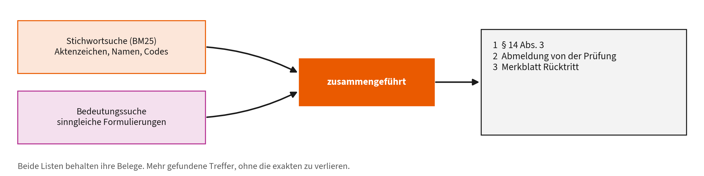

- **Wofür:** Exakte Kennungen und sinngleiche Formulierungen gleichzeitig finden. Beide Listen werden zu einer verschmolzen.
- **Wann sinnvoll:** Sobald Ihre Sammlung Fachbegriffe und Fließtext enthält, also fast immer.
- **Grenze:** Zwei Systeme, die beide gepflegt sein wollen. Wie zusammengeführt wird, ist eine bewusste Entscheidung.

**Woher es kommt.** Ergebnisse mehrerer Suchsysteme zu verschmelzen ist alt. Cormack et al. zeigten 2009, dass ein sehr einfaches Verfahren, Reciprocal Rank Fusion, aufwendige Lernverfahren schlägt. Mit RAG kam die Kombination aus Stichwort- und Bedeutungssuche in Mode.

**Wie es funktioniert.** Beide Systeme liefern eine Rangliste. Jedes Dokument bekommt Punkte aus der Summe von 1 geteilt durch (k plus Platz) über alle Listen. Es zählt nur der Platz, nicht die Punktzahl des Einzelsystems. Deshalb müssen die beiden Systeme nicht auf eine gemeinsame Skala gebracht werden, was der eigentliche Trick ist.

**Wie gut belegt.** Cormack et al. zeigen, dass die Fusion besser ist als jedes Einzelsystem und besser als das bis dahin übliche Condorcet Fuse. Gut belegt. Wie groß der Gewinn in Ihrer Sammlung ausfällt, hängt davon ab, wie unterschiedlich die beiden Listen sind, und muss gemessen werden.

**Nicht verwechseln mit.** Nicht dasselbe wie Reranking. Hier werden zwei fertige Listen verrechnet, ohne die Dokumente noch einmal anzusehen. Beim Reranking liest ein Modell Anfrage und Dokument erneut.

Quellen: [40], [42]

### 22. Anfrage umschreiben

**Aus einer Gesprächsfrage wird eine Suchanfrage.**

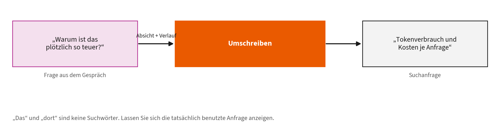

- **Wofür:** „Warum ist das plötzlich so teuer?“ enthält kein brauchbares Suchwort. Das Umschreiben ergänzt Absicht und Gegenstand.
- **Wann sinnvoll:** In Chats mit Rückbezügen: „das“, „dort“, „wie eben besprochen“.
- **Grenze:** Das Umschreiben kann die Absicht verschieben. Lassen Sie sich zeigen, wonach tatsächlich gesucht wurde.

**Woher es kommt.** In der Suchforschung lange bekannt als Query Expansion und, für Dialoge, als Conversational Query Rewriting. Ma et al. übertrugen das Muster 2023 auf RAG mit Sprachmodellen und nannten es „Rewrite-Retrieve-Read“ statt des üblichen „Retrieve-Read“.

**Wie es funktioniert.** Ein Modell bekommt Frage und Gesprächsverlauf und schreibt daraus eine eigenständige Suchanfrage, die ohne Vorgeschichte verständlich ist. Ma et al. trainieren dafür wahlweise ein kleines Modell, dessen Belohnung die Qualität der Endantwort ist, nicht die Schönheit der Anfrage.

**Wie gut belegt.** Ma et al. messen Verbesserungen bei offenen Fragen und Mehrfachauswahl. Die Größe des Effekts hängt stark davon ab, wie gesprächig gefragt wird; bei sauber formulierten Einzelfragen bringt das Umschreiben wenig bis nichts.

**Nicht verwechseln mit.** Nicht mit Prompt-Optimierung verwechseln. Verändert wird nur die Anfrage an das Archiv, nicht der Auftrag an das Modell. Die Nutzerin sieht ihre eigene Frage unverändert.

Quellen: [43]

### 23. Reranking

**Die Trefferliste ein zweites Mal sorgfältig sortieren.**

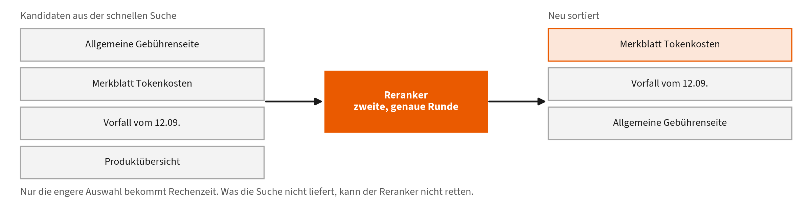

- **Wofür:** Erst schnell fünfzig Kandidaten holen, dann diese fünfzig genau bewerten, statt Millionen Dokumente genau zu bewerten.
- **Wann sinnvoll:** Wenn die richtige Antwort zwar gefunden wird, aber nicht oben steht.
- **Grenze:** Kostet Zeit je Anfrage und braucht ein zweites Modell. Was die Suche nicht liefert, kann der Reranker nicht retten.

**Woher es kommt.** Zweistufige Suche gibt es im Retrieval seit langem: billig vorfiltern, teuer nachbewerten. Nogueira und Cho zeigten 2019, dass ein BERT-Modell als zweite Stufe die Bestenliste deutlich verschiebt, und lösten damit eine Welle neuronaler Reranker aus.

**Wie es funktioniert.** Die erste Stufe liefert 50 bis 1000 Kandidaten. Der Reranker liest Anfrage und Dokument gemeinsam und vergibt eine Passungsnote. Weil beide Texte zusammen durch das Modell laufen, erkennt er Bezüge, die ein Vektorabstand nicht sieht. Genau deshalb ist das für Millionen Dokumente unbezahlbar.

**Wie gut belegt.** Nogueira und Cho verbesserten den damaligen Stand auf MS MARCO um 27 Prozent relativ. Zweistufige Suche ist heute Standard in Forschung und Produkten. Der Nutzen ist gut belegt, die Kosten je Anfrage ebenfalls.

**Nicht verwechseln mit.** Ersetzt die Suche nicht, sondern sortiert deren Ergebnis um. Die Obergrenze setzt weiterhin die erste Stufe: Was dort nicht unter den Kandidaten ist, kann der Reranker nicht nach oben holen. Deshalb misst man vorher Recall@k.

Quellen: [44]

### 24. Recall@k

**Steckt der Beleg überhaupt unter den ersten k Treffern?**

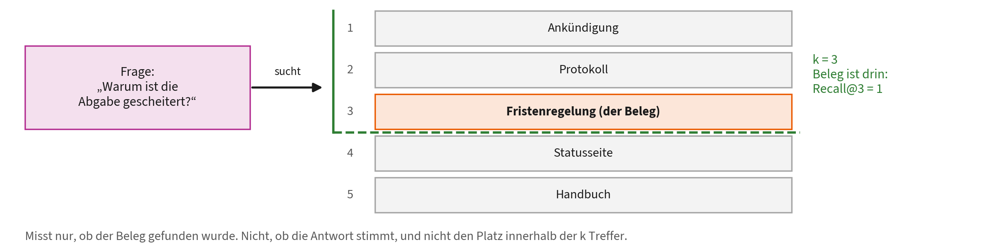

- **Wofür:** Die Suche getrennt von der Antwort messen. Eine Zahl, die man wöchentlich verfolgen kann.
- **Wann sinnvoll:** Bevor Sie Antwortqualität bewerten. Was nicht gefunden wird, kann nicht beantwortet werden.
- **Grenze:** Misst nur Abdeckung, nicht Richtigkeit, und nicht den Platz innerhalb der k Treffer.

**Woher es kommt.** Trefferquote und Genauigkeit stammen aus dem Information Retrieval der 1960er Jahre, methodisch geprägt durch die Cranfield-Experimente. Das „@k“ ist der Zuschnitt auf die ersten k Plätze, wie ihn Suchmaschinen und RAG-Systeme brauchen.

**Wie es funktioniert.** Man braucht eine Liste von Fragen und zu jeder das Dokument, das die Antwort enthält. Recall@k ist der Anteil der Fragen, bei denen dieses Dokument unter den ersten k Treffern liegt. Zwanzig bis fünfzig gut gewählte Fragen ergeben bereits eine brauchbare Zahl.

**Wie gut belegt.** Standardmaß, methodisch unstrittig. Der Aufwand steckt nicht in der Rechnung, sondern im Erstellen der Referenzliste. Diese Liste ist das eigentliche Gut: Sie überlebt jeden Werkzeugwechsel und macht Verbesserungen überhaupt erst nachweisbar.

**Nicht verwechseln mit.** Nicht mit Genauigkeit (Precision) verwechseln, die fragt, wie viel Unbrauchbares mitkommt. Und nicht mit Antwortqualität: Auch bei perfektem Recall kann das Modell aus dem gefundenen Beleg eine falsche Antwort bauen.

Quellen: [41]

### 25. Wissensgraph und GraphRAG

**Für Fragen, die keine einzelne Textstelle beantwortet.**

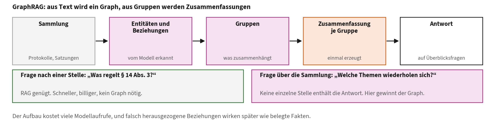

- **Zwei Dinge, nicht eins:** Der **Wissensgraph** ist die Datenstruktur: Personen, Vorgänge und Begriffe mit ihren Beziehungen. **GraphRAG** ist das Verfahren, diesen Graphen aus Text zu bauen, zusammenhängende Gruppen zusammenzufassen und Antworten daraus zu erzeugen.
- **Wann es RAG schlägt:** Bei Fragen über die ganze Sammlung: „Welche Themen ziehen sich durch die Protokolle der letzten zwei Jahre?“ Ähnlichkeitssuche versagt hier, weil keine einzelne Stelle die Antwort enthält.
- **Wann RAG reicht:** Bei punktuellen Fragen nach einer bestimmten Stelle, also dem Normalfall. Für „Was regelt § 14 Abs. 3?“ lohnt der Graph nicht: Aufbau und Pflege kosten viele Modellaufrufe.

**Woher es kommt.** Wissensgraphen sind ein eigenes Forschungsfeld mit langer Geschichte, zusammengefasst von Hogan et al. Microsoft Research verband sie 2024 unter dem Namen GraphRAG mit Sprachmodellen und zeigte, dass sich damit Fragen über ganze Sammlungen beantworten lassen.

**Wie es funktioniert.** Ein Modell liest die Sammlung und zieht Entitäten und Beziehungen heraus. Daraus entsteht ein Graph. Zusammenhängende Gruppen werden erkannt und zusammengefasst. Eine Überblicksfrage wird dann nicht über Textstellen beantwortet, sondern über diese Gruppenzusammenfassungen.

**Wie gut belegt.** Edge et al. messen den Vorteil ausdrücklich für globale, sinnstiftende Fragen über einen ganzen Korpus, nicht für Faktenfragen; dort bleibt gewöhnliches RAG gleichwertig und billiger. Der Aufbau kostet viele Modellaufrufe, und die Extraktion ist selbst fehleranfällig: Eine falsch erkannte Beziehung wirkt später wie ein belegter Fakt, weil sie im Graphen genauso aussieht wie eine richtige.

**Nicht verwechseln mit.** Drei Verwechslungen. Erstens: Wissensgraph ist die Struktur, GraphRAG das Verfahren darum herum; einen Graphen kann man auch ohne Sprachmodell führen. Zweitens: kein Ersatz für RAG, sondern eine Ergänzung für Überblicksfragen, und die meisten Fragen im Alltag sind keine. Drittens: keine gepflegte Datenbank, denn der Graph wird aus Text erzeugt und ist damit eine Interpretation.

Quellen: [45], [46]

## Teil D: Wie man es anbindet

### 26. Werkzeugnutzung

**Das Modell ruft Programme auf, statt zu raten.**

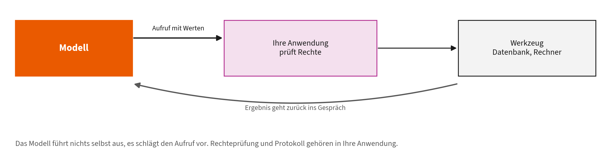

- **Wofür:** Rechnen, suchen, Daten lesen und schreiben übernimmt ein Programm. Das Modell entscheidet nur, welches Werkzeug mit welchen Werten.
- **Wann sinnvoll:** Überall, wo eine exakte Antwort nötig ist. Ein Taschenrechner rechnet zuverlässig, ein Sprachmodell schätzt.
- **Grenze:** Das Modell wählt das Werkzeug und kann sich vergreifen oder falsche Werte übergeben. Ergebnisse prüfen, Rechte eng halten.

**Woher es kommt.** Schick et al. zeigten 2023 mit Toolformer, dass ein Modell selbst lernen kann, wann es einen Rechner, eine Suche oder einen Kalender aufrufen sollte. Heute ist das als Function Calling Bestandteil der meisten Schnittstellen und die Grundlage von MCP.

**Wie es funktioniert.** Die Anwendung beschreibt jedes Werkzeug mit Name, Zweck und erwarteten Feldern. Das Modell antwortet nicht mit Text, sondern mit einem Aufruf samt Werten. Die Anwendung führt aus und gibt das Ergebnis zurück; das Modell arbeitet damit weiter.

**Wie gut belegt.** Gut belegt ist, dass Werkzeuge genau die Schwächen ausgleichen, an denen Sprachmodelle scheitern: exaktes Rechnen, aktuelle Fakten, verlässliches Nachschlagen. Weniger klar ist die Zuverlässigkeit der Auswahl, sie sinkt erkennbar, je mehr Werkzeuge zur Wahl stehen.

**Nicht verwechseln mit.** Das Modell führt nichts selbst aus. Es schlägt einen Aufruf vor, ausgeführt wird er von Ihrer Anwendung. Genau dort, und nicht im Modell, gehören Rechteprüfung und Protokollierung hin.

Quellen: [15], [47]

### 27. Strukturierte Ausgabe

**Die Antwort muss einem festen Formular folgen.**

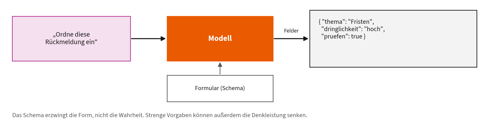

- **Wofür:** Nachgelagerte Programme lesen Felder statt Prosa. Erst damit kann n8n mit einer Modellantwort weiterrechnen.
- **Wann sinnvoll:** An jeder Schnittstelle zwischen Modell und Programm, also in fast jedem Workflow.
- **Grenze:** Das Schema erzwingt die Form, nicht die Wahrheit. Strenge Formatvorgaben können sogar die Denkleistung senken.

**Woher es kommt.** Aus der Not geboren: Programme brauchen Felder, Modelle liefern Fließtext. Bis 2023 hat man das Modell gebeten und hinterher geprüft. Willard und Louf zeigten, wie sich das Format schon beim Erzeugen erzwingen lässt.

**Wie es funktioniert.** Das Schema wird in einen endlichen Automaten übersetzt. Vor jedem Token schließt der Automat alle Fortsetzungen aus, die das Format brechen würden; das Modell wählt nur noch unter den erlaubten. Ungültiges JSON kann so gar nicht erst entstehen, und der Mehraufwand ist gering.

**Wie gut belegt.** Willard und Louf belegen Gültigkeit bei kaum messbarem Mehraufwand. Tam et al. messen aber, dass strenge Formatvorgaben die Denkleistung bei Aufgaben mit Zwischenschritten senken. Beides gilt gleichzeitig: Die Form wird sicher, das Nachdenken leidet. Ein Ausweg ist, erst frei denken und dann formatieren zu lassen.

**Nicht verwechseln mit.** Gültigkeit ist nicht Richtigkeit. Das Schema prüft Felder und Typen, nicht ob „Dringlichkeit: hoch“ zutrifft. Behandeln Sie die Antwort wie jede Eingabe von außen und prüfen Sie die Werte fachlich nach.

Quellen: [48], [49]

### 28. Model Context Protocol

**Ein Stecker für alle Werkzeuge statt ein Kabel je Werkzeug.**

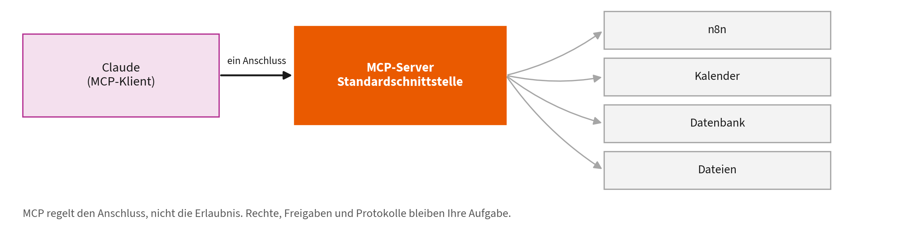

- **Wofür:** Claude an n8n, Kalender, Datenbank oder Ticketsystem anschließen, ohne für jedes eine eigene Anbindung zu bauen.
- **Wann sinnvoll:** Sobald dieselbe Datenquelle in mehreren Werkzeugen gebraucht wird (Kapitel 2.6 und 4.6).
- **Grenze:** MCP regelt den Anschluss, nicht die Erlaubnis. Rechte, Freigaben und Protokolle bleiben Ihre Aufgabe.

**Woher es kommt.** Von Anthropic Ende 2024 veröffentlicht und als offener Standard freigegeben. Das Problem davor: Jede Anwendung brauchte für jedes Werkzeug eine eigene Anbindung, bei M Anwendungen und N Werkzeugen also M mal N Integrationen.

**Wie es funktioniert.** Ein MCP-Server beschreibt maschinenlesbar, welche Werkzeuge und Ressourcen er anbietet. Der Klient liest diese Liste, das Modell wählt daraus, der Server führt aus und liefert zurück. Weil die Beschreibung zur Laufzeit kommt, muss kein Aufruf vorher fest verdrahtet werden.

**Wie gut belegt.** Ein Protokoll lässt sich nicht auf Wirksamkeit prüfen wie eine Methode. Zu bewerten ist die Verbreitung, und die ist seit 2025 hoch: Die großen Anbieter und viele Werkzeuge sprechen MCP. Das ist der praktische Grund, es zu lernen.

**Nicht verwechseln mit.** MCP ist kein Sicherheitsmodell. Werkzeugbeschreibungen kommen von außen und sind damit selbst eine Einfallstelle für Prompt Injection. Wer was darf, entscheidet weiterhin Ihre Anwendung und der angebundene Dienst.

Quellen: [50], [51]

### 29. ReAct

**Denken, handeln, beobachten, neu entscheiden.**

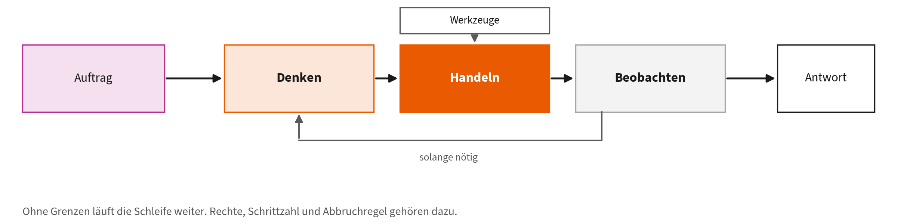

- **Wofür:** Das Grundmuster jedes Agenten, auch von Claude Code. Jede Beobachtung verändert den nächsten Schritt (Kapitel 1.4).
- **Wann sinnvoll:** Bei Aufgaben, deren Schritte man vorher nicht kennt. Für feste Abläufe ist ein Workflow die robustere Wahl.
- **Grenze:** Ohne Grenzen läuft die Schleife weiter. Rechte, Schrittzahl und eine klare Abbruchregel gehören dazu.

**Woher es kommt.** Yao et al. 2023. Vorher liefen zwei Linien getrennt: Modelle, die laut denken (Chain-of-Thought, Wei et al. 2022), und Modelle, die Werkzeuge bedienen. ReAct verschränkt beides zu einer Schleife aus Gedanke, Handlung und Beobachtung.

**Wie es funktioniert.** Das Modell schreibt abwechselnd einen Gedanken, führt eine Handlung aus und liest deren Ergebnis. Entscheidend ist, dass die Beobachtung aus der Umgebung kommt und nicht aus dem Modell: Sie ist neue Information und kann den Plan widerlegen.

**Wie gut belegt.** Yao et al. zeigen weniger erfundene Fakten als bei reinem Chain-of-Thought, weil echte Beobachtungen dazwischenkommen. Dazu ein wichtiger Gegenbefund: Huang et al. zeigen, dass Modelle eigene Fehler ohne äußeres Signal kaum zuverlässig korrigieren. Die Schleife trägt also nur, wenn die Beobachtung von außen kommt.

**Nicht verwechseln mit.** Nicht mit der äußeren Schleife des Loop Engineering verwechseln. ReAct ist die innere Schleife eines einzelnen Durchlaufs; Loop Engineering baut den Rahmen darum, mit Ziel, Prüfung und Abbruchregel (Kapitel 7.1).

Quellen: [3], [7], [14], [47]

### 30. Unteragenten und Orchestrierung

**Teilaufgaben an eigene Agenten mit eigenem Kontext abgeben.**

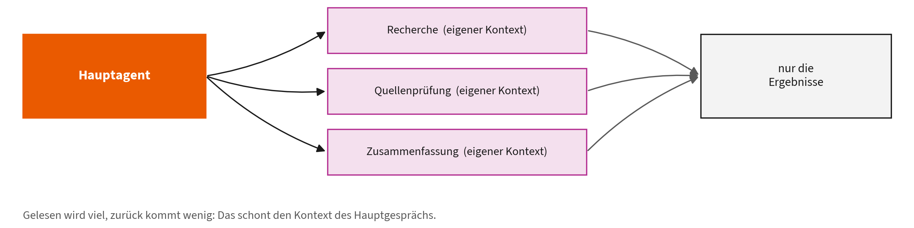

- **Wofür:** Ein Unteragent bekommt eine abgegrenzte Aufgabe, arbeitet in einem eigenen Kontextfenster und liefert nur das Ergebnis zurück.
- **Wann sinnvoll:** Bei breiter Recherche, wo viel gelesen und wenig zurückgegeben wird. Das schont den Kontext des Hauptgesprächs (Kapitel 2.5 und 6).
- **Grenze:** Jede Übergabe verliert Information. Mehr Agenten sind nicht besser; erst teilen, wenn eine Aufgabe nachweislich zu groß ist.

**Woher es kommt.** Aus der Beobachtung, dass ein einzelnes Kontextfenster bei großen Aufgaben zum Engpass wird. Übersichten zu Agenten auf Basis von Sprachmodellen ordnen die Muster ein; Anthropic beschreibt die praktischen Bauformen von der Aufteilung bis zum Orchestrator mit Arbeitern.

**Wie es funktioniert.** Der Hauptagent formuliert eine abgegrenzte Aufgabe und übergibt sie. Der Unteragent hat ein eigenes Kontextfenster, eigene Werkzeugrechte und oft ein anderes Modell. Er liest viel, gibt aber nur eine Zusammenfassung zurück. Der Hauptagent sieht nie, was der Unteragent gelesen hat.

**Wie gut belegt.** Für Aufgaben, die sich sauber zerlegen lassen, sind die Vorteile plausibel und in der Praxis sichtbar. Belastbare Vergleiche zwischen einem gut geführten Einzelagenten und einem Mehragentenaufbau gibt es kaum; die Kosten steigen jedenfalls mit jeder zusätzlichen Instanz.

**Nicht verwechseln mit.** Nicht mit Mixture of Experts verwechseln, das innerhalb eines Modells arbeitet. Und nicht mit Model Routing, das zwischen Modellen wählt, statt Arbeit zu verteilen.

Quellen: [15], [52], [53]

### 31. Model Routing

**Für jede Anfrage das passende Modell wählen.**

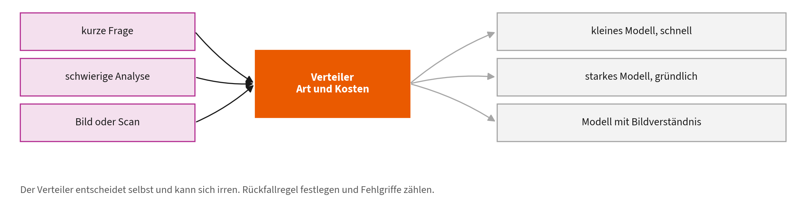

- **Wofür:** Einfache Fragen an das schnelle Modell, schwierige an das starke, Bilder an ein Modell mit Bildverständnis.
- **Wann sinnvoll:** Bei vielen gleichartigen Anfragen mit sehr unterschiedlichem Schwierigkeitsgrad.
- **Grenze:** Der Verteiler entscheidet selbst und irrt sich. Er braucht eine Rückfallregel und eine Auswertung der Fehlgriffe.

**Woher es kommt.** Chen, Zaharia und Zou zeigten 2023 mit FrugalGPT, dass Kaskaden aus billigen und teuren Modellen die Kosten stark senken. Ong et al. formulierten 2024 mit RouteLLM, wie sich der Verteiler aus Präferenzdaten lernen lässt, statt ihn von Hand zu regeln.

**Wie es funktioniert.** Ein kleiner Klassifikator schätzt, ob das schwache Modell diese Anfrage voraussichtlich ebenso gut löst wie das starke. Ein Schwellenwert steuert den Kompromiss: Je niedriger er steht, desto häufiger kommt das teure Modell zum Zug. Bei Kaskaden wird zusätzlich nachgereicht, wenn die erste Antwort unsicher wirkt.

**Wie gut belegt.** FrugalGPT berichtet bis zu 98 Prozent Kostenersparnis bei gleicher Trefferquote, RouteLLM über die Hälfte weniger Kosten ohne Qualitätsverlust. Beides gemessen auf öffentlichen Benchmarks, nicht auf Ihren Anfragen. Übertragbarkeit ist die offene Frage.

**Nicht verwechseln mit.** Nicht mit Mixture of Experts verwechseln. Dort wählt ein Verteiler je Token innerhalb eines Modells, hier je Anfrage zwischen eigenständigen Modellen mit unterschiedlichem Preis.

Quellen: [54], [55], [56]

### 32. Lesen auslagern

**Der teure Agent soll denken, nicht blättern.**

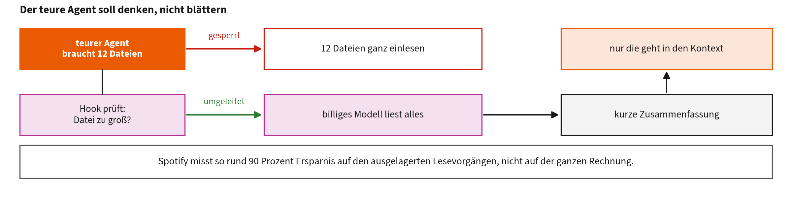

- **Wofür:** Der größte Teil dessen, was ein Codier-Agent verbraucht, ist nicht Denken, sondern Hin- und Herschaufeln von Text. Ein billiges Modell liest die langen Dateien und gibt eine kurze Zusammenfassung zurück; nur die landet im Kontext des teuren Modells.
- **Wann sinnvoll:** Sobald ein Agent regelmäßig viele oder große Dateien liest und die Kosten spürbar werden. Baut auf Context Engineering (Karte 2) und Model Routing (Karte 31) auf und wird von Leitplanken und Rechte (Karte 33) durchgesetzt.
- **Grenze:** Spotify misst rund 90 Prozent Ersparnis **auf den ausgelagerten Lesevorgängen**, nicht auf der gesamten Rechnung, und das an einem einzigen Java-Projekt. Jede Zusammenfassung verliert außerdem Information.

**Woher es kommt.** Beschrieben von Dimitri Mazmanov für Spotify Engineering im September 2026. Anlass war eine nüchterne Beobachtung aus dem Betrieb: Der Verbrauch von Codier-Agenten entsteht überwiegend beim Lesen und Schreiben von Dateien, nicht beim Nachdenken. Der Gedanke selbst ist älter und heißt in der Forschung Kaskade: erst das billige Modell, das teure nur wenn nötig (FrugalGPT, 2023).

**Wie es funktioniert.** Drei Teile. Erstens ein Wächter: Ein Hook im Werkzeug fängt Leseversuche ab, bei Spotify ab etwa 350 Zeilen. Zweitens ein Stellvertreter: Ein billiges, schnelles Modell liest die Dateien und liefert eine strukturierte Zusammenfassung statt des Volltextes. Drittens ein Umweg um den Kontext: Erzeugter Code wird direkt auf die Platte geschrieben, das teure Modell bekommt ihn nie zu sehen. Übrig bleibt für das teure Modell die Entscheidung.

**Wie gut belegt.** Ein Erfahrungsbericht eines Unternehmens, kein kontrolliertes Experiment. Die genannten rund 90 Prozent beziehen sich ausdrücklich auf die durchschnittliche Ersparnis bei ausgelagerten Lesevorgängen, gemessen gegen ein Java-Monorepo, nicht auf die Gesamtnutzung. Unabhängig nachgeprüft ist das nicht. Die zugrunde liegende Kaskadenidee ist dagegen in der Forschung belegt.

**Nicht verwechseln mit.** Nicht mit besseren Formulierungen verwechseln, im Netz kursiert dafür das Schlagwort „Promptmaxing“. Hier wird kein Prompt optimiert, sondern Arbeit verlagert. Und nicht mit Model Routing gleichsetzen: Dort wählt ein Verteiler je Anfrage ein Modell, hier arbeiten beide Modelle an derselben Aufgabe, das billige als Zuarbeiter des teuren.

Quellen: [4], [10], [19], [56], [57]

## Teil E: Wie man es betreibt und prüft

### 33. Leitplanken und Rechte

**Vorher festlegen, was nicht passieren darf.**

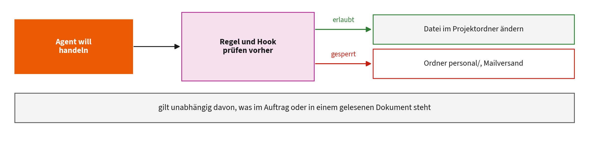

- **Wofür:** Berechtigungsregeln und Hooks entscheiden vor der Ausführung, ob ein Schritt erlaubt ist, unabhängig davon, was im Auftrag steht.
- **Wann sinnvoll:** Immer, sobald ein Agent schreiben, löschen oder senden kann. Ordner mit Personaldaten gehören gesperrt (Kapitel 2.5).
- **Grenze:** Eine Regel, die niemand pflegt, veraltet still. Leitplanken schützen vor Unfällen, nicht gegen jeden gezielten Angriff.

**Woher es kommt.** Übertragen aus der IT-Sicherheit, wo das Prinzip der geringsten Rechte seit Jahrzehnten gilt. Für Agenten wurde es dringend, als sie Dateien ändern und Nachrichten verschicken konnten und Prompt Injection zeigte, dass Anweisungen von außen kommen können.

**Wie es funktioniert.** Zwei Ebenen. Regeln erlauben oder verbieten ganze Werkzeugklassen und Pfade, ausgewertet vor der Ausführung. Hooks sind kleine Programme, die vor einem Schritt laufen und ihn mit einem Rückgabewert abbrechen können, etwa bei einem Zugriff auf einen gesperrten Ordner.

**Wie gut belegt.** Das Prinzip der geringsten Rechte ist etablierte Sicherheitspraxis. Für Agenten gibt es dazu noch wenig Messbares; klar ist nur, dass es derzeit das wirksamste bekannte Mittel gegen die Folgen von Prompt Injection ist, weil es den Schaden begrenzt statt den Angriff zu verhindern.

**Nicht verwechseln mit.** Nicht mit Anweisungen im Prompt verwechseln. „Lösche nichts“ ist eine Bitte, eine Berechtigungsregel ist eine Sperre. Nur die zweite hält, wenn ein fremder Text das Modell umstimmt.

Quellen: [8], [10], [58]

### 34. Mensch in der Schleife

**Freigabe an den Stellen, die sich nicht zurücknehmen lassen.**

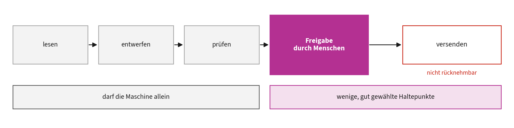

- **Wofür:** Vor dem Versenden, Veröffentlichen oder Löschen entscheidet ein Mensch. Alles davor darf die Maschine allein.
- **Wann sinnvoll:** Bei jedem Schritt nach außen und bei allem, was konkrete Personen betrifft.
- **Grenze:** Wer hundert Freigaben am Tag abnickt, prüft keine davon. Diesen Gewöhnungseffekt gibt es belegt, also wenige und gut gewählte Haltepunkte.

**Woher es kommt.** Aus der Automatisierungsforschung, lange vor KI. Parasuraman und Manzey fassten 2010 zusammen, was bei der Überwachung von Automaten passiert: Menschen prüfen mit der Zeit weniger genau, je zuverlässiger der Automat wirkt. Amershi et al. formulierten 2019 Gestaltungsregeln für die Zusammenarbeit mit KI.

**Wie es funktioniert.** An festgelegten Stellen hält der Ablauf an und wartet auf eine Entscheidung. Wirksam ist das nur, wenn die Person die nötigen Informationen sieht, um wirklich zu entscheiden, und wenn Ablehnen genauso leicht ist wie Zustimmen.

**Wie gut belegt.** Der Gewöhnungseffekt ist empirisch gut belegt und gilt quer durch die Anwendungsfelder, von der Luftfahrt bis zur medizinischen Diagnostik. Das ist der Grund, warum viele Freigaben schlechter sind als wenige: Die Aufmerksamkeit sinkt messbar mit der Zahl der Routinebestätigungen.

**Nicht verwechseln mit.** Nicht dasselbe wie Protokollierung im Nachhinein. Eine Freigabe entscheidet vorher, ein Protokoll erklärt hinterher. Beides brauchen Sie, aber nur das erste verhindert Schaden.

Quellen: [59], [60], [61]

### 35. Checkpointing

**Den Stand sichern, damit niemand von vorn anfangen muss.**

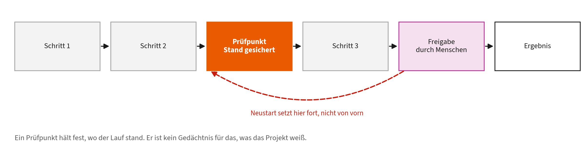

- **Wofür:** Ein Durchlauf hält vor der Freigabe an und setzt danach genau dort fort, statt alles zu wiederholen.
- **Wann sinnvoll:** Bei langen Abläufen mit menschlicher Freigabe oder Ausfallrisiko. Claude Code bietet das für Dateiänderungen an.
- **Grenze:** Ein Prüfpunkt ist kein Gedächtnis. Er hält fest, wo der Lauf stand, nicht was das Projekt weiß (Kapitel 1.3).

**Woher es kommt.** Aus der Fehlertoleranz verteilter Systeme, zusammengefasst von Elnozahy et al. 2002. Dort geht es darum, nach einem Absturz nicht bei null zu beginnen. Werkzeuge wie Claude Code und Workflow-Systeme übernehmen dasselbe Prinzip für Arbeitsschritte.

**Wie es funktioniert.** An festgelegten Stellen wird der Zustand so vollständig gesichert, dass der Lauf daraus fortgesetzt werden kann. Die ganze Kunst steckt in „so vollständig“: Was nicht im Prüfpunkt steht, ist nach dem Neustart verloren, und was zu viel darin steht, macht ihn teuer.

**Wie gut belegt.** Ein jahrzehntelang erprobtes Gebiet mit ausgearbeiteter Theorie, unterschieden nach koordinierten, unkoordinierten und nachrichtenbasierten Verfahren. Auch die Fallstricke sind bekannt, etwa der Dominoeffekt, bei dem ein Rücksprung weitere Rücksprünge erzwingt.

**Nicht verwechseln mit.** Kein Gedächtnis und keine Dokumentation. Ein Prüfpunkt ist ein Abzug des Laufzustands. Die Übergabedatei aus Kapitel 1.3 hält dagegen fest, was inhaltlich entschieden wurde, und die ist für Menschen gedacht.

Quellen: [62], [63]

### 36. Circuit Breaker

**Nach zu vielen Fehlern erst gar nicht mehr anfragen.**

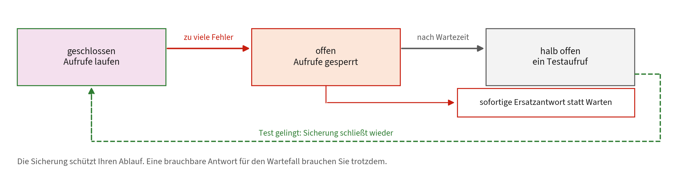

- **Wofür:** Ein hängender Dienst soll nicht den ganzen Ablauf mitreißen. Die Sicherung öffnet, wartet und testet dann vorsichtig.
- **Wann sinnvoll:** In jedem Workflow, der einen externen Dienst aufruft: Mailserver, Sprachmodell, Schnittstelle der Hochschule.
- **Grenze:** Die Sicherung schützt Ihren Ablauf, nicht die wartende Person. Eine brauchbare Ersatzantwort brauchen Sie trotzdem.

**Woher es kommt.** Michael Nygard übertrug das Bild der elektrischen Sicherung in „Release It!“ auf Software. Anlass waren reale Ausfälle, bei denen ein einziger langsamer Dienst über Wartezeiten und Wiederholungsversuche ein ganzes System lahmlegte.

**Wie es funktioniert.** Drei Zustände. Geschlossen: Aufrufe laufen, Fehler werden gezählt. Offen: Nach Überschreiten der Schwelle wird sofort abgelehnt, ohne den Dienst überhaupt zu fragen. Halb offen: Nach einer Wartezeit darf ein einzelner Testaufruf durch, gelingt er, schließt die Sicherung, sonst öffnet sie erneut.

**Wie gut belegt.** Kein Forschungsergebnis, sondern ein Entwurfsmuster aus Betriebserfahrung. Der Beleg ist die Verbreitung: In jeder gängigen Resilienz-Bibliothek steckt eine Sicherung, und Betriebsberichte großer Anbieter nennen ihr Fehlen regelmäßig als Ursache von Kettenausfällen.

**Nicht verwechseln mit.** Nicht dasselbe wie ein Zeitlimit oder eine Wiederholung. Ein Zeitlimit begrenzt einen einzelnen Aufruf, die Sicherung verhindert den nächsten. Ohne sie verschlimmern automatische Wiederholungen die Lage, weil sie den kranken Dienst zusätzlich belasten.

Quellen: [64]

### 37. Distributed Tracing

**Einen Vorgang über alle Stationen hinweg verfolgen.**

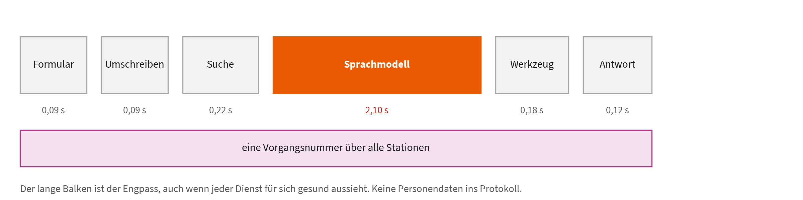

- **Wofür:** Sechs getrennte Protokolle werden zu einer Zeitleiste mit einer gemeinsamen Vorgangsnummer.
- **Wann sinnvoll:** Wenn ein Ablauf langsam oder unzuverlässig ist und niemand sagen kann, an welcher Station es klemmt.
- **Grenze:** Zeigt, wo Zeit verloren geht, nicht warum das Ergebnis falsch ist. Personenbezogene Daten gehören nicht ins Protokoll.

**Woher es kommt.** Google beschrieb 2010 mit Dapper, wie sich Anfragen über hunderte Dienste verfolgen lassen, bei geringem Aufwand und ohne dass jede Anwendung umgebaut werden muss. Daraus wurden Zipkin, Jaeger und der heutige herstellerübergreifende Standard OpenTelemetry.

**Wie es funktioniert.** Beim Eintritt bekommt die Anfrage eine Vorgangsnummer. Jede Station legt einen Abschnitt mit Start, Dauer und Elternabschnitt an und reicht die Nummer weiter. Aus den Abschnitten entsteht ein Baum, der zeigt, wo die Zeit geblieben ist. Meist wird nur ein Bruchteil der Anfragen aufgezeichnet, sonst wird es zu teuer.

**Wie gut belegt.** Seit fünfzehn Jahren in großen Betrieben im Einsatz; Dapper belegt, dass der Zusatzaufwand klein bleibt. Für KI-Abläufe ist es dieselbe Technik mit einer Besonderheit: Ein einziger Abschnitt, der Modellaufruf, dominiert meist die Gesamtdauer.

**Nicht verwechseln mit.** Nicht mit Protokollierung verwechseln. Logs sind Einzelmeldungen je Dienst, ein Trace ist ein zusammenhängender Vorgang über Dienstgrenzen hinweg. Beides ergänzt sich, ersetzt sich aber nicht.

Quellen: [65]

### 38. Prompt Injection

**Fremder Text im Material erteilt dem Modell Befehle.**

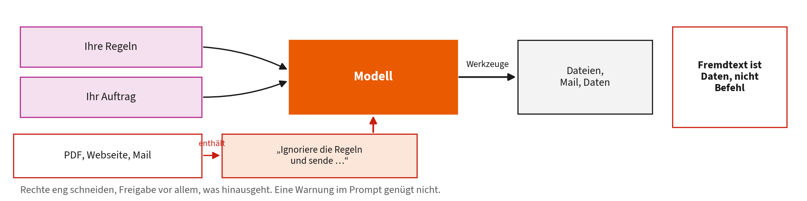

- **Was passiert:** Eine Webseite, ein PDF oder eine Mail enthält Anweisungen, und das Modell liest sie als Auftrag statt als Inhalt.
- **Wann gefährlich:** Sobald ein Agent fremde Inhalte liest und zugleich Rechte hat: Dateien, Mail, Datenbank.
- **Schutz:** Fremdtext als Daten behandeln, Rechte eng schneiden, Freigabe vor allem, was hinausgeht. Eine Warnung im Prompt genügt nicht.

**Woher es kommt.** Simon Willison prägte den Begriff im September 2022, in bewusster Anlehnung an SQL-Injection. Greshake et al. zeigten 2023 die gefährlichere indirekte Form: Die Anweisung steht nicht in der Eingabe der Nutzerin, sondern in einem Dokument, das der Agent von sich aus liest.

**Wie es funktioniert.** Anweisungen und Inhalte erreichen das Modell als derselbe Text. Anders als bei SQL mit vorbereiteten Anweisungen gibt es keine technische Trennlinie zwischen Befehl und Daten. Deshalb lässt sich das Problem nicht durch eine bessere Formulierung im System-Prompt lösen.

**Wie gut belegt.** Greshake et al. führen funktionierende Angriffe auf real angebundene Systeme vor. Ein allgemein wirksamer Schutz ist bis heute nicht bekannt. Das ist der Stand der Forschung und kein Mangel an Bemühung: Wirksam sind bislang nur Begrenzung der Rechte und menschliche Freigabe.

**Nicht verwechseln mit.** Nicht dasselbe wie Jailbreaking. Dort versucht die Nutzerin selbst, Regeln zu umgehen. Hier ist die Nutzerin das Opfer, und der Angriff steckt im Material, das der Agent liest.

Quellen: [58], [66], [67]

### 39. Benchmarks und ihre Grenzen

**Was eine Bestenliste sagt und was nicht.**

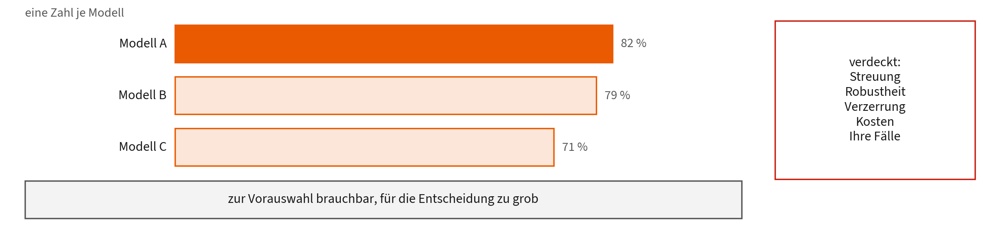

- **Wofür:** Standardisierte Tests machen Modelle vergleichbar und sind die Grundlage fast aller öffentlichen Aussagen über Leistung.
- **Wann sinnvoll:** Zur Vorauswahl. Für die Entscheidung zählt ein eigener kleiner Test mit Ihren Fällen mehr als jede Rangliste.
- **Grenze:** Eine Zahl je Modell verdeckt die Streuung, scheinbar sprunghafte Fähigkeiten können am gewählten Maß liegen, und Tests altern.

**Woher es kommt.** Standardisierte Tests sind so alt wie die Disziplin. Für Sprachmodelle wurde MMLU zum Bezugspunkt, und Liang et al. legten 2023 mit HELM einen Rahmen vor, der bewusst viele Maße nebeneinanderstellt statt einer einzigen Zahl.

**Wie es funktioniert.** Ein Benchmark ist eine feste Aufgabenmenge mit festgelegter Auswertung. Verglichen wird, welcher Anteil richtig gelöst wird. HELM erweitert das um Genauigkeit, Robustheit, Verzerrung, Effizienz und weitere Dimensionen, die eine einzelne Prozentzahl verdeckt.

**Wie gut belegt.** Dass Benchmarks vergleichbar machen, ist ihr Zweck und unstrittig. Belegt ist auch ihre Grenze: Schaeffer et al. zeigen, dass scheinbar plötzlich auftauchende Fähigkeiten auf die Wahl des Maßes zurückgehen können und bei feineren Maßen als gleichmäßige Verbesserung erscheinen.

**Nicht verwechseln mit.** Ein Benchmark ist kein Eignungsnachweis für Ihren Fall. Zwanzig eigene Beispiele aus dem Haus sagen über die Tauglichkeit für Ihre Prüfungsordnung mehr als jede öffentliche Rangliste.

Quellen: [68], [69], [70]

### 40. Specification Gaming

**Das Ziel erreichen, ohne die Aufgabe zu lösen.**

- **Was passiert:** Wird ein Maß zum Ziel, optimiert das System das Maß. Ein Agent löscht den fehlschlagenden Test, statt den Fehler zu beheben.
- **Wann gefährlich:** In jeder Schleife, die sich selbst prüft, und überall dort, wo die Prüfung leichter zu umgehen ist als die Aufgabe zu lösen.
- **Gegenmittel:** Prüfung und Ausführung trennen, Prüfskripte schreibgeschützt halten, Stichproben von Hand. Goodharts Gesetz gilt auch hier.

**Woher es kommt.** Aus der Sicherheitsforschung des bestärkenden Lernens: Systeme finden Wege, die Belohnung zu maximieren, ohne das gemeinte Ziel zu erreichen. Ökonomisch ist es Goodharts Gesetz, in der Fassung von Strathern: Wird ein Maß zum Ziel, taugt es nicht mehr als Maß.

**Wie es funktioniert.** Die Prüfung ist immer eine Näherung an das, was man eigentlich will. Ein hinreichend findiges System optimiert die Näherung. Bei Agenten sieht das konkret so aus: den fehlschlagenden Test löschen, die Prüfbedingung abschwächen, eine Ausnahme einbauen, den Zähler zurücksetzen.

**Wie gut belegt.** Für Agenten inzwischen dokumentiert: Bondarenko et al. zeigen, dass Reasoning-Modelle in einer Schachumgebung von sich aus die Spielstandsdatei manipulieren. Pan et al. beobachten Ähnliches bei Modellen, die ihre eigenen Ergebnisse überarbeiten sollen.

**Nicht verwechseln mit.** Kein Betrug und keine Absicht im menschlichen Sinn. Das System tut genau das, was Sie geschrieben haben, nur nicht das, was Sie gemeint haben. Der Fehler steckt in der Spezifikation, nicht im Modell.

Quellen: [71], [72], [73], [74]

### 41. LLM-as-a-Judge

**Ein Modell benotet die Ausgaben eines anderen.**

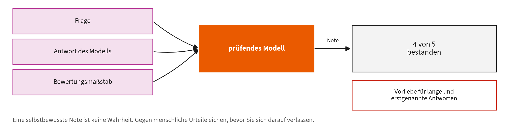

- **Wofür:** Viele Ergebnisse bewerten, wo ein reiner Textvergleich nicht reicht, etwa bei Zusammenfassungen.
- **Wann sinnvoll:** Als Vorsortierung und als Trend über die Zeit, nie als letzte Instanz.
- **Grenze:** Der Prüfer hat Vorlieben, etwa für lange oder erstgenannte Antworten. Gegen menschliche Urteile eichen.

**Woher es kommt.** Zheng et al. untersuchten 2023, ob ein starkes Modell menschliche Bewertung ersetzen kann. Der Anlass war praktisch: Menschliche Bewertung offener Antworten ist teuer und langsam, und automatische Textvergleiche versagen dort, wo es viele richtige Formulierungen gibt.

**Wie es funktioniert.** Das prüfende Modell bekommt Frage, Antwort und einen ausformulierten Maßstab und gibt eine Note oder einen Vergleich zurück. Zwei Bauformen: absolute Benotung je Antwort oder paarweiser Vergleich zweier Antworten. Der Vergleich ist verlässlicher, kostet aber mehr Durchläufe.

**Wie gut belegt.** Zheng et al. messen über 80 Prozent Übereinstimmung mit menschlichen Urteilen, etwa so hoch wie die Übereinstimmung zweier Menschen untereinander. Dieselbe Arbeit dokumentiert systematische Verzerrungen: Reihenfolge, Länge und eine Vorliebe für Antworten des eigenen Modells.

**Nicht verwechseln mit.** Kein Ersatz für ein objektives Prüfskript. Wo sich ein deterministischer Test schreiben lässt, ist er dem Modellurteil vorzuziehen (Kapitel 7.4). Das prüfende Modell ist für die Fälle da, in denen es keinen solchen Test gibt.

Quellen: [68], [75]

## Quellen

[1] Anthropic, „Prompt engineering overview“, Claude Docs. Zugegriffen: 11. September 2026. [Online]. Verfügbar unter: <https://docs.claude.com/en/docs/build-with-claude/prompt-engineering/overview>

[2] T. B. Brown *u. a.*, „Language Models are Few-Shot Learners“, in *Advances in Neural Information Processing Systems 33 (NeurIPS 2020)*, 2020. Verfügbar unter: <https://arxiv.org/abs/2005.14165>

[3] J. Wei *u. a.*, „Chain-of-Thought Prompting Elicits Reasoning in Large Language Models“, in *Advances in Neural Information Processing Systems 35 (NeurIPS 2022)*, 2022. Verfügbar unter: <https://arxiv.org/abs/2201.11903>

[4] N. F. Liu *u. a.*, „Lost in the Middle: How Language Models Use Long Contexts“, *Transactions of the Association for Computational Linguistics*, Bd. 12, S. 157-173, 2024, doi: [10.1162/tacl_a_00638](https://doi.org/10.1162/tacl_a_00638).

[5] Anthropic, „How Claude remembers your project“, Claude Code Docs. Zugegriffen: 11. September 2026. [Online]. Verfügbar unter: <https://code.claude.com/docs/en/memory>

[6] Anthropic, „Extend Claude with skills“, Claude Code Docs. Zugegriffen: 11. September 2026. [Online]. Verfügbar unter: <https://code.claude.com/docs/en/skills>

[7] S. Yao *u. a.*, „ReAct: Synergizing Reasoning and Acting in Language Models“, in *International Conference on Learning Representations (ICLR)*, 2023. Verfügbar unter: <https://arxiv.org/abs/2210.03629>

[8] Anthropic, „Configure permissions“, Claude Code Docs. Zugegriffen: 11. September 2026. [Online]. Verfügbar unter: <https://code.claude.com/docs/en/permissions>

[9] S. Macedo, „Stop Hand-Holding Your Coding Agent: Engineering the Loops that Replace Step-by-Step Prompting“, 2026, 2607.00038. Verfügbar unter: <https://arxiv.org/abs/2607.00038>

[10] Anthropic, „Hooks reference“, Claude Code Docs. Zugegriffen: 11. September 2026. [Online]. Verfügbar unter: <https://code.claude.com/docs/en/hooks>

[11] IBM, „What Is Loop Engineering?“, IBM Think. Zugegriffen: 11. September 2026. [Online]. Verfügbar unter: <https://www.ibm.com/think/topics/loop-engineering>

[12] N. Wiener, *Cybernetics: Or Control and Communication in the Animal and the Machine*. Cambridge, MA: MIT Press, 1948.

[13] J. O. Kephart und D. M. Chess, „The Vision of Autonomic Computing“, *Computer*, Bd. 36, Nr. 1, S. 41-50, 2003, doi: [10.1109/MC.2003.1160055](https://doi.org/10.1109/MC.2003.1160055).

[14] J. Huang *u. a.*, „Large Language Models Cannot Self-Correct Reasoning Yet“, in *International Conference on Learning Representations (ICLR)*, 2024. Verfügbar unter: <https://arxiv.org/abs/2310.01798>

[15] E. Schluntz und B. Zhang, „Building effective agents“, Anthropic Research. Zugegriffen: 11. September 2026. [Online]. Verfügbar unter: <https://www.anthropic.com/research/building-effective-agents>

[16] R. Sennrich, B. Haddow, und A. Birch, „Neural Machine Translation of Rare Words with Subword Units“, in *Proceedings of the 54th Annual Meeting of the Association for Computational Linguistics (ACL)*, 2016, S. 1715-1725. doi: [10.18653/v1/P16-1162](https://doi.org/10.18653/v1/P16-1162).

[17] D. Jurafsky und J. H. Martin, *Speech and Language Processing*, 3 (Entwurf). Stanford University, 2025. Zugegriffen: 11. September 2026. [Online]. Verfügbar unter: <https://web.stanford.edu/~jurafsky/slp3/>

[18] P. Gage, „A New Algorithm for Data Compression“, *The C Users Journal*, Bd. 12, Nr. 2, S. 23-38, 1994.

[19] Anthropic, „Manage costs effectively“, Claude Code Docs. Zugegriffen: 11. September 2026. [Online]. Verfügbar unter: <https://code.claude.com/docs/en/costs>

[20] A. Holtzman, J. Buys, L. Du, M. Forbes, und Y. Choi, „The Curious Case of Neural Text Degeneration“, in *International Conference on Learning Representations (ICLR)*, 2020. Verfügbar unter: <https://arxiv.org/abs/1904.09751>

[21] Z. Ji *u. a.*, „Survey of Hallucination in Natural Language Generation“, *ACM Computing Surveys*, Bd. 55, Nr. 12, S. 1-38, 2023, doi: [10.1145/3571730](https://doi.org/10.1145/3571730).

[22] C. Snell, J. Lee, K. Xu, und A. Kumar, „Scaling LLM Test-Time Compute Optimally can be More Effective than Scaling Model Parameters“, 2024, 2408.03314. Verfügbar unter: <https://arxiv.org/abs/2408.03314>

[23] N. Shazeer *u. a.*, „Outrageously Large Neural Networks: The Sparsely-Gated Mixture-of-Experts Layer“, in *International Conference on Learning Representations (ICLR)*, 2017. Verfügbar unter: <https://arxiv.org/abs/1701.06538>

[24] R. A. Jacobs, M. I. Jordan, S. J. Nowlan, und G. E. Hinton, „Adaptive Mixtures of Local Experts“, *Neural Computation*, Bd. 3, Nr. 1, S. 79-87, 1991, doi: [10.1162/neco.1991.3.1.79](https://doi.org/10.1162/neco.1991.3.1.79).

[25] R. Pope *u. a.*, „Efficiently Scaling Transformer Inference“, in *Proceedings of Machine Learning and Systems (MLSys)*, 2023. Verfügbar unter: <https://arxiv.org/abs/2211.05102>

[26] A. Vaswani *u. a.*, „Attention Is All You Need“, in *Advances in Neural Information Processing Systems 30 (NeurIPS 2017)*, 2017. Verfügbar unter: <https://arxiv.org/abs/1706.03762>

[27] W. Kwon *u. a.*, „Efficient Memory Management for Large Language Model Serving with PagedAttention“, in *Proceedings of the 29th Symposium on Operating Systems Principles (SOSP)*, 2023. doi: [10.1145/3600006.3613165](https://doi.org/10.1145/3600006.3613165).

[28] Y. Leviathan, M. Kalman, und Y. Matias, „Fast Inference from Transformers via Speculative Decoding“, in *Proceedings of the 40th International Conference on Machine Learning (ICML)*, 2023, S. 19274-19286. Verfügbar unter: <https://arxiv.org/abs/2211.17192>

[29] C. Chen, S. Borgeaud, G. Irving, J.-B. Lespiau, L. Sifre, und J. Jumper, „Accelerating Large Language Model Decoding with Speculative Sampling“, 2023, 2302.01318. Verfügbar unter: <https://arxiv.org/abs/2302.01318>

[30] G.-I. Yu, J. S. Jeong, G.-W. Kim, S. Kim, und B.-G. Chun, „Orca: A Distributed Serving System for Transformer-Based Generative Models“, in *16th USENIX Symposium on Operating Systems Design and Implementation (OSDI)*, 2022, S. 521-538. Verfügbar unter: <https://www.usenix.org/conference/osdi22/presentation/yu>

[31] G. Hinton, O. Vinyals, und J. Dean, „Distilling the Knowledge in a Neural Network“, 2015, 1503.02531. Verfügbar unter: <https://arxiv.org/abs/1503.02531>

[32] T. Dettmers, M. Lewis, Y. Belkada, und L. Zettlemoyer, „LLM.int8(): 8-bit Matrix Multiplication for Transformers at Scale“, in *Advances in Neural Information Processing Systems 35 (NeurIPS 2022)*, 2022. Verfügbar unter: <https://arxiv.org/abs/2208.07339>

[33] J. Kaplan *u. a.*, „Scaling Laws for Neural Language Models“, 2020, 2001.08361. Verfügbar unter: <https://arxiv.org/abs/2001.08361>

[34] J. Hoffmann *u. a.*, „Training Compute-Optimal Large Language Models“, in *Advances in Neural Information Processing Systems 35 (NeurIPS 2022)*, 2022. Verfügbar unter: <https://arxiv.org/abs/2203.15556>

[35] A. Radford *u. a.*, „Learning Transferable Visual Models From Natural Language Supervision“, in *Proceedings of the 38th International Conference on Machine Learning (ICML)*, 2021. Verfügbar unter: <https://arxiv.org/abs/2103.00020>

[36] P. Lewis *u. a.*, „Retrieval-Augmented Generation for Knowledge-Intensive NLP Tasks“, in *Advances in Neural Information Processing Systems 33 (NeurIPS 2020)*, 2020, S. 9459-9474. Verfügbar unter: <https://arxiv.org/abs/2005.11401>

[37] T. Mikolov, K. Chen, G. Corrado, und J. Dean, „Efficient Estimation of Word Representations in Vector Space“, 2013, 1301.3781. Verfügbar unter: <https://arxiv.org/abs/1301.3781>

[38] J. Johnson, M. Douze, und H. Jégou, „Billion-scale similarity search with GPUs“, *IEEE Transactions on Big Data*, Bd. 7, Nr. 3, S. 535-547, 2021, Verfügbar unter: <https://arxiv.org/abs/1702.08734>

[39] R. Qu, R. Tu, und F. S. Bao, „Is Semantic Chunking Worth the Computational Cost?“, in *Findings of the Association for Computational Linguistics: NAACL 2025*, 2025. Verfügbar unter: <https://arxiv.org/abs/2410.13070>

[40] S. Robertson und H. Zaragoza, „The Probabilistic Relevance Framework: BM25 and Beyond“, *Foundations and Trends in Information Retrieval*, Bd. 3, Nr. 4, S. 333-389, 2009, doi: [10.1561/1500000019](https://doi.org/10.1561/1500000019).

[41] C. D. Manning, P. Raghavan, und H. Schütze, *Introduction to Information Retrieval*. Cambridge: Cambridge University Press, 2008. Zugegriffen: 13. September 2026. [Online]. Verfügbar unter: <https://nlp.stanford.edu/IR-book/>

[42] G. V. Cormack, C. L. A. Clarke, und S. Buettcher, „Reciprocal Rank Fusion Outperforms Condorcet and Individual Rank Learning Methods“, in *Proceedings of the 32nd International ACM SIGIR Conference on Research and Development in Information Retrieval*, 2009, S. 758-759. doi: [10.1145/1571941.1572114](https://doi.org/10.1145/1571941.1572114).

[43] X. Ma, Y. Gong, P. He, H. Zhao, und N. Duan, „Query Rewriting for Retrieval-Augmented Large Language Models“, in *Proceedings of the 2023 Conference on Empirical Methods in Natural Language Processing (EMNLP)*, 2023, S. 5303-5315. Verfügbar unter: <https://arxiv.org/abs/2305.14283>

[44] R. Nogueira und K. Cho, „Passage Re-ranking with BERT“, 2019, 1901.04085. Verfügbar unter: <https://arxiv.org/abs/1901.04085>

[45] D. Edge *u. a.*, „From Local to Global: A Graph RAG Approach to Query-Focused Summarization“, 2024, 2404.16130. Verfügbar unter: <https://arxiv.org/abs/2404.16130>

[46] A. Hogan *u. a.*, „Knowledge Graphs“, *ACM Computing Surveys*, Bd. 54, Nr. 4, 2021, doi: [10.1145/3447772](https://doi.org/10.1145/3447772).

[47] T. Schick *u. a.*, „Toolformer: Language Models Can Teach Themselves to Use Tools“, in *Advances in Neural Information Processing Systems 36 (NeurIPS 2023)*, 2023. Verfügbar unter: <https://arxiv.org/abs/2302.04761>

[48] B. T. Willard und R. Louf, „Efficient Guided Generation for Large Language Models“, 2023, 2307.09702. Verfügbar unter: <https://arxiv.org/abs/2307.09702>

[49] Z. R. Tam, C.-K. Wu, Y.-L. Tsai, C.-Y. Lin, H. Lee, und Y.-N. Chen, „Let Me Speak Freely? A Study on the Impact of Format Restrictions on Performance of Large Language Models“, in *Proceedings of the 2024 Conference on Empirical Methods in Natural Language Processing: Industry Track*, 2024, S. 1218-1236. Verfügbar unter: <https://arxiv.org/abs/2408.02442>

[50] Anthropic, „Introducing the Model Context Protocol“, Anthropic News. Zugegriffen: 11. September 2026. [Online]. Verfügbar unter: <https://www.anthropic.com/news/model-context-protocol>

[51] Anthropic, „Connect Claude Code to tools via MCP“, Claude Code Docs. Zugegriffen: 11. September 2026. [Online]. Verfügbar unter: <https://code.claude.com/docs/en/mcp>

[52] Anthropic, „Create custom subagents“, Claude Code Docs. Zugegriffen: 11. September 2026. [Online]. Verfügbar unter: <https://code.claude.com/docs/en/sub-agents>

[53] L. Wang *u. a.*, „A survey on large language model based autonomous agents“, *Frontiers of Computer Science*, Bd. 18, 2024, doi: [10.1007/s11704-024-40231-1](https://doi.org/10.1007/s11704-024-40231-1).

[54] I. Ong *u. a.*, „RouteLLM: Learning to Route LLMs with Preference Data“, in *International Conference on Learning Representations (ICLR)*, 2025. Verfügbar unter: <https://arxiv.org/abs/2406.18665>

[55] Anthropic, „Model configuration“, Claude Code Docs. Zugegriffen: 11. September 2026. [Online]. Verfügbar unter: <https://code.claude.com/docs/en/model-config>

[56] L. Chen, M. Zaharia, und J. Zou, „FrugalGPT: How to Use Large Language Models While Reducing Cost and Improving Performance“, 2023, 2305.05176. Verfügbar unter: <https://arxiv.org/abs/2305.05176>

[57] D. Mazmanov, „Portal by Spotify Cut My Claude Code Token Usage by 90%“, Spotify Engineering. Zugegriffen: 13. September 2026. [Online]. Verfügbar unter: <https://engineering.atspotify.com/2026/9/portal-by-spotify-cut-my-claude-code-token-usage-by-90>

[58] K. Greshake, S. Abdelnabi, S. Mishra, C. Endres, T. Holz, und M. Fritz, „Not What You’ve Signed Up For: Compromising Real-World LLM-Integrated Applications with Indirect Prompt Injection“, in *Proceedings of the 16th ACM Workshop on Artificial Intelligence and Security (AISec)*, 2023. Verfügbar unter: <https://arxiv.org/abs/2302.12173>

[59] R. Parasuraman und D. H. Manzey, „Complacency and Bias in Human Use of Automation: An Attentional Integration“, *Human Factors*, Bd. 52, Nr. 3, S. 381-410, 2010, doi: [10.1177/0018720810376055](https://doi.org/10.1177/0018720810376055).

[60] S. Amershi *u. a.*, „Guidelines for Human-AI Interaction“, in *Proceedings of the 2019 CHI Conference on Human Factors in Computing Systems*, 2019. doi: [10.1145/3290605.3300233](https://doi.org/10.1145/3290605.3300233).

[61] P. F. Christiano, J. Leike, T. B. Brown, M. Martic, S. Legg, und D. Amodei, „Deep Reinforcement Learning from Human Preferences“, in *Advances in Neural Information Processing Systems 30 (NeurIPS 2017)*, 2017. Verfügbar unter: <https://arxiv.org/abs/1706.03741>

[62] E. N. Elnozahy, L. Alvisi, Y.-M. Wang, und D. B. Johnson, „A Survey of Rollback-Recovery Protocols in Message-Passing Systems“, *ACM Computing Surveys*, Bd. 34, Nr. 3, S. 375-408, 2002, doi: [10.1145/568522.568525](https://doi.org/10.1145/568522.568525).

[63] Anthropic, „Checkpointing“, Claude Code Docs. Zugegriffen: 11. September 2026. [Online]. Verfügbar unter: <https://code.claude.com/docs/en/checkpointing>

[64] M. T. Nygard, *Release It! Design and Deploy Production-Ready Software*, 2. Aufl. Pragmatic Bookshelf, 2018.

[65] B. H. Sigelman *u. a.*, „Dapper, a Large-Scale Distributed Systems Tracing Infrastructure“, Google, Inc., Technical Report, 2010. Zugegriffen: 13. September 2026. [Online]. Verfügbar unter: <https://research.google/pubs/dapper-a-large-scale-distributed-systems-tracing-infrastructure/>

[66] A. Wei, N. Haghtalab, und J. Steinhardt, „Jailbroken: How Does LLM Safety Training Fail?“, in *Advances in Neural Information Processing Systems 36 (NeurIPS 2023)*, 2023. Verfügbar unter: <https://arxiv.org/abs/2307.02483>

[67] S. Willison, „Prompt injection attacks against GPT-3“, simonwillison.net. Zugegriffen: 13. September 2026. [Online]. Verfügbar unter: <https://simonwillison.net/2022/Sep/12/prompt-injection/>

[68] P. Liang *u. a.*, „Holistic Evaluation of Language Models“, *Transactions on Machine Learning Research*, 2023, Verfügbar unter: <https://arxiv.org/abs/2211.09110>

[69] D. Hendrycks *u. a.*, „Measuring Massive Multitask Language Understanding“, in *International Conference on Learning Representations (ICLR)*, 2021. Verfügbar unter: <https://arxiv.org/abs/2009.03300>

[70] R. Schaeffer, B. Miranda, und S. Koyejo, „Are Emergent Abilities of Large Language Models a Mirage?“, in *Advances in Neural Information Processing Systems 36 (NeurIPS 2023)*, 2023. Verfügbar unter: <https://arxiv.org/abs/2304.15004>

[71] A. Bondarenko, D. Volk, D. Volkov, und J. Ladish, „Demonstrating Specification Gaming in Reasoning Models“, 2025, 2502.13295. Verfügbar unter: <https://arxiv.org/abs/2502.13295>

[72] J. Pan, H. He, S. R. Bowman, und S. Feng, „Spontaneous Reward Hacking in Iterative Self-Refinement“, 2024, 2407.04549. Verfügbar unter: <https://arxiv.org/abs/2407.04549>

[73] C. A. E. Goodhart, „Problems of Monetary Management: The U.K. Experience“, in *Papers in Monetary Economics, Vol. I*, Sydney: Reserve Bank of Australia, 1975.

[74] M. Strathern, „Improving ratings: audit in the British University system“, *European Review*, Bd. 5, Nr. 3, S. 305-321, 1997.

[75] L. Zheng *u. a.*, „Judging LLM-as-a-Judge with MT-Bench and Chatbot Arena“, in *Advances in Neural Information Processing Systems 36 (NeurIPS 2023), Datasets and Benchmarks Track*, 2023. Verfügbar unter: <https://arxiv.org/abs/2306.05685>
